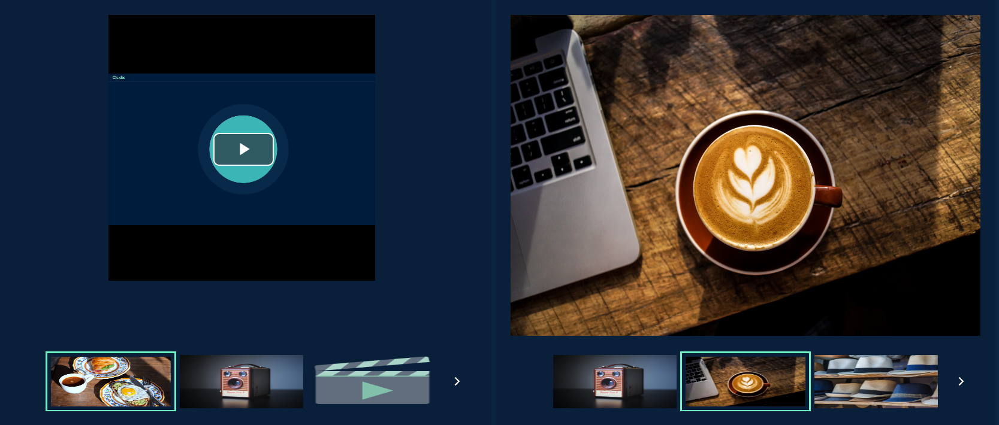
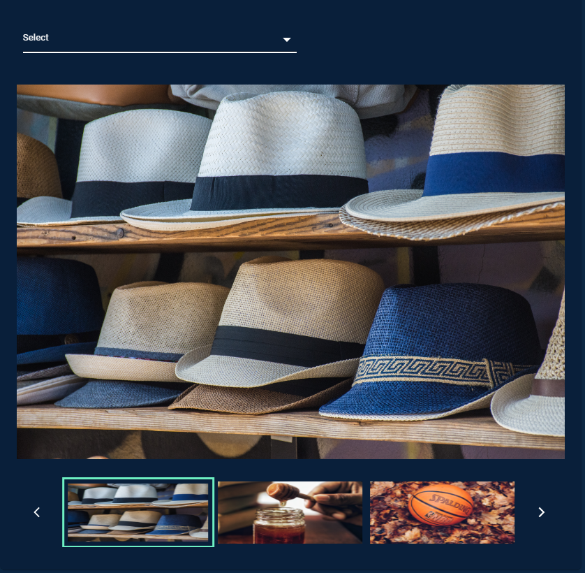
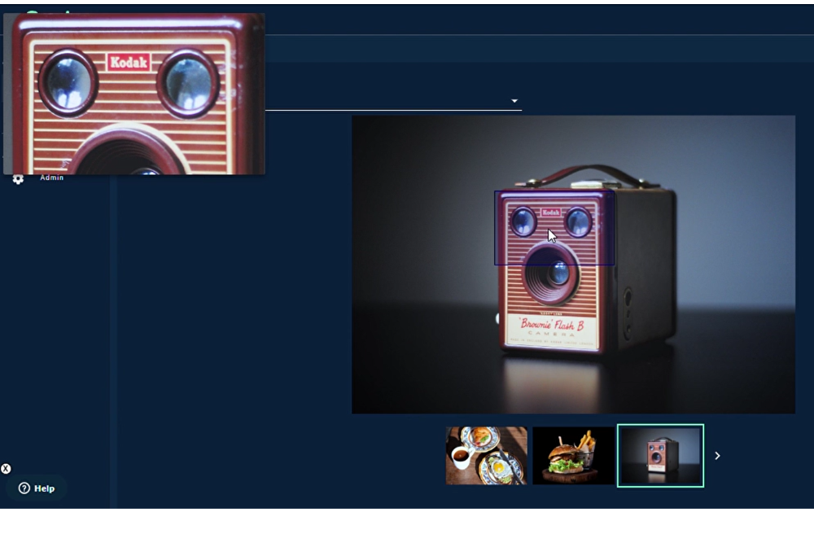

# Introduction

Carousel Component is useful to navigate through a collection of elements(images/videos) in a sequential fashion, moving to the previous/next one through the arrows on the sides. Component is built in a such way that it can be configurable to some extent.



# Arguments

- `item_data` (list, required) : The list of objects to be used to get details of each element to be shown in Carousel. -
  * `sku_id` (int, required)  is unique ID for element.
  * `img` (str, required) is image which will be visible as slider element. For `content_type` video, `img` is considered as thumbnail image.
  * `video` (str, optional) is link to the video. It is only to be provided for `content_type` video.
  * `title` (str, optional) is a title.
  * `contentType` (str, required) is to identify the type of element.

- `options` (dict, required): Options is the confuguration for the Carousel. -

  * `show` (int, required) is how many items to be shown in the Carousel Slider.
  * `data_per_page` (int, required) is how many items to be load in the Carousel Slider in each page(Lazy Load).
  * `selection_type` (str, optional) is the configuration to set section on items as single/multiple.
  * `interval` (int, optional) is time interval after which user actions will be submitted(in ms).
  * `direction` (str, required) is Flex direction in CSS is a sub-property of the flexible box layout module. You can choose between column and row orientations for the Carousel Component, giving you the flexibility to determine the layout(row, column, row-reversed, column-reversed).
  * `sliderMode` (str, required) offers the option to choose between horizontal and vertical modes for the slider.
  * `viewerHeight` (str, required) is height of selected element(%,rem,px and more options available in CSS).
  * `viewerWidth` (str, required) is width of selected element(%,rem,px and more options available in CSS).
  * `sliderHeight` (str, required) is height of slider of elements(%,rem,px and more options available in CSS).
  * `sliderWidth` (str, required) is width of slider of elements(%,rem,px and more options available in CSS).

- `select_options` (dict, optional): Select dropdown which is optional user input. -
  * `id` (int, required) is unique ID for element.
  * `lable` (str, required) is lable to show.
  * `value` (str, required) actual value behind the option.

- `zoom_options` (dict, optional): Zoom Feature which is optional user input. -
  * `enable_zoom` (boolean, required).
  * `zoom_popup_width` (str, optional) height(%,rem,px and more options available in CSS).
  * `zoom_popup_height` (str, optional) width(%,rem,px and more options available in CSS).
  * `zoom_vertical_position` (str, optional) top/bottom.
  * `zoom_vertical_position` (str, optional) right/left.

# Attributes and Methods

- `json_string` : An attribute of the component conversion object which returns a JSON string for the component, which is used to render the component on the UI. Kindly refer the sample codes for usage.
- `component_dict` : An attribute which returns the dictionary/JSON structure of the component. Unlike `json_string` attribute which returns a JSON string, this returns a python dictionary.

# Sample Codes

```
import json
from codex_widget_factory_lite.visuals.carousel import Carousel
item_data = [
    {
        "sku_id": 1,
        "img": "https://images.unsplash.com/photo-1551963831-b3b1ca40c98e",
        "video": "https://willbedeletedsoon.blob.core.windows.net/test-user-guides/Retail-Media-Landing-Page-Animation.mp4",
        "title": "Breakfast", "height": "400px", "width": "400px",
        "contentType": "video"
    },
    {
        "sku_id": 2,
        "img": "https://images.unsplash.com/photo-1522770179533-24471fcdba45",
        "title": "Camera", "height": "200px", "width": "200px",
        "contentType": "image"
    },
    {
        "sku_id": 3,
        "video": "https://willbedeletedsoon.blob.core.windows.net/test-user-guides/webm_sample.webm",
        "title": "Burger", "height": "800px", "width": "500px",
        "contentType": "video"
    },
    {
        "sku_id": 4,
        "img": "https://images.unsplash.com/photo-1444418776041-9c7e33cc5a9c",
        "title": "Coffee",
        "contentType": "image"
    },
    {
        "sku_id": 5,
        "img": "https://images.unsplash.com/photo-1533827432537-70133748f5c8",
        "title": "Hats",
        "contentType": "image"
    },
    {
        "sku_id": 6,
        "img": "https://images.unsplash.com/photo-1558642452-9d2a7deb7f62",
        "title": "Honey",
        "contentType": "image"
    },
    {
        "sku_id": 7,
        "img": "https://images.unsplash.com/photo-1516802273409-68526ee1bdd6",
        "title": "Basketball",
        "contentType": "image"
    },
    {
        "sku_id": 8,
        "img": "https://images.unsplash.com/photo-1518756131217-31eb79b20e8f",
        "title": "Fern",
        "contentType": "image"
    },
    {
        "sku_id": 9,
        "img": "https://images.unsplash.com/photo-1597645587822-e99fa5d45d25",
        "title": "Mushrooms",
        "contentType": "image"
    },
    {
        "sku_id": 10,
        "img": "https://images.unsplash.com/photo-1567306301408-9b74779a11af",
        "title": "Tomato basil",
        "contentType": "image"
    },
    {
        "sku_id": 11,
        "img": "https://images.unsplash.com/photo-1471357674240-e1a485acb3e1",
        "title": "Sea star",
        "contentType": "image"
    },
    {
        "sku_id": 12,
        "img": "https://images.unsplash.com/photo-1589118949245-7d38baf380d6",
        "title": "Bike",
        "contentType": "image"
    },
    {
        "sku_id": 13,
        "img": "https://images.unsplash.com/photo-1516802273409-68526ee1bdd6",
        "title": "Basketball",
        "contentType": "image"
    },
    {
        "sku_id": 14,
        "img": "https://images.unsplash.com/photo-1518756131217-31eb79b20e8f",
        "title": "Fern",
        "contentType": "image"
    },
    {
        "sku_id": 15,
        "img": "https://images.unsplash.com/photo-1597645587822-e99fa5d45d25",
        "title": "Mushrooms",
        "contentType": "image"
    },
    ]

options = {
    "show": 3,
    "data_per_page": 3,
    "selection_type": "single",
    "interval": 2000,
    "direction": "column",
    "sliderMode": "horizontal",
    "viewerHeight": "80%",
    "sliderHeight": "15%",
    "viewerWidth": "100%",
    "sliderWidth": "100%",
    }

dynamic_outputs = Carousel(
        item_data = item_data,
        options = options,
        select_options = select_options,
        zoom_options = zoom_options
    ).json_string
```

## Carousel with Select Options



```
import json
from codex_widget_factory_lite.visuals.carousel import Carousel
item_data = [
    {
        "sku_id": 1,
        "img": "https://images.unsplash.com/photo-1551963831-b3b1ca40c98e",
        "video": "https://willbedeletedsoon.blob.core.windows.net/test-user-guides/Retail-Media-Landing-Page-Animation.mp4",
        "title": "Breakfast", "height": "400px", "width": "400px",
        "contentType": "video"
    },
    {
        "sku_id": 2,
        "img": "https://images.unsplash.com/photo-1522770179533-24471fcdba45",
        "title": "Camera", "height": "200px", "width": "200px",
        "contentType": "image"
    },
    {
        "sku_id": 3,
        "video": "https://willbedeletedsoon.blob.core.windows.net/test-user-guides/webm_sample.webm",
        "title": "Burger", "height": "800px", "width": "500px",
        "contentType": "video"
    },
    {
        "sku_id": 4,
        "img": "https://images.unsplash.com/photo-1444418776041-9c7e33cc5a9c",
        "title": "Coffee",
        "contentType": "image"
    },
    {
        "sku_id": 5,
        "img": "https://images.unsplash.com/photo-1533827432537-70133748f5c8",
        "title": "Hats",
        "contentType": "image"
    },
    {
        "sku_id": 6,
        "img": "https://images.unsplash.com/photo-1558642452-9d2a7deb7f62",
        "title": "Honey",
        "contentType": "image"
    },
    {
        "sku_id": 7,
        "img": "https://images.unsplash.com/photo-1516802273409-68526ee1bdd6",
        "title": "Basketball",
        "contentType": "image"
    },
    {
        "sku_id": 8,
        "img": "https://images.unsplash.com/photo-1518756131217-31eb79b20e8f",
        "title": "Fern",
        "contentType": "image"
    },
    {
        "sku_id": 9,
        "img": "https://images.unsplash.com/photo-1597645587822-e99fa5d45d25",
        "title": "Mushrooms",
        "contentType": "image"
    },
    {
        "sku_id": 10,
        "img": "https://images.unsplash.com/photo-1567306301408-9b74779a11af",
        "title": "Tomato basil",
        "contentType": "image"
    },
    {
        "sku_id": 11,
        "img": "https://images.unsplash.com/photo-1471357674240-e1a485acb3e1",
        "title": "Sea star",
        "contentType": "image"
    },
    {
        "sku_id": 12,
        "img": "https://images.unsplash.com/photo-1589118949245-7d38baf380d6",
        "title": "Bike",
        "contentType": "image"
    },
    {
        "sku_id": 13,
        "img": "https://images.unsplash.com/photo-1516802273409-68526ee1bdd6",
        "title": "Basketball",
        "contentType": "image"
    },
    {
        "sku_id": 14,
        "img": "https://images.unsplash.com/photo-1518756131217-31eb79b20e8f",
        "title": "Fern",
        "contentType": "image"
    },
    {
        "sku_id": 15,
        "img": "https://images.unsplash.com/photo-1597645587822-e99fa5d45d25",
        "title": "Mushrooms",
        "contentType": "image"
    },
    ]

options = {
    "show": 3,
    "data_per_page": 3,
    "selection_type": "single",
    "interval": 2000,
    "direction": "column",
    "sliderMode": "horizontal",
    "viewerHeight": "80%",
    "sliderHeight": "15%",
    "viewerWidth": "100%",
    "sliderWidth": "100%",
    }

select_options = [
    {
          "id": 1,
          "label": "one",
          "value": "one"
        },
        {
          "id": 1,
          "label": "two",
          "value": "two"
        },
        {
          "id": 1,
          "label": "three",
          "value": "three"
        }
]

dynamic_outputs = Carousel(
        item_data = item_data,
        options = options,
        select_options = select_options,
        zoom_options = zoom_options
    ).json_string
```

## Carousel with Zoom Feature



```
import json
from codex_widget_factory_lite.visuals.carousel import Carousel
item_data = [
    {
        "sku_id": 1,
        "img": "https://images.unsplash.com/photo-1551963831-b3b1ca40c98e",
        "video": "https://willbedeletedsoon.blob.core.windows.net/test-user-guides/Retail-Media-Landing-Page-Animation.mp4",
        "title": "Breakfast", "height": "400px", "width": "400px",
        "contentType": "video"
    },
    {
        "sku_id": 2,
        "img": "https://images.unsplash.com/photo-1522770179533-24471fcdba45",
        "title": "Camera", "height": "200px", "width": "200px",
        "contentType": "image"
    },
    {
        "sku_id": 3,
        "video": "https://willbedeletedsoon.blob.core.windows.net/test-user-guides/webm_sample.webm",
        "title": "Burger", "height": "800px", "width": "500px",
        "contentType": "video"
    },
    {
        "sku_id": 4,
        "img": "https://images.unsplash.com/photo-1444418776041-9c7e33cc5a9c",
        "title": "Coffee",
        "contentType": "image"
    },
    {
        "sku_id": 5,
        "img": "https://images.unsplash.com/photo-1533827432537-70133748f5c8",
        "title": "Hats",
        "contentType": "image"
    },
    {
        "sku_id": 6,
        "img": "https://images.unsplash.com/photo-1558642452-9d2a7deb7f62",
        "title": "Honey",
        "contentType": "image"
    },
    {
        "sku_id": 7,
        "img": "https://images.unsplash.com/photo-1516802273409-68526ee1bdd6",
        "title": "Basketball",
        "contentType": "image"
    },
    {
        "sku_id": 8,
        "img": "https://images.unsplash.com/photo-1518756131217-31eb79b20e8f",
        "title": "Fern",
        "contentType": "image"
    },
    {
        "sku_id": 9,
        "img": "https://images.unsplash.com/photo-1597645587822-e99fa5d45d25",
        "title": "Mushrooms",
        "contentType": "image"
    },
    {
        "sku_id": 10,
        "img": "https://images.unsplash.com/photo-1567306301408-9b74779a11af",
        "title": "Tomato basil",
        "contentType": "image"
    },
    {
        "sku_id": 11,
        "img": "https://images.unsplash.com/photo-1471357674240-e1a485acb3e1",
        "title": "Sea star",
        "contentType": "image"
    },
    {
        "sku_id": 12,
        "img": "https://images.unsplash.com/photo-1589118949245-7d38baf380d6",
        "title": "Bike",
        "contentType": "image"
    },
    {
        "sku_id": 13,
        "img": "https://images.unsplash.com/photo-1516802273409-68526ee1bdd6",
        "title": "Basketball",
        "contentType": "image"
    },
    {
        "sku_id": 14,
        "img": "https://images.unsplash.com/photo-1518756131217-31eb79b20e8f",
        "title": "Fern",
        "contentType": "image"
    },
    {
        "sku_id": 15,
        "img": "https://images.unsplash.com/photo-1597645587822-e99fa5d45d25",
        "title": "Mushrooms",
        "contentType": "image"
    },
    ]

options = {
    "show": 3,
    "data_per_page": 3,
    "selection_type": "single",
    "interval": 2000,
    "direction": "column",
    "sliderMode": "horizontal",
    "viewerHeight": "80%",
    "sliderHeight": "15%",
    "viewerWidth": "100%",
    "sliderWidth": "100%",
    }

zoom_options = {
    "enable_zoom": True
}

dynamic_outputs = Carousel(
        item_data = item_data,
        options = options,
        select_options = select_options,
        zoom_options = zoom_options
    ).json_string
```


# JSON Structure

The complete JSON structure of the component with basic sample data is captured below

```
{
    "componentType": "custom:codxComponentCarousel",
    "inputs": {
      "itemData": [
        {
          "sku_id": 1,
          "img": "https://images.unsplash.com/photo-1551963831-b3b1ca40c98e",
          "video": "https://willbedeletedsoon.blob.core.windows.net/test-user-guides/Retail-Media-Landing-Page-Animation.mp4",
          "title": "Breakfast", "height": "400px", "width": "400px",
          "contentType": "video"
        },
        {
          "sku_id": 2,
          "img": "https://images.unsplash.com/photo-1522770179533-24471fcdba45",
          "title": "Camera", "height": "200px", "width": "200px",
          "contentType": "image"
        },
        {
          "sku_id": 3,
          "video": "https://willbedeletedsoon.blob.core.windows.net/test-user-guides/webm_sample.webm",
          "title": "Burger", "height": "800px", "width": "500px",
          "contentType": "video"
        },
        {
          "sku_id": 4,
          "img": "https://images.unsplash.com/photo-1444418776041-9c7e33cc5a9c",
          "title": "Coffee",
           "contentType": "image"
        },
        {
          "sku_id": 5,
          "img": "https://images.unsplash.com/photo-1533827432537-70133748f5c8",
          "title": "Hats",
           "contentType": "image"
        },
        {
          "sku_id": 6,
          "img": "https://images.unsplash.com/photo-1558642452-9d2a7deb7f62",
          "title": "Honey",
           "contentType": "image"
        },
        {
          "sku_id": 7,
          "img": "https://images.unsplash.com/photo-1516802273409-68526ee1bdd6",
          "title": "Basketball",
           "contentType": "image"
        },
        {
          "sku_id": 8,
          "img": "https://images.unsplash.com/photo-1518756131217-31eb79b20e8f",
          "title": "Fern",
           "contentType": "image"
        },
        {
          "sku_id": 9,
          "img": "https://images.unsplash.com/photo-1597645587822-e99fa5d45d25",
          "title": "Mushrooms",
           "contentType": "image"
        },
        {
          "sku_id": 10,
          "img": "https://images.unsplash.com/photo-1567306301408-9b74779a11af",
          "title": "Tomato basil",
           "contentType": "image"
        },
        {
          "sku_id": 11,
          "img": "https://images.unsplash.com/photo-1471357674240-e1a485acb3e1",
          "title": "Sea star",
           "contentType": "image"
        },
        {
          "sku_id": 12,
          "img": "https://images.unsplash.com/photo-1589118949245-7d38baf380d6",
          "title": "Bike",
           "contentType": "image"
        },
        {
          "sku_id": 13,
          "img": "https://images.unsplash.com/photo-1516802273409-68526ee1bdd6",
          "title": "Basketball",
           "contentType": "image"
        },
        {
          "sku_id": 14,
          "img": "https://images.unsplash.com/photo-1518756131217-31eb79b20e8f",
          "title": "Fern",
           "contentType": "image"
        },
        {
          "sku_id": 15,
          "img": "https://images.unsplash.com/photo-1597645587822-e99fa5d45d25",
          "title": "Mushrooms",
           "contentType": "image"
        },
      ],
      "options": {
        "show": 3,
        "data_per_page": 3,
        "selection_type": "single",
        "interval": 2000,
        "direction": "column",
        "sliderMode": "horizontal",
        "viewerHeight": "80%",
        "sliderHeight": "15%",
        "viewerWidth": "100%",
        "sliderWidth": "100%",
      },
      "selectOptions": [
        {
          "id": 1,
          "label": "one",
          "value": "one"
        },
        {
          "id": 1,
          "label": "two",
          "value": "two"
        },
        {
          "id": 1,
          "label": "three",
          "value": "three"
        }
      ],
      "enable_zoom": true
    }
  }
```