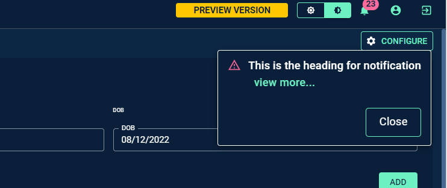

# Introduction

The Notification interface helps to push custom notification for the applications. It should be added while handling the dynamic action or screen level action




# Tooltip:

- Tooltips briefly describe a UI element. They're best used for labelling UI elements with no text, like icon-only buttons and fields.
- It is shown when user hover on the icon, text link, button.
- The will remain visible until user leaves that interaction area.

# Popover:

- Popover displays additional information in a temporary window. It can include rich content such as titles, long definitions, links and buttons
- Use when you need to display additional information in form of text on “i” icon.
- It is shown when user clicks on a word or icon.
- The window remains visible until they click “x” icon on popover.


# Arguments

- `notification_body` : The body message for the notification
- `notification_heading` : The title for the notification
- `access_token` (required) : The Personal Access Token(PAT) required to verify the permission to push custom notification, recommended way to use PAT is storing it in application variables and reading the same.
- `base_url` : The base url for custom-notification endpoint, which can be read through global variable __baseurl__ in the UIaC. The __baseurl__ is implicitly available in all UIaCs.
- `source_app_id` : The source application id from custom-notification endpoint is triggered, which can be read through global variable source_app_id
- `user_info` : User information detail who triggers the custom notification, which can be read through global variable user_info

# Tooltip:

- Tooltips briefly describe a UI element. They're best used for labelling UI elements with no text, like icon-only buttons and fields.
- It is shown when user hover on the icon, text link, button.
- The will remain visible until user leaves that interaction area.

# Popover:

- Popover displays additional information in a temporary window. It can include rich content such as titles, long definitions, links and buttons
- Use when you need to display additional information in form of text on “i” icon.
- It is shown when user clicks on a word or icon.
- The window remains visible until they click “x” icon on popover.

# Attributes and Methods

- `notification_type` : The type of notification to be triggered. It needs to be of type NotificationTypes. Available NotificationTypes -
						- NotificationTypes.InApp
						- NotificationTypes.Default
						- NotificationTypes.IntraApp
						- NotificationTypes.Information
						- NotificationTypes.Confirm
						- NotificationTypes.Approval
- `add_tooltip` : A method which is used to add tooltip to provide contextual information about the feature. It can take the following parameters -

    - `isTooltip` (bool,optional,default=True) : A flag to determine to add tooltip or not.
    - `tooltip_text` (string, optional, default="This is a tooltip") : Title of the tooltip which displays when user hovers on it.
    - `placement` (string, optional, default="top") : Specifies the position of the tooltip. Values are "top", "bottom", "left", "right", "top-start", "top-end", "bottom-start", "bottom-end","left-start", "left-end", "right-start", "right-end"


- `notification_target_apps` : The list of application IDs on which the notification needs to be triggered.
- `notification_target_users` : The list of user email ids for which the notification should be triggered.
- `push_notification` : A method which is used to push the custom notification for targeted users on targeted applications


# Additional Examples
Notifications interface currently do not support pushing email notification.

The example below illustrates how to configure custom notifications.

```
from codex_widget_factory_lite.utils.notifications.notification import Notification, NotificationTypes
# Hardcoding a sample data here, please insert details as required
app_notification = Notification(
    notification_body = "This is the body for notification",
    notification_heading = 'This is the heading for notification',
    base_url = base_url,
    access_token = _codx_app_vars_['auth_token'],
    source_app_id = source_app_id,
    user_info = user_info
)
app_notification.notification_type = NotificationTypes.Information
app_notification.notification_target_apps = [1, 2]
app_notification.notification_target_users = ['testuser@test.com']
app_notification.push_notification()
```

The example below illustrates how to configure custom notifications with Dynamic Form .

```
import pandas as pd
from codex_widget_factory_lite.visuals.dynamic_form import DynamicForm
from codex_widget_factory_lite.utils.notifications.notification import Notification, NotificationTypes


df = DynamicForm()

action_button_df = pd.DataFrame(data=[['Add', '', 'contained', 'Add']], columns=['name', 'size', 'variant', 'action_type'])
action_button_table_df = pd.DataFrame(data=[['Reset', '', '', 'Reset']], columns=['name', 'size', 'variant', 'action_type'])

df.add_header_text('Name', grid=4)
df.add_header_text('Age', grid=4)
df.add_header_text('DOB', grid=4)

df.add_input('name', 'name', value='Jim', placeholder='Type your name here', input_type='text', grid=4)
df.add_input('age', 'age', value=20, placeholder='Enter your age', input_type='number', grid=4)
df.add_date_input('DOB', 'DOB', default_time="2022-12-08T00:00:00", grid=4)
df.add_action_button(action_button_df)

if "action_type" in globals().keys():
    if action_type=='Add':
        temp_list = screen_data['main table'].copy()
        temp_dict = {'Name':screen_data['name'], 'Age':screen_data['age'], 'DOB':screen_data['DOB']}
        temp_list.append(temp_dict)
        table_df = pd.DataFrame(temp_list)
        table_df['DOB'] = pd.to_datetime(table_df['DOB'], dayfirst=True).dt.strftime('%d/%m/%Y')
        df.add_dynamic_table(table_df, table_name='main table', grid=12)
        df.add_action_button(action_button_table_df)
        # Hardcoding a sample data here, please insert details as required
        app_notification = Notification(
            notification_body = "This is the body for notification",
            notification_heading = 'This is the heading for notification',
            base_url = base_url,
            access_token = _codx_app_vars_['auth_token'],
            source_app_id = source_app_id,
            user_info = user_info
        )
        app_notification.notification_type = NotificationTypes.Information
        app_notification.notification_target_apps = [1, 2]
        app_notification.notification_target_users = ['testuser@test.com']
        app_notification.push_notification()
    else:
        table_df = pd.DataFrame(columns=['Name', 'Age', 'DOB'])
        df.add_dynamic_table(table_df, table_name='main table', grid=12)
else:
    table_df = pd.DataFrame(columns=['Name', 'Age', 'DOB'])
    df.add_dynamic_table(table_df, table_name='main table', grid=12)
df.add_tooltip(isTooltip=True,tooltip_text="This is a tooltip" ,placement="top")
dynamic_outputs= df.json_string
```


The example below illustrates how to configure custom notifications with Screen Level Action .

```
from codex_widget_factory_lite.screen_actions.screen_actions_handler import ScreenActionsHandler
from codex_widget_factory_lite.utils.notifications.notification import Notification, NotificationTypes

if action_type == "test_button_action":
  ########
  # Add your custom business logic here
  ########
  # Hardcoding a sample data here, please insert details as required
  app_notification = Notification(
      notification_body = "This is the body for screen level action notification",
      notification_heading = 'This is the heading for screen level action notification',
      base_url = base_url,
      access_token = _codx_app_vars_['auth_token'],
      source_app_id = source_app_id,
      user_info = user_info
  )
  app_notification.notification_type = NotificationTypes.Information
  app_notification.notification_target_apps = [344]
  app_notification.notification_target_users = ['ira.shrivastava@themathcompany.com']
  app_notification.push_notification()
  dynamic_outputs = ScreenActionsHandler(message = "Some cool button this is!",
    type = "success").json_string
```