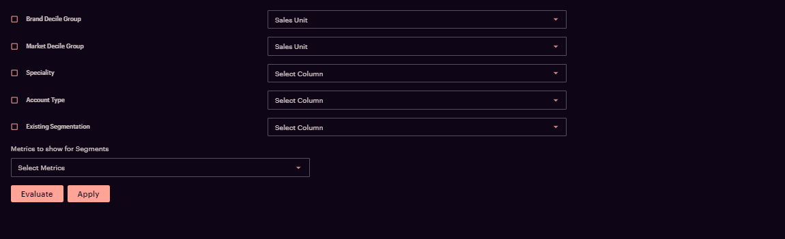
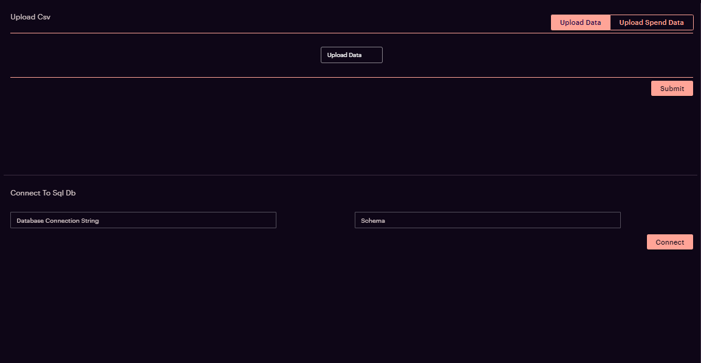
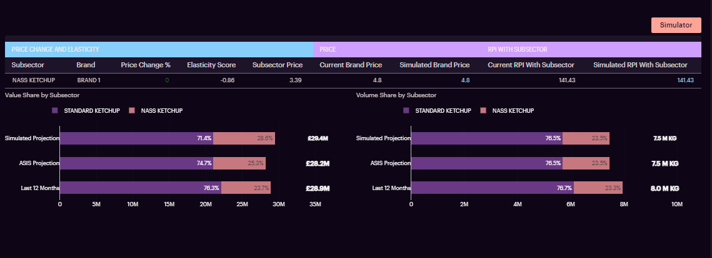
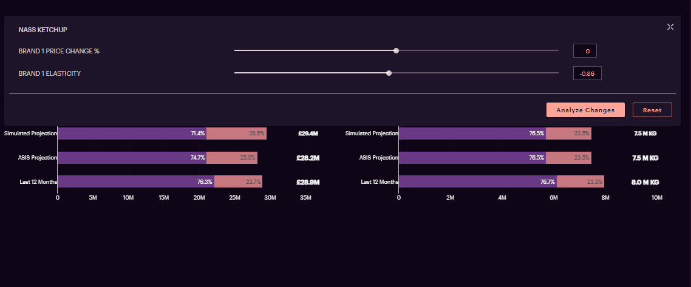
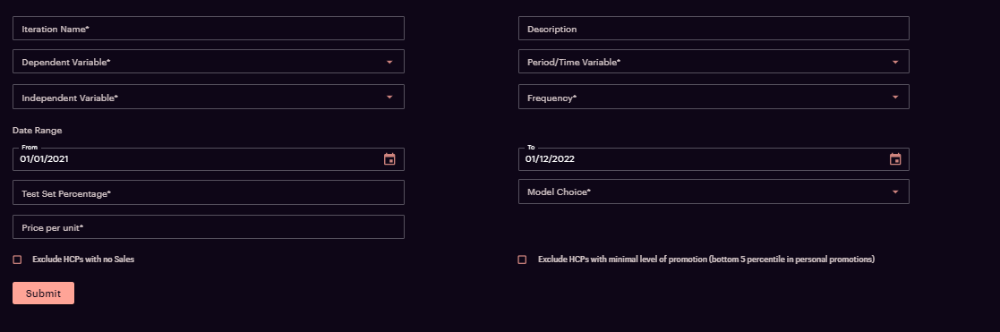

# Introduction

The dynamic form on NucliOS UI allows users to  create a custom form layout with customizable components that can include:

- A Grid Table - (Creates a dynamic table with custom table header, custom row, with functionalities to add colors to rows and columns, delete, rearrange, copy row data, custom cell types, order, sort, search row, handle duplicate rows among others)

- Buttons

    - Upload Button (Creates a button used to upload a file)

    - Download Button (Creates a button used to download a file to local)

    - Action Buttons (Creates other buttons for different functionalities like Save, Analyze etc)

- Dynamic Insights (This component is used to get insights)

- Plots (This component is used to get plots)

- Simulator Section (This component is used to add a simulator that helps simulate various scenarios)

- Download Data (This component is used to download the data of the required table)

- Markdown (This component is used to add a markdown)


Fig 1 - Dynamic form with dropdown ,check box and action buttons.

Fig 2 - Dynamic form with upload buttons and action buttons.

Fig 3 - Dyamic form with Table and other components.




# Tooltip:

- Tooltips briefly describe a UI element. They're best used for labelling UI elements with no text, like icon-only buttons and fields.
- It is shown when user hover on the icon, text link, button.
- The will remain visible until user leaves that interaction area.

# Popover:

- Popover displays additional information in a temporary window. It can include rich content such as titles, long definitions, links and buttons
- Use when you need to display additional information in form of text on “i” icon.
- It is shown when user clicks on a word or icon.
- The window remains visible until they click “x” icon on popover.

# Attributes and Methods
- `json_string` : An attribute of the component conversion object which returns a JSON string for the component, which is used to render the component on the UI. Kindly refer the sample code snippets for usage.
- `add_tooltip` : A method which is used to add tooltip to provide contextual information about the feature. It can take the following parameters -

    - `isTooltip` (bool,optional,default=True) : A flag to determine to add tooltip or not.
    - `tooltip_text` (string, optional, default="This is a tooltip") : Title of the tooltip which displays when user hovers on it.
    - `placement` (string, optional, default="top") : Specifies the position of the tooltip. Values are "top", "bottom", "left", "right", "top-start", "top-end", "bottom-start", "bottom-end","left-start", "left-end", "right-start", "right-end"

- `component_dict` : An attribute which returns the dictionary/JSON structure of the component. Unlike `json_string` attribute which returns a JSON string, this returns a python dictionary.
- `append` :
    <br />
    Appends form item into dynamic form
    <br />
    Args -
    <br />
    data: (dict, required) form item

- `add_simulator`:
<div style="white-space: pre;">
A dynamic form widget component, to Append a simulator to the forms list.
Args:
    simulator_values_df (pandas dataframe): The simulator options table is a dataframe that contains the properties for the simulator section.
                                            The table contains columns such as :"header", "input_type", "label", "id", "value", "options", "max", "min", "steps", "control".
                                            simulator_df = pd.DataFrame({
                                            'header': ['TRX Range','NBRX Range', 'Caliper',"Enter Month"],
                                            'input_type': ['slider','slider','slider','dropdown'],
                                            'id': ['a','b','c','d'],
                                            'label': ['TRX Range','NBRX Range', 'Caliper','Enter Month'],
                                            'value': [10, 10, 10,'Jan-20'],
                                            'options':[' ',' ',' ',['Jan-20','Feb-20','March-20','Apr-20']],
                                            'max': [10,10,10,10],
                                            'min': [0,0,0,0],
                                            'steps': [2,2,1,2],
                                            'control': [0,0,0,2]
                                            })
    simulator_actions_df (pandas dataframe): simulator_buttons_df = pd.DataFrame({
                                            'name':['Analyse Changes'],
                                            'action_flag_type':['Simulator_section_analyse_changes'],
                                            'variant': ['outlined'],
                                            })
    label (str, optional): display name of the button, defaults to 'Simulator'.
    size (str, optional): size of the button, defaults to 'small'.
</div>


- `get_simulator`:
<div style="white-space: pre;">
A dynamic form widget component, to get a simulator.
Args:
    simulator_values_df (pandas dataframe): The simulator options table is a dataframe that contains the properties for the simulator section.
                                            The table contains columns such as :"header", "input_type", "label", "id", "value", "options", "max", "min", "steps", "control".
                                            simulator_df = pd.DataFrame({
                                            'header': ['TRX Range','NBRX Range', 'Caliper',"Enter Month"],
                                            'input_type': ['slider','slider','slider','dropdown'],
                                            'id': ['a','b','c','d'],
                                            'label': ['TRX Range','NBRX Range', 'Caliper','Enter Month'],
                                            'value': [10, 10, 10,'Jan-20'],
                                            'options':[' ',' ',' ',['Jan-20','Feb-20','March-20','Apr-20']],
                                            'max': [10,10,10,10],
                                            'min': [0,0,0,0],
                                            'steps': [2,2,1,2],
                                            'control': [0,0,0,2]
                                            })
    simulator_actions_df (pandas dataframe): simulator_buttons_df = pd.DataFrame({
                                            'name':['Analyse Changes'],
                                            'action_flag_type':['Simulator_section_analyse_changes'],
                                            'variant': ['outlined'],
                                            })
    label (str, optional): display name of the button, defaults to 'Simulator'.
    size (str, optional): size of the button, defaults to 'small'.
Returns:
    dict: a simulator dictionary
</div>

- `add_download_button`:
<div style="white-space: pre;">
A dynamic form widget component, used to download a file using a button. Appends a download button into the forms list.
Args:
    label (string): label of the button
    url (string): url of the file
    grid (str, int, bool, optional): used to define how space should element"s container should consume.
                            Defaults to "auto". possible values = 1,2,3,4,5,6,7,8,9,10,11,12, "auto", True, False.
</div>


## usage
```
import pandas as pd
from codex_widget_factory_lite.visuals.dynamic_form import DynamicForm

df = DynamicForm()
df.add_download_button('download','https://test.com') #(label and url of the file needs to be passed)
df.add_tooltip(isTooltip=True,tooltip_text="This is a tooltip" ,placement="top")
dynamic_outputs= df.json_string

```

- `get_download_button`
<div style="white-space: pre;">
A dynamic form widget component, used to download a file using a button
Args:
    label (string): label of the button
    url (string): url of the file
    grid (str, int, bool, optional): used to define how space should element"s container should consume.
                            Defaults to "auto". possible values = 1,2,3,4,5,6,7,8,9,10,11,12, "auto", True, False.
Returns:
    dictionary : download button dictionary
</div>

- `add_upload_button`:
<div style="white-space: pre;">
A dynamic form widget component, used to upload a file using a button. Appends a upload button into the forms list.
Args:
    label (string): label of the button
    properties (dictionary): used to specify the extension of the uploading file and other properties. usage for csv file, {'accept': '*.csv, .xlsx'}
    grid (str, int, bool, optional): used to define how space should element"s container should consume.
                            Defaults to "auto". possible values = 1,2,3,4,5,6,7,8,9,10,11,12, "auto", true, False.
</div>

## usage
```
import pandas as pd
from codex_widget_factory_lite.visuals.dynamic_form import DynamicForm
import json

# Persistent storage for uploaded files
if "uploaded_files" not in globals():
    uploaded_files = []  # Initialize as an empty list

# Initialize the form
df = DynamicForm()
df.add_upload_button('Upload Spend Data', {"accept": ".csv"}, fullWidth=True, grid=12, name='Upload_Spend_Data', multiple=True )
df.add_tooltip(isTooltip=True, tooltip_text="This is a tooltip", placement="top")

# Convert form to JSON and set initial value for the upload field
data = json.loads(df.json_string)
data["form_config"]["fields"][0]["value"] = uploaded_files  # Use persistent storage

# Retrieve the 'multiple' configuration
field_info = data["form_config"]["fields"][0]
is_multiple = field_info.get("multiple", False)  # Default to False if not set

# Handle upload action
if "action_type" in globals().keys() and action_type == 'upload':
    new_files = screen_data.get("Upload_Spend_Data", [])
    if not isinstance(new_files, list):
        new_files = [new_files]  # Wrap single upload in a list

    if is_multiple:
        # Append each file to the uploaded_files list if multiple uploads are allowed
        for file in new_files:
            uploaded_files.append(file)
    else:
        uploaded_files = new_files
        data["form_config"]["fields"][0]["value"] = uploaded_files

dynamic_outputs = json.dumps(data)

```

## usage
```
# Enable Preview for Uploaded PDF Files
import pandas as pd
from codex_widget_factory_lite.visuals.dynamic_form import DynamicForm
import json

# Persistent storage for uploaded files
if "uploaded_files" not in globals():
    uploaded_files = []  # Initialize as an empty list

# Initialize the form
df = DynamicForm()
df.add_upload_button('Upload Spend Data', {"accept": ".pdf"}, fullWidth=True, grid=12, name='Upload_Spend_Data', multiple=True )
df.add_tooltip(isTooltip=True, tooltip_text="This is a tooltip", placement="top")

# Convert form to JSON and set initial value for the upload field
data = json.loads(df.json_string)
data["form_config"]["fields"][0]["value"] = uploaded_files  # Use persistent storage

# Add file preview and content type configuration
data["form_config"]["fields"][0]["filePreview"] = True  # Enable file preview
data["form_config"]["fields"][0]["uploadWithContentType"] = "application/pdf"  # Specify allowed content type

# Retrieve the 'multiple' configuration
field_info = data["form_config"]["fields"][0]
is_multiple = field_info.get("multiple", False)  # Default to False if not set

# Handle upload action
if "action_type" in globals().keys() and action_type == 'upload':
    new_files = screen_data.get("Upload_Spend_Data", [])
    if not isinstance(new_files, list):
        new_files = [new_files]  # Wrap single upload in a list

    if is_multiple:
        # Append each file to the uploaded_files list if multiple uploads are allowed
        for file in new_files:
            uploaded_files.append(file)
    else:
        uploaded_files = new_files
        data["form_config"]["fields"][0]["value"] = uploaded_files

dynamic_outputs = json.dumps(data)

```

- `get_upload_button`:
<div style="white-space: pre;">
A dynamic form widget component, used to upload a file using a button
Args:
    label (string): label of the button
    properties (dictionary): used to specify the extension of the uploading file and other properties. usage for csv file, {'accept': '*.csv, .xlsx'}
    grid (str, int, bool, optional): used to define how space should element"s container should consume.
                            Defaults to "auto". possible values = 1,2,3,4,5,6,7,8,9,10,11,12, "auto", true, False.
Returns:
    dictionary: upload button dictionary
</div>

- `add_header_text`:
<div style="white-space: pre;">
A dynamic form widget component, used to get the header of a component (insights and graphs). Appends a header into the forms list.
Args:
    value (string): header of the component
    properties (list, optional): used to specify the properties of the value. Defaults to [{"variant": "h4", "align": "center"}].
    grid (str, int, bool, optional): used to define how space should element"s container should consume.
                                Defaults to "auto". possible values = 1,2,3,4,5,6,7,8,9,10,11,12, "auto", true, False.
</div>

## usage
```
import pandas as pd
from codex_widget_factory_lite.visuals.dynamic_form import DynamicForm

df = DynamicForm()
df.add_header_text('Metrics to show for Segments',properties={"variant": "h4", "align": "left"}, grid=12)
df.add_tooltip(isTooltip=True,tooltip_text="This is a tooltip" ,placement="top")
dynamic_outputs= df.json_string
```
- `get_header_text`:
<div style="white-space: pre;">
A dynamic form widget component, used to get the header of a component (insights and graphs)
Args:
    value (string): header of the component
    properties (list, optional): used to specify the properties of the value. Defaults to [{"variant": "h4", "align": "center"}].
    grid (str, int, bool, optional): used to define how space should element"s container should consume.
                            Defaults to "auto". possible values = 1,2,3,4,5,6,7,8,9,10,11,12, "auto", true, False.
Returns:
    dictionary: header dictionary
</div>

- `add_insights_values`:
<div style="white-space: pre;">
A dynamic form widget component, used to get insights. Appends a insights component into the forms list.
Args:
df (pandas dataframe): dataframe with only two columns named label and value, where label column
                    has title of insights in list and value column has values for insights
                    df = pd.DataFrame([{"label": "["PERCENTAGE OF ITEMS"]", "value": "43%"},
                                            {"label": "["$ SALES SHARE"]", "value": "11.0%"},
                                            {"label": "["ACV RANGE"]", "value": "3.692-41.55"},
                                            {"label": "["AVG $/MM ACV"]", "value": "23.0"},
                                            {"label": "["IGM RANGE"]", "value": "25.95-70.99"}])
grid (str, int, bool, optional): used to define how much space element's container should consume.
                            Defaults to "auto". possible values = 1,2,3,4,5,6,7,8,9,10,11,12, "auto", True, False.
</div>

## usage
```
from codex_widget_factory_lite.visuals.dynamic_form import DynamicForm
import pandas as pd

df = DynamicForm()

df.add_insights_values(pd.DataFrame([
    {"label": "PERCENTAGE OF ITEMS", "value": "43%"},
    {"label": "$ SALES SHARE", "value": "11.0%"},
    {"label": "ACV RANGE", "value": "3.692-41.55"},
    {"label":"AVG $/MM ACV", "value": "23.0"},
    {"label": "IGM RANGE", "value": "25.95-70.99"}
    ]),
    grid=12)
df.add_tooltip(isTooltip=True,tooltip_text="This is a tooltip" ,placement="top")
dynamic_outputs= df.json_string

```
- `get_insights_values`:
<div style="white-space: pre;">
A dynamic form widget component, used to get insights
Args:
    df (pandas dataframe): dataframe with only two columns named label and value, where label column
                        has title of insights in list and value column has values for insights
                        df = pd.DataFrame([{"label": "["PERCENTAGE OF ITEMS"]", "value": "43%"},
                                                {"label": "["$ SALES SHARE"]", "value": "11.0%"},
                                                {"label": "["ACV RANGE"]", "value": "3.692-41.55"},
                                                {"label": "["AVG $/MM ACV"]", "value": "23.0"},
                                                {"label": "["IGM RANGE"]", "value": "25.95-70.99"}])
    grid (str, int, bool, optional): used to define how much space element's container should consume.
                            Defaults to "auto". possible values = 1,2,3,4,5,6,7,8,9,10,11,12, "auto", True, False.
Returns:
    dictionary: insights values dictionary
</div>

- `add_dynamic_table`:
<div style="white-space: pre;">
A dynamic form widget component, to create a customized table. Appends a dynamic/grid table component into the forms list.
Args:
    df (pandas dataframe): input data
    col_props (dict, optional): used to specify properties of a column. Defaults to {}.
                                { 'country': {"sticky": True}, 'population': {'sortable': True, 'width' : '200px'}}
    grid_options (dict, optional): used to specify the properties of the table. Defaults to {"tableSize": "small", "tableMaxHeight": "20vh"}.
    group_headers (list, optional): used to merge columns. Defaults to [].
    row_params (dict, optional): used to define properties for individual rows of the table
                                make sure to pass 'rowParamsField' in grid_options ex: grid_options['rowParamsField']='row_properties' before using this argument
                                sample: {0:{'highlight':True}, 2:{'error':True}}
    cell_params (dict, optional): used to define properties for cells of the table.
                                sample: {('column_name', 0):{'highlight':True}, ('column_2', 2):{'highlight':True}}
                                key must be tuple with column_name and index as first and second element respectively
    grid (str, int, bool, optional): used to define how space should element's container should consume.
                            Defaults to "auto". possible values = 1,2,3,4,5,6,7,8,9,10,11,12, "auto", True, False.
    table_name (str, optional): name of the table to be stored in screen_data
</div>

## usage

```
from codex_widget_factory_lite.visuals.dynamic_form import DynamicForm
import pandas as pd

df = DynamicForm()

table_df = pd.DataFrame(data = [['tom', 'USA', 10,"https://profile1234.com"],['Nick', 'USA', 12,"https://profile1234.com"]],columns=['Name', 'Country', 'Age','Profile_link'])
grid_options = {"enableInRowDelete":True,"enableRowCopy":True}
df.add_dynamic_table(table_df, table_name='main table',grid_options=grid_options,
col_props={'Age': {"type": 'number'},'Profile_link':{"cellRenderer":'link'}},grid=12)
df.add_tooltip(isTooltip=True,tooltip_text="This is a tooltip" ,placement="top")
dynamic_outputs= df.json_string
```
## Note : If any cell contains numerical data ,that will be `right` aligned by default.To align the header of such columns to the right, you can specify the column type as `number` by passing this value in the col_props parameter (Ex :col_props={'Age': {"type": 'number'}})

- `generate_dynamic_table`:
<div style="white-space: pre;">
A dynamic form widget component, to create a customized table
Args:
    df (pandas dataframe): input data
    col_props (dict, optional): used to specify properties of a column. Defaults to {}.
                                { 'country': {"sticky": True}, 'population': {'sortable': True, 'width' : '200px'}}
    grid_options (dict, optional): used to specify the properties of the table. Defaults to {"tableSize": "small", "tableMaxHeight": "20vh"}.
    group_headers (list, optional): used to merge columns. Defaults to [].
    row_params (dict, optional): used to define properties for individual rows of the table
                                make sure to pass 'rowParamsField' in grid_options ex: grid_options['rowParamsField']='row_properties' before using this argument
                                sample: {0:{'highlight':True}, 2:{'error':True}}
    cell_params (dict, optional): used to define properties for cells of the table.
                                sample: {('column_name', 0):{'highlight':True}, ('column_2', 2):{'highlight':True}}
                                key must be tuple with column_name and index as first and second element respectively
    grid (str, int, bool, optional): used to define how space should element's container should consume.
                            Defaults to "auto". possible values = 1,2,3,4,5,6,7,8,9,10,11,12, "auto", True, False.
    table_name (str, optional): name of the table to be stored in screen_data
Returns:
    dict: a customized table dictionary
<div>

- `add_action_button`:
<div style="white-space: pre;">
A dynamic form widget component, to create action buttons. Appends a action button into the forms list.
Args:
    df (pandas dataframe): df with columns ['name', 'size', 'variant', 'action_type']
    grid (str, int, bool, optional): used to define how much space element's container should consume.
                            Defaults to "auto", possible values = 1,2,3,4,5,6,7,8,9,10,11,12, "auto", True, False.
</div>

## usage
```
import pandas as pd
from codex_widget_factory_lite.visuals.dynamic_form import DynamicForm

df = DynamicForm()
action_button_df = pd.DataFrame(data=[['Add', '', 'contained', 'Add']], columns=['name', 'size', 'variant', 'action_type'])
df.add_action_button(action_button_df,grid=12)
df.add_tooltip(isTooltip=True,tooltip_text="This is a tooltip" ,placement="top")
dynamic_outputs= df.json_string
```

- `generate_action_button`:
<div style="white-space: pre;">
A dynamic form widget component, to create action buttons
Args:
    df (pandas dataframe): df with columns ['name', 'size', 'variant', 'action_type']
    grid (str, int, bool, optional): used to define how much space element's container should consume.
                            Defaults to "auto", possible values = 1,2,3,4,5,6,7,8,9,10,11,12, "auto", True, False.
Returns:
    dict: a action button dictionary
</div>

- `add_graph`:
<div style="white-space: pre;">
A dynamic form widget component, to create plots. Appends a plot/graph into the forms list.
Args:
    figure_obj (figure object/ figure, required): plotly figure object of the required plot
    height (str,optional): used to define the height of the plot, defaults to '250px'
    grid (str, int, bool, optional): used to define how much space this plot should use
                            Defaults to "auto". Possible values = 1,2,3,4,5,6,7,8,9,10,11,12, "auto", True, False.
</div>

## usgae
```
from codex_widget_factory_lite.visuals.plotly_graph import PlotlyGraph
import plotly.graph_objects as go
import pandas as pd
from codex_widget_factory_lite.visuals.dynamic_form import DynamicForm
df = DynamicForm()
fig = go.Figure(go.Waterfall(
    name = "20", orientation = "v",
    measure = ["relative", "relative", "total", "relative", "relative", "total"],
    x = ["Sales", "Consulting", "Net revenue", "Purchases", "Other expenses", "Profit before tax"],
    textposition = "outside",
    text = ["+60", "+80", "", "-40", "-20", "Total"],
    y = [60, 80, 0, -40, -20, 0],
    connector = {"line":{"color":"rgb(63, 63, 63)"}},
))

fig.update_layout(
    title = "Profit and loss statement 2018",
    showlegend = True
)

df.add_graph(fig)
df.add_tooltip(isTooltip=True,tooltip_text="This is a tooltip" ,placement="top")
dynamic_outputs= df.json_string
```
- `get_graph`:
<div style="white-space: pre;">
A dynamic form widget component, to create plots
Args:
    figure_obj (figure object/ figure, required): plotly figure object of the required plot
    height (str,optional): used to define the height of the plot, defaults to '250px'
    grid (str, int, bool, optional): used to define how much space this plot should use
                            Defaults to "auto". Possible values = 1,2,3,4,5,6,7,8,9,10,11,12, "auto", True, False.
Returns:
    dict: a graph dictionary
</div>

- `add_download_data`
<div style="white-space: pre;">
Used to download the dataframe of the table using a button (download icon). Appends a download button into the forms list.
Args:
    df (pandas dataframe, required): dataframe of the component that needs to be downloaded
</div>

- `get_download_data`:
<div style="white-space: pre;">
Used to download the dataframe of the table using a button (download icon)
Args:
    df (pandas dataframe, required): dataframe of the component that needs to be downloaded
Returns:
    dictionary : download data dictionary
</div>

- `add_input`:
<div style="white-space: pre;">
A dynamic form widget, to get input box for text and number. Appends a input field into the forms list.
Args:
    label (str): Name of the input field
    name (str): Name attribute of the input element
    input_type (str, optional): type of the input. Defaults to 'text'. ('text', 'number')
    grid (str, int, bool, optional): used to define how space should element"s container should consume.
                    Defaults to "auto". possible values = 1,2,3,4,5,6,7,8,9,10,11,12, "auto", true, False.
    placeholder (str): The short hint displayed in the input before the user enters a value.
    value (str, optional): The value of the input element, required for a controlled component. Defaults to ''.
    margin (str, optional): If dense, will adjust vertical spacing. Defaults to 'none'.
    variant (str): variant of input outlined, contained etc.
    error (str, optional): If true, the input will indicate an error.
    helpertext (str, optional): message that need to be shown when there is error
</div>

## usage
```
from codex_widget_factory_lite.visuals.dynamic_form import DynamicForm

df = DynamicForm()
df.add_input(
        label='Iteration Name',
        name='Iteration Name',
        input_type="text",
        grid="auto",
        placeholder="Enter Iteration Name",
        value="",
        margin="none",
        variant="outlined",
        error=False,
        helpertext="Field is Mandatory",
)
df.add_tooltip(isTooltip=True,tooltip_text="This is a tooltip" ,placement="top")
dynamic_outputs= df.json_string
```
- `get_input`:
<div style="white-space: pre;">
A dynamic form widget, to get input box for text and number
Args:
    label (str): Name of the input field
    name (str): Name attribute of the input element
    input_type (str, optional): type of the input. Defaults to 'text'. ('text', 'number')
    grid (str, int, bool, optional): used to define how space should element"s container should consume.
                    Defaults to "auto". possible values = 1,2,3,4,5,6,7,8,9,10,11,12, "auto", true, False.
    placeholder (str): The short hint displayed in the input before the user enters a value.
    value (str, optional): The value of the input element, required for a controlled component. Defaults to ''.
    margin (str, optional): If dense, will adjust vertical spacing. Defaults to 'none'.
    variant (str): variant of input outlined, contained etc.
    error (str, optional): If true, the input will indicate an error.
    helpertext (str, optional): message that need to be shown when there is error
Returns:
    dict: a input box dictionary
</div>

- `add_date_input`:
<div style="white-space: pre;">
A dynamic form widget, to get date input box. Appends a date input field into the forms list.
Args:
    label (str): label attribute of the input element (label of the input box)
    name (str): Name attribute of the input element (this name will be stored in screen data)
    default_time (str): Default date when the screen is loaded. example: "2022-12-08T00:00:00"
    variant (str): variant of input outlined, contained etc.
    date_format (str): Date format default 'DD/MM/yyyy'
    placeholder (str): The short hint displayed in the input before the user enters a value.
    grid (str, int, bool, optional): used to define how space should element"s container should consume.
                            Defaults to "auto". possible values = 1,2,3,4,5,6,7,8,9,10,11,12, "auto", true, False.
</div>

## usage
```

from codex_widget_factory_lite.visuals.dynamic_form import DynamicForm

df = DynamicForm()
df.add_date_input(
        label='Date',
        name='Date',
        default_time='01/01/2024',
        variant="outlined",
        date_format="DD/MM/yyyy",
        placeholder="Enter Date",
        grid=6,
    )
df.add_tooltip(isTooltip=True,tooltip_text="This is a tooltip" ,placement="top")
dynamic_outputs= df.json_string
```

- `get_date_input`:
<div style="white-space: pre;">
A dynamic form widget, to get date input box
Args:
    label (str): label attribute of the input element (label of the input box)
    name (str): Name attribute of the input element (this name will be stored in screen data)
    default_time (str): Default date when the screen is loaded. example: "2022-12-08T00:00:00"
    variant (str): variant of input outlined, contained etc.
    date_format (str): Date format default 'DD/MM/yyyy'
    placeholder (str): The short hint displayed in the input before the user enters a value.
    grid (str, int, bool, optional): used to define how space should element"s container should consume.
                            Defaults to "auto". possible values = 1,2,3,4,5,6,7,8,9,10,11,12, "auto", true, False.
Returns:
    dict: a input box dictionary
</div>

- `add_dropdown_input`:
<div style="white-space: pre;">
A dynamic form widget, to get input box. Appends a dropdown input field into the forms list.
Args:
    label (str): label attribute of the input element (label of the input box)
    name (str): Name attribute of the input element (this name will be stored in screen data)
    options (list): Pass the list of options to be shown in dropdown menu
    grid (str, int, bool, optional): used to define how space should element"s container should consume.
                    Defaults to "auto". possible values = 1,2,3,4,5,6,7,8,9,10,11,12, "auto", true, False.
    error (str, optional): If true, the input will indicate an error.
    multi_select(Boolean ,optional): used to define multi select dropdown
    helpertext (str, optional): message that need to be shown when there is error
</div>

## usage
```
from codex_widget_factory_lite.visuals.dynamic_form import DynamicForm

df = DynamicForm()
df. add_dropdown_input(
        label='Select Metrics',
        name='Select Metrics',
        options=["Sales","Sales"],
        grid=12,
        multi_select=False,
    )
df.add_tooltip(isTooltip=True,tooltip_text="This is a tooltip" ,placement="top")
dynamic_outputs= df.json_string
```

- `get_dropdown_input`:
<div style="white-space: pre;">
A dynamic form widget, to get input box
Args:
    label (str): label attribute of the input element (label of the input box)
    name (str): Name attribute of the input element (this name will be stored in screen data)
    options (list): Pass the list of options to be shown in dropdown menu
    grid (str, int, bool, optional): used to define how space should element"s container should consume.
                    Defaults to "auto". possible values = 1,2,3,4,5,6,7,8,9,10,11,12, "auto", true, False.
    error (str, optional): If true, the input will indicate an error.
    helpertext (str, optional): message that need to be shown when there is error
Returns:
    dict: a input box dictionary
</div>

- `add_markdown`:
<div style="white-space: pre;">
A dynamic form widget component, used to create a markdown
Args:
    markdown_data (str, required): a markdown string
    header_text (str, optional): the text header for the markdown component
    grid (str, int, bool, optional): used to define how much space element's container should consume.
                            Defaults to "auto", possible values = 1,2,3,4,5,6,7,8,9,10,11,12, "auto", True, False.
    height (str, optional): used to define the height of the markdown, defaults to '60rem'
Returns:
    dict: markdown dictionary
</div>

## usage
```
from codex_widget_factory_lite.visuals.dynamic_form import DynamicForm

df = DynamicForm()
df.add_markdown(
    markdown_data='# heading one',
    header_text="Markdown component"
)
df.add_tooltip(isTooltip=True,tooltip_text="This is a tooltip" ,placement="top")
dynamic_outputs= df.json_string

```

## JSON Structure

- The JSON Structure of Dynamic Form Component consists of 2 major containers called the simulator_options and form_config where form_config can be used independently and simulator_options must be used with the form_config.

- The fields object under form_config contains a majority of components of the dynamic form component, hence all the function calls must be appended to an empty list called fields as shown in Usage.

- Similarly container_dict is the parent object that contains both the simulator_options and form_config.


Dictionaries required for 'form_config' are generated through the conversion functions.

General JSON Structure:

    {
    'simulator_options':{
        'sections':[{ <input for the simulator> }]
        'actions':[{ <data for buttons in simulator section> }]
        'trigger':{ <simulator button properties (name, size)> }
        }
    'form_config':{
        'fields': [
        { <download button dict> },
        { <upload button dict> },
        { <table data dict> },
        { <table buttons dict> },
        { <insights header dict> },
        { <insights data dict> },
        { <graph header dict> },
        { <graph obj dict> }
        { <markdown dict> }
        ]
        }
    }


## Example of creating layout with customizable components
    import pandas as pd
    from codex_widget_factory_lite.visuals.dynamic_form import DynamicForm

    df = DynamicForm()

    action_button_df = pd.DataFrame(data=[['Add', '', 'contained', 'Add']], columns=['name', 'size', 'variant', 'action_type'])
    action_button_table_df = pd.DataFrame(data=[['Reset', '', '', 'Reset']], columns=['name', 'size', 'variant', 'action_type'])

    df.add_header_text('Name', grid=4)
    df.add_header_text('Age', grid=4)
    df.add_header_text('DOB', grid=4)

    df.add_input('name', 'name', value='Jim', placeholder='Type your name here', input_type='text', grid=4)
    df.add_input('age', 'age', value=20, placeholder='Enter your age', input_type='number', grid=4)
    df.add_date_input('DOB', 'DOB', default_time="2022-12-08T00:00:00", grid=4)
    df.add_action_button(action_button_df)

    if "action_type" in globals().keys():
        if action_type=='Add':
            temp_list = screen_data['main table'].copy()
            temp_dict = {'Name':screen_data['name'], 'Age':screen_data['age'], 'DOB':screen_data['DOB']}
            temp_list.append(temp_dict)
            table_df = pd.DataFrame(temp_list)
            table_df['DOB'] = pd.to_datetime(table_df['DOB'], dayfirst=True).dt.strftime('%d/%m/%Y')
            df.add_dynamic_table(table_df, table_name='main table', grid=12)
            df.add_action_button(action_button_table_df)
        else:
            table_df = pd.DataFrame(columns=['Name', 'Age', 'DOB'])
            df.add_dynamic_table(table_df, table_name='main table', grid=12)
    else:
        table_df = pd.DataFrame(columns=['Name', 'Age', 'DOB'])
        df.add_dynamic_table(table_df, table_name='main table', grid=12)
    df.add_tooltip(isTooltip=True,tooltip_text="This is a tooltip" ,placement="top")
    dynamic_outputs= df.json_string
