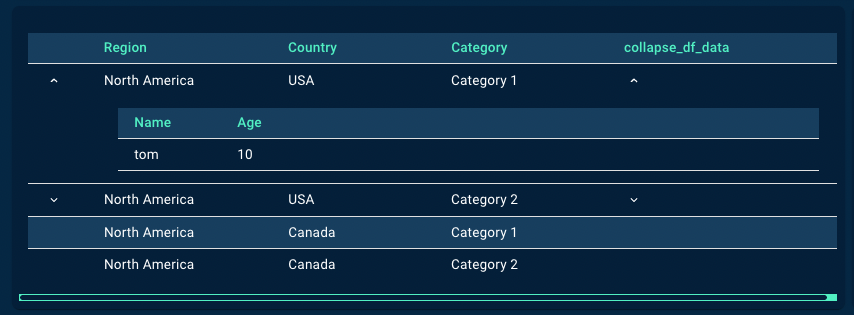

# Introduction

The expandable table component helps to build nested tables (2 levels) which can be used to show information on demand to the user.



# Tooltip:

- Tooltips briefly describe a UI element. They're best used for labelling UI elements with no text, like icon-only buttons and fields.
- It is shown when user hover on the icon, text link, button.
- The will remain visible until user leaves that interaction area.

# Popover:

- Popover displays additional information in a temporary window. It can include rich content such as titles, long definitions, links and buttons
- Use when you need to display additional information in form of text on “i” icon.
- It is shown when user clicks on a word or icon.
- The window remains visible until they click “x” icon on popover.

# Arguments

- `expandable_df` (df, required) : This can be used in two different scenarios -
  * Scenario 1 : Groupby operations on a dataframe visualized as an expandable table
    In this scenario, all columns of the outer and expanded table as passed in the dataframe. While rendering, the outer table forms the columns on used for the groupby operations, while the aggregated values are shown in the expanded table. The columns which are not specified for aggregation using `value_cols_aggfunc_dict` is used by default for group by operation and shown in the outer table. The `value_cols_aggfunc_dict` parameter is mandatory when using this approach.
  * Scenario 2 : Pre computed values for outer table and expanded table
    In this scenario, the dataframe contains all columns to be shown in the outer table. It is mandatory to pass `expandable_rows_flag` and `expandable_rows_values` while using this approach.
- `value_cols_aggfunc_dict` (dict, optional): This parameter is mandatory if `expandable_df` is passed using **Scenario 1**. The dictionary contains all the possible aggregations to pe performed while rendering the expanded table. The key is column name to aggregate and value is function or list of functions. Sample JSON structure -

  ```
  {
    "Val_col_1": "mean",
    "Val_col_2": "sum",
  }
  ```
- `expandable_rows_flag` (list, optional): This parameter is required if `expandable_df` is passed using **Scenario 2**. This contains a list of values whose length is equal to the number of rows in `expandable_df`. The list can take boolean values `True` or `False` - indicating if each row in `expandable_df` is expandable or not. Sample JSON structure -

  ```
  {
    "Val_col_1": "mean",
    "Val_col_2": "sum",
  }
  ```
- `expandable_rows_values` (list, optional): This parameter is required if `expandable_df` is passed using **Scenario 2**. This parameter contains a list of dictionaries whose length is equal to the number of rows in `expandable_df`. Each value in the list represents the table to be shown when expanded (this can be obtained by using `your_df_name.to_dict()`). For rows that do not have an expandable table, as indicated by `expandable_rows_flag`, the value can be set to `False` instead of passing a dictionary.  Sample JSON structure -

  ```
  {
    "Val_col_1": "mean",
    "Val_col_2": "sum",
  }
  ```

*Kindly note that when using Scenario 2, the index and length of `expandable_df`, `expandable_rows_flag` and `expandable_rows_values` need to be the same.*

# Tooltip:

- Tooltips briefly describe a UI element. They're best used for labelling UI elements with no text, like icon-only buttons and fields.
- It is shown when user hover on the icon, text link, button.
- The will remain visible until user leaves that interaction area


# Popover:

- Popover displays additional information in a temporary window. It can include rich content such as titles, long definitions, links and buttons
- Use when you need to display additional information in form of text on “i” icon.
- It is shown when user clicks on a word or icon.
- The window remains visible until they click “x” icon on popover.

# Attributes and Methods

- `json_string` : An attribute of the component conversion object which returns a JSON string for the component, which is used to render the component on the UI. Kindly refer the sample codes for usage.
- `add_tooltip` : A method which is used to add tooltip to provide contextual information about the feature. It can take the following parameters -

    - `isTooltip` (bool,optional,default=True) : A flag to determine to add tooltip or not.
    - `tooltip_text` (string, optional, default="This is a tooltip") : Title of the tooltip which displays when user hovers on it.
    - `placement` (string, optional, default="top") : Specifies the position of the tooltip. Values are "top", "bottom", "left", "right", "top-start", "top-end", "bottom-start", "bottom-end","left-start", "left-end", "right-start", "right-end"

- `component_dict` : An attribute which returns the dictionary/JSON structure of the component. Unlike `json_string` attribute which returns a JSON string, this returns a python dictionary.
- `add_information` : A method which is used to add information inputs (information icon which opens a pop-up on click). It can take the following parameters -

    - `visual_object` (widget factory lite visual object, required) : A widget factory lite visual object (example - Table, Graph, Insights), that needs to shown on click of the information button
    - `title` (string, optional, default=None) : Title of the popup that comes up when the information button is clicked.
    See sample code section below to understand how to configure information inputs.

# Sample Codes
## Scenario 1 : Groupby operations on a dataframe visualized as an expandable table

This example shows how a groupby operation on a dataframe can be visualized as an expandable table.

```
import pandas as pd
from codex_widget_factory_lite.visuals.expandable_table import ExpandableTable
# Hardcoding a sample dataframe here, please ingest you dataset or create
expandable_df = pd.DataFrame(
    columns=['Region', 'Country', 'Random Metric'],
    data=[
        ['North America', 'USA', 100],
        ['North America', 'USA', 200],
        ['North America', 'Canada', 10],
        ['North America', 'Canada', 20],
    ]
)
value_cols_aggfunc_dict = { "Random Metric": "sum" }
output= ExpandableTable(expandable_df = expandable_df,
  value_cols_aggfunc_dict = value_cols_aggfunc_dict)
output.add_tooltip(isTooltip=True,tooltip_text="This is a tooltip" ,placement="top")
dynamic_outputs=output.json_string
```

## Scenario 2 : Pre computed values for outer table and expanded table

In the example below -

* The dataframe `expandable_df` represents the outer table
* The list `expandable_rows_flag` represents whether each row in `expandable_df` is expandable
* The list `expandable_rows_values` contains the JSON structure for the expanded table to be shown for each table

```
import pandas as pd
from codex_widget_factory_lite.visuals.expandable_table import ExpandableTable
# Hardcoding a sample dataframe here, please ingest you dataset or create
expandable_df = pd.DataFrame(
    columns=['Region', 'Country', 'Category'],
    data=[
        ['North America', 'USA', 'Category 1'],
        ['North America', 'USA', 'Category 2'],
        ['North America', 'Canada', 'Category 1'],
        ['North America', 'Canada', 'Category 2']
    ]
)
expandable_rows_flag = [True, True, False, False]
expandable_rows_values = [{"Name":{"0":"tom"},"Age":{"0":10}},
    {"Name":{"1":"nick","2":"juli"},"Age":{"1":15,"2":14}}, False, False]
output= ExpandableTable(expandable_df = expandable_df,
  expandable_rows_flag = expandable_rows_flag,
  expandable_rows_values = expandable_rows_values)
output.add_tooltip(isTooltip=True,tooltip_text="This is a tooltip" ,placement="top")
dynamic_outputs =output.json_string
```
## Information Inputs

This component can be configured to have an information button, which opens up a pop up when clicked. The popup can be customized to contain the following visual components -

* Simple Table
* Expandable Table
* Insights
* Grid Table

Simulators are not supported as a component on the information inputs popup.

The example below illustrates how to configure information inputs for expandable table where a plotly graph is shown in the popup.

```
# primary visual component - expandable table
import pandas as pd
from codex_widget_factory_lite.visuals.expandable_table import ExpandableTable
# Hardcoding a sample dataframe here, please ingest you dataset or create
expandable_df = pd.DataFrame(
    columns=['Region', 'Country', 'Category'],
    data=[
        ['North America', 'USA', 'Category 1'],
        ['North America', 'USA', 'Category 2'],
        ['North America', 'Canada', 'Category 1'],
        ['North America', 'Canada', 'Category 2']
    ]
)
expandable_rows_flag = [True, True, False, False]
expandable_rows_values = [{"Name":{"0":"tom"},"Age":{"0":10}},
    {"Name":{"1":"nick","2":"juli"},"Age":{"1":15,"2":14}}, False, False]
expandable_table_outputs = ExpandableTable(expandable_df = expandable_df,
  expandable_rows_flag = expandable_rows_flag,
  expandable_rows_values = expandable_rows_values)

# secondary visual component, shown as pop up on clicking information button
# this example shows plotly chart, you can add visual components such as tables, graphs, insights, etc.
# Simulators do not have information inputs support
from codex_widget_factory_lite.visuals.plotly_graph import PlotlyGraph
import plotly.graph_objects as go
fig = go.Figure(go.Waterfall(
    name = "20", orientation = "v",
    measure = ["relative", "relative", "total", "relative", "relative", "total"],
    x = ["Sales", "Consulting", "Net revenue", "Purchases",
        "Other expenses", "Profit before tax"],
    textposition = "outside",
    text = ["+60", "+80", "", "-40", "-20", "Total"],
    y = [60, 80, 0, -40, -20, 0],
    connector = {"line":{"color":"rgb(63, 63, 63)"}},
))
fig.update_layout(
    title = "Profit and loss statement 2018",
    showlegend = True
)
information_outputs = PlotlyGraph(plot_object = fig)

# combine primary and secondary visual components
expandable_table_outputs.add_information(visual_object = information_outputs,
    title = "Deep Dive Graph")
expandable_table_outputs.add_tooltip(isTooltip=True,tooltip_text="This is a tooltip" ,placement="top")
dynamic_outputs = expandable_table_outputs.json_string
```
# JSON Structure

The complete JSON structure of the component with sample data is captured below -

```
{
   "columns": [
     {
       "id": <Will be used internally to show the data>,
       "label": <Used as the Table Header>
     }, ...
   ],
   "rows": [
     {
       "collapse": <boolean, if true renders the nested table, else ignores the , One needs to pass the data of the nested table
          as rows,columns inside the "data" key(line 18) inside each row which should be expanded>,
       ],
       "data": {
         "collapse": <If true, you need to pass data propery inside this >,
         "title": <Title of the table/subtable-+>,
         "columns": [
           {
             "id": <column_id>,
             "label": <column label>
           },
         ],
         "rows": [
         ]
       }
   ],
   "isExpandable": <boolean>,
   "assumptions": <Information inputs object>,
   "isTooltip": true,
   "tooltip_text": "This is a tooltip",
   "placement": "top-start"
}
```


