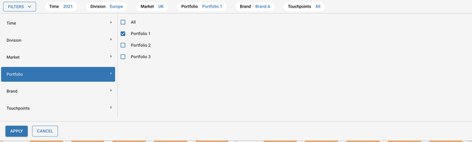
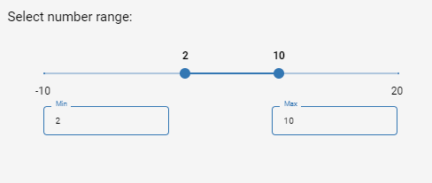
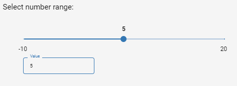
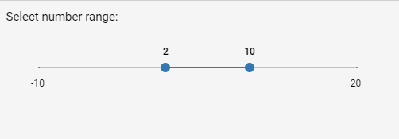

# Introduction

The filter component aids in applying data filers to all the screens on Co.dx. This documentation illustrates how the filter class hcan be used to translate inputs
into a JSON structure that can be rendered as an filter on the Co.dx UI. Typically these filter values are precomputed from an ADS or SQL table and stored elsewhere for easy retrival. The different features of the filter widget can be summarised as -

- Configurable filter values - single select, multi select, date values, etc.
- Ability to configure hirearchical filters. Example - filter sales based on region, country and state selection, here based on the filter applied te the region level, the filter values are also subsetted for countries and states.
- Define default values for the filters
- Retain filter selection across screens


# Arguments

* `hirearchy_filter_df` (pandas dataframe, required) : This dataframe should contain the all possible combinations of filters. Each row contains a combination of filter. Hierarchy of filters is applied left to right. Possible filter values are taken from the Columns and filter names are the column names. Filters in the UI appear in the same order of hirearchy_filter_df columns.
* `default_values_selected` (dict, required) : The default values of the filters that are applied when screen is refreshed or loads for the first time. The keys are the filter names and values are the filter values to be selected on the screen. For multi select filters provide the value(s) in a list. For date filters, pass a dictionary containing keys start date and end date with their respetive values. Other filters take single value, either a string or integer or date based on filter.
* `multi_select_filters` (list, required) : The names of the filters that contain multiple selection option. Provide the list of filter names that matches with column names in df or that matches with the keys in static_filters.
* `multi_select_all_filters` (list, required) : The names of the filters that contain "All" option. Provide the list of filter names that matches with column names in df or that matches with the keys in static_filters.
* `static_filters` (dict, optional, default={}) : The additional filters which are not present in df. The filters are independent of the filters in df and doesn't have hierarchy. These filters appear in the order after the filters present in df. The keys are the filter names and values are the list of possible options for the filter. By default, static_filters is empty.
* `date_filters` (dict, optional, default={}) : A dictonary containing all date filters that need to added. The key contains the name of the name of the filter and the value is a dictionay containing two keys `format` and `suppressUTC`. Sample `date_filters` is shown as as below - `{'Date': {'format': "DD/MM/YYYY", "suppressUTC": True}}`
* `current_filter_params` (dict, required) : current_filter_params is a request payload comes from UI. It contains two keys, "current_filter", "selected". It is empty dict when screen is loaded for the first time. **It is mandatory to pass this parameter - this variable is available by default in the execution environment, see examples for more information**

# Attributes and Methods

- `json_string` : An attribute of the component conversion object which returns a JSON string for the component, which is used to render the component on the UI. Kindly refer the sample codes for usage.
- `component_dict` : An attribute which returns the dictionary/JSON structure of the component. Unlike `json_string` attribute which returns a JSON string, this returns a python dictionary.

# Sample Codes

## Hirearchichal + Non Hirearchichal Filters

This example shows how to configure two hirearchical filters (region & country), followed by a static/Non hirearchical filter (category).

```
from codex_widget_factory_lite.visuals.filter import Filter
import pandas as pd

# Example hardcoded df below, please ingest data or create your own data
hirearchy_filters = pd.DataFrame(
    columns=['Region', 'Country'],
    data=[
        ['North America', 'USA'],
        ['North America', 'Canada'],
        ['Europe', 'UK'],
        ['Europe', 'Germany'],
    ]
)
# Static filter filters, provide filter_names, filter_options
static_filters = {'Category': ['Category 1','Category 2']}
# The default value to be selected for a filter, provide filter_name, filter_values
default_values_selected = {'Region': 'North America', 'Country': 'USA',
    'Category': 'Category 1'}

dynamic_outputs = Filter(hirearchy_filter_df = hirearchy_filters,
  default_values_selected = default_values_selected,
  static_filters = static_filters,
  current_filter_params = current_filter_params).json_string
```

## Single select and Multi select Filters


This example shows three hirearchichical filters - Region, Country & Category. Here, Region & Catgeory are configured as multiselected filters. This example also shows how to enable `All` filter values selection for the Category filter.

```
from codex_widget_factory_lite.visuals.filter import Filter
import pandas as pd

# Example hardcoded df below, please ingest data or create your own data
hirearchy_filter_df = pd.DataFrame(
    columns=['Region', 'Country', 'Category'],
    data=[
        ['North America', 'USA', 'Category 1'],
        ['North America', 'USA', 'Category 2'],
        ['North America', 'Canada', 'Category 1'],
        ['North America', 'Canada', 'Category 2'],
        ['Europe', 'UK', 'Category 1'],
        ['Europe', 'Germany', 'Category 2']
    ]
)
# The default value to be selected for a filter, provide filter_name, filter_values
default_values_selected = {'Region': 'North America', 'Country': 'USA',
    'Category': 'Category 1'}
# Configure your multi select example here
multi_select_filters = ['Region', 'Category']
# Within multiselect options, configure filters which have the "All" selection enabled
all_option_filters = ['Category']

dynamic_outputs = Filter(hirearchy_filter_df = hirearchy_filter_df,
  default_values_selected = default_values_selected,
  multi_select_filters = multi_select_filters,
  multi_select_all_filters = all_option_filters,
  current_filter_params = current_filter_params).json_string
```


## Date filters

The filters can be configured to have date values. The example code below shows how date filters can be configured.

```
from codex_widget_factory_lite.visuals.filter import Filter
import pandas as pd

# Example hardcoded df below, please ingest data or create your own data
hirearchy_filters = pd.DataFrame(
    columns=['Region', 'Country'],
    data=[
        ['North America', 'USA'],
        ['North America', 'Canada'],
        ['Europe', 'UK'],
        ['Europe', 'Germany'],
    ]
)
# Date filters, provide filter_names, filter_options
date_filters = {'Date': {'format': "DD/MM/YYYY", "suppressUTC": True}}
# The default value to be selected for a filter, provide filter_name, filter_values
# Notice format of default value for date
default_values_selected = {'Region': 'North America', 'Country': 'USA',
    'Date': {"start_date": "2022-01-29T00:00:00", "end_date": "2022-02-06T23:59:00"}}

dynamic_outputs = Filter(hirearchy_filter_df = hirearchy_filters,
  default_values_selected = default_values_selected,
  date_filters = date_filters,
  current_filter_params = current_filter_params).json_string
```


## Number Range filters

The filters can be configured to number filters, single and range filters.



The example code below shows how number range filters can be configured.

```
import json
data = {
  "dataValues": [
    {
      "widget_filter_index": 0,
      "widget_filter_function": False,
      "widget_filter_function_parameter": False,
      "widget_filter_hierarchy_key": False,
      "widget_filter_isall": False,
      "widget_filter_multiselect": False,
      "widget_tag_key": "Range_Selector",
      "widget_tag_label": "Range Selector",
      "widget_filter_type": "range_select",
      "widget_filter_params": {
        "title": "Select number range:",
        "min": -10,
        "max": 20,
        "step": .01,
        "enableInputBox": True
      }
    }
  ],
  "defaultValues": {
    "Range_Selector": [2, 10]
  }
}

dynamic_outputs = json.dumps(data)
```

### __Variations of number range filter:-__

### _Single value_



There'll only be a single slider. Set _Range_Selector_ to a single value

```
import json
data = {
  "dataValues": [
    {
      "widget_filter_index": 0,
      "widget_filter_function": False,
      "widget_filter_function_parameter": False,
      "widget_filter_hierarchy_key": False,
      "widget_filter_isall": False,
      "widget_filter_multiselect": False,
      "widget_tag_key": "Range_Selector",
      "widget_tag_label": "Range Selector",
      "widget_filter_type": "range_select",
      "widget_filter_params": {
        "title": "Select number range:",
        "min": -10,
        "max": 20,
        "step": .01,
        "enableInputBox": True
      }
    }
  ],
  "defaultValues": {
    "Range_Selector": 5
    # Or you can use [5]
  }
}

dynamic_outputs = json.dumps(data)
```

### _Multiple values_


There'll be multiple sliders available. Set _Range_Selector_ to an ```array```

```
import json
data = {
  "dataValues": [
    {
      "widget_filter_index": 0,
      "widget_filter_function": False,
      "widget_filter_function_parameter": False,
      "widget_filter_hierarchy_key": False,
      "widget_filter_isall": False,
      "widget_filter_multiselect": False,
      "widget_tag_key": "Range_Selector",
      "widget_tag_label": "Range Selector",
      "widget_filter_type": "range_select",
      "widget_filter_params": {
        "title": "Select number range:",
        "min": -10,
        "max": 20,
        "step": .01,
        "enableInputBox": True
      }
    }
  ],
  "defaultValues": {
    "Range_Selector": [2, 10]
  }
}

dynamic_outputs = json.dumps(data)
```

### _Without range text box_



The text boxes used for setting the slider value will be unavailable. Set _enableInputBox_ flag to ```False```.

```
import json
data = {
  "dataValues": [
    {
      "widget_filter_index": 0,
      "widget_filter_function": False,
      "widget_filter_function_parameter": False,
      "widget_filter_hierarchy_key": False,
      "widget_filter_isall": False,
      "widget_filter_multiselect": False,
      "widget_tag_key": "Range_Selector",
      "widget_tag_label": "Range Selector",
      "widget_filter_type": "range_select",
      "widget_filter_params": {
        "title": "Select number range:",
        "min": -10,
        "max": 20,
        "step": .01,
        "enableInputBox": False # Set this flag to false
      }
    }
  ],
  "defaultValues": {
    "Range_Selector": [2, 10]
  }
}

dynamic_outputs = json.dumps(data)
```
# Sample Filter Code for PowerBI

This Example shows how to apply filters for Power BI Reports or Visuals. 

```
from codex_widget_factory_lite.visuals.filter import Filter
import pandas as pd
import json

hirearchy_filters = pd.DataFrame(
    columns=['country'], # Replace with actual column name from your dataset
    data=[
        ['India'],['USA'],
        ['Brazil'],['UK'],
        ['Germany'],['France'],['Argentina'],['Australia'],['Greece'],['Belgium'],['Austria']
        ,['Brazil'],['China'],['Estonia'],['Iran']
    ] #Replace with actual data from your dataset.
)

# The default value to be selected for a filter, provide filter_name, filter_values
default_values_selected = { 'country': 'Argentina'}
 
dynamic = Filter(hirearchy_filter_df = hirearchy_filters,
  default_values_selected = default_values_selected,
 
  current_filter_params = current_filter_params).json_string
dynamic_object = json.loads(dynamic)
table_name=['Country_list'] #Replace with actual Table name from your dataset.

String2=json.dumps(table_name)
object2=json.loads(String2)
dynamic_object['table_name'] = object2

dynamic_outputs=json.dumps(dynamic_object)
```

# Sample Filter Code for Tableau

This Example shows how to apply filters for Tableau Workbooks. 

```
from codex_widget_factory_lite.visuals.filter import Filter
import pandas as pd

# Example hardcoded df below, please ingest data or create your own data
hirearchy_filters = pd.DataFrame(
    columns=['Region','Category'],# Replace with actual filterField
    data=[['East','Office Supplies'],['West','Furniture'],['East','Furniture']])
     #Replace with acutal filterValue

# The default value to be selected for a filter, provide filter_name, filter_values
default_values_selected = {'Region': 'East','Category':'Furniture'}

dynamic_outputs = Filter(hirearchy_filter_df = hirearchy_filters,
  default_values_selected = default_values_selected,
 
  current_filter_params = current_filter_params).json_string

```


# JSON Structure

The complete JSON structure of the component with sample data is captured below -

```
{
  "dataValues": [
    {
      "widget_filter_index": 0,
      "widget_filter_function": false,
      "widget_filter_function_parameter": false,
      "widget_filter_hierarchy_key": false,
      "widget_filter_isall": false,
      "widget_filter_multiselect": false,
      "widget_tag_key": "Time",
      "widget_tag_label": "Time",
      "widget_tag_input_type": "select",
      "widget_tag_value": [
        "2021"
      ]
    },
    {
      "widget_filter_index": 1,
      "widget_filter_function": false,
      "widget_filter_function_parameter": false,
      "widget_filter_hierarchy_key": false,
      "widget_filter_isall": false,
      "widget_filter_multiselect": false,
      "widget_tag_key": "Division",
      "widget_tag_label": "Division",
      "widget_tag_input_type": "select",
      "widget_tag_value": [
        "Europe"
      ]
    },
    {
      "widget_filter_index": 2,
      "widget_filter_function": false,
      "widget_filter_function_parameter": false,
      "widget_filter_hierarchy_key": false,
      "widget_filter_isall": false,
      "widget_filter_multiselect": false,
      "widget_tag_key": "Market",
      "widget_tag_label": "Market",
      "widget_tag_input_type": "select",
      "widget_tag_value": [
        "UK"
      ]
    },
    {
      "widget_filter_index": 3,
      "widget_filter_function": false,
      "widget_filter_function_parameter": false,
      "widget_filter_hierarchy_key": false,
      "widget_filter_isall": true,
      "widget_filter_multiselect": true,
      "widget_tag_key": "Portfolio",
      "widget_tag_label": "Portfolio",
      "widget_tag_input_type": "select",
      "widget_tag_value": [
        "All",
        "Portfolio 1",
        "Portfolio 2",
        "Portfolio 3"
      ]
    },
    {
      "widget_filter_index": 4,
      "widget_filter_function": false,
      "widget_filter_function_parameter": false,
      "widget_filter_hierarchy_key": false,
      "widget_filter_isall": true,
      "widget_filter_multiselect": true,
      "widget_tag_key": "Brand",
      "widget_tag_label": "Brand",
      "widget_tag_input_type": "select",
      "widget_tag_value": [
        "All",
        "Brand A",
        "Brand B",
        "Brand C",
        "Brand D",
        "Brand E",
        "Brand F",
        "Brand G",
        "Brand H",
        "Brand I"
      ]
    },
    {
      "widget_filter_index": 5,
      "widget_filter_function": false,
      "widget_filter_function_parameter": false,
      "widget_filter_hierarchy_key": false,
      "widget_filter_isall": false,
      "widget_filter_multiselect": false,
      "widget_tag_key": "Touchpoints",
      "widget_tag_label": "Touchpoints",
      "widget_tag_input_type": "select",
      "widget_tag_value": [
        "All"
      ]
    },
    {
      "widget_filter_index": 6,
      "widget_filter_function": false,
      "widget_filter_function_parameter": false,
      "widget_filter_hierarchy_key": false,
      "widget_filter_isall": false,
      "widget_filter_multiselect": true,
      "widget_tag_key": "Taxonomy",
      "widget_tag_label": "Taxonomy",
      "widget_tag_input_type": "select",
      "widget_filter_params": {
          "legends": [
              {"label": " 100% Available", "color": "#3CFF33"},
              {"label": "90% Available", "color": "#FF7D33"},
              {"label": "Unavailable", "color": "#BDBDBC"}
          ],
          "widget_filter_alertInfo": {
              "severity" :"info",
              "label" :"Alert success message"
          }
     },
  ],
  "defaultValues": {
    "Time": "2021",
    "Division": "Europe",
    "Market": "UK",
    "Portfolio": "Portfolio 1",
    "Brand": ["Brand A"], ##### MAKE SURE THAT FOR ANY FILTER WHICH HAS MULTISELECT as TRUE, YOU NEED TO PASS THE DATA AS A LIST
    "Touchpoints": "All"
  }
}
```

