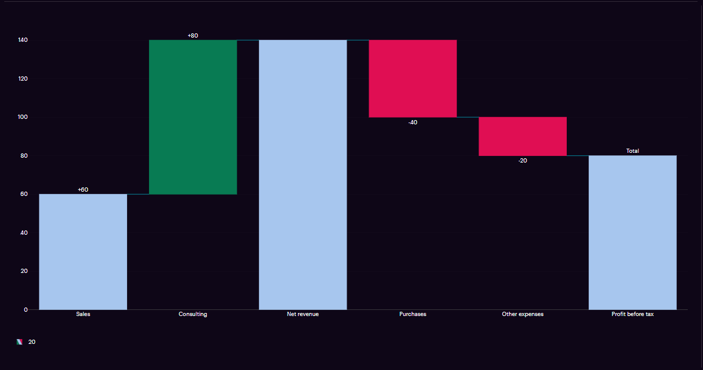
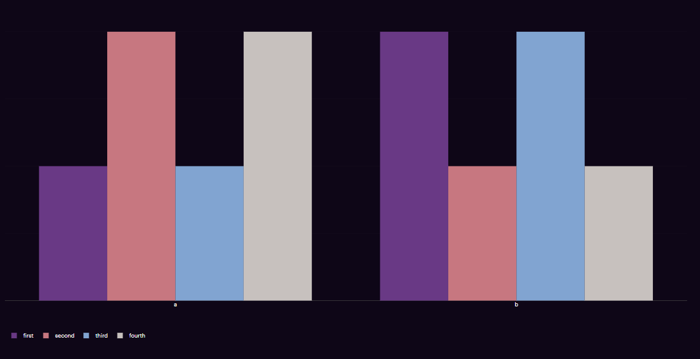
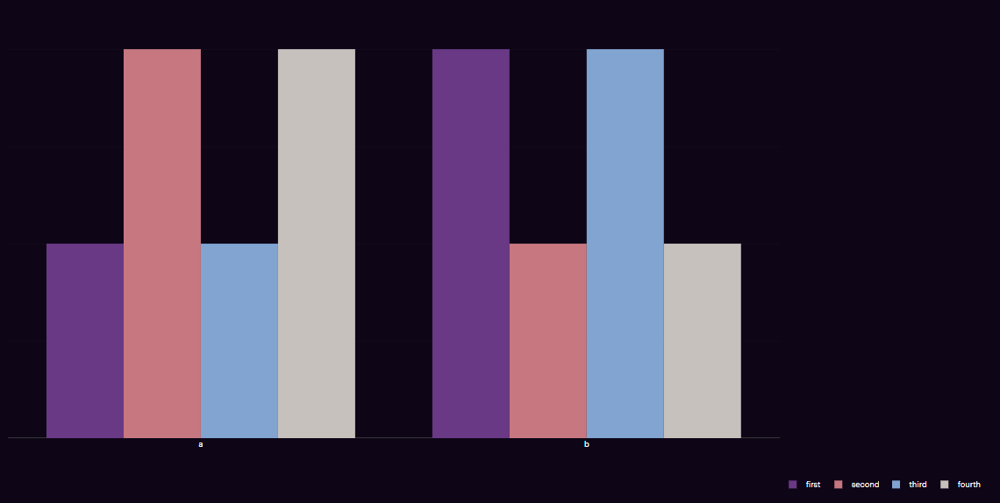
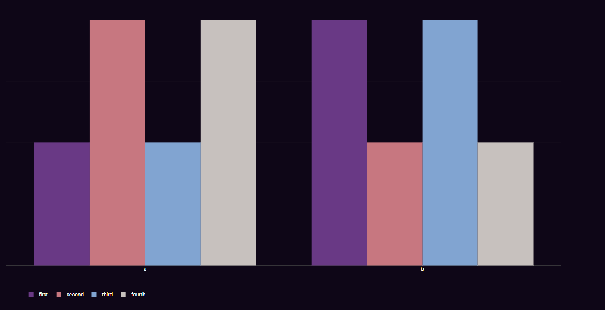
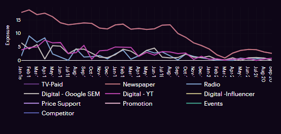
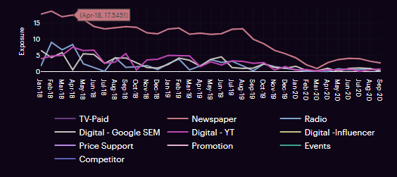
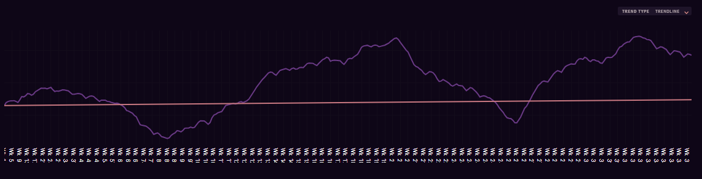
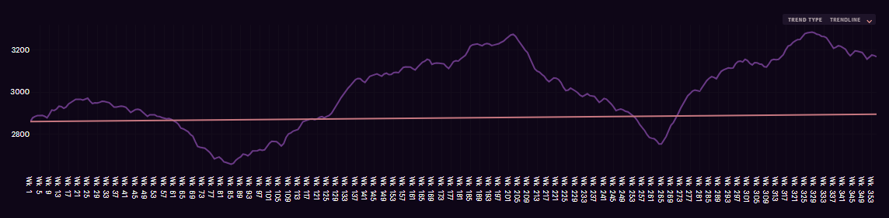
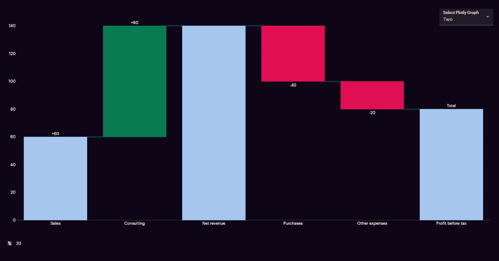
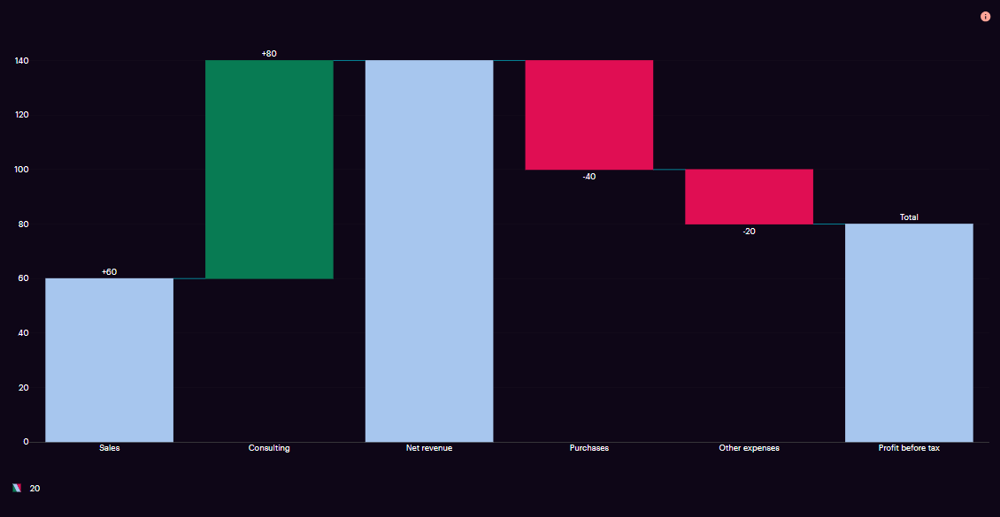

# Introduction

The Plotly Graph component helps render a wide variety of visualizations on the UI.



# Tooltip:

- Tooltips briefly describe a UI element. They're best used for labelling UI elements with no text, like icon-only buttons and fields.
- It is shown when user hover on the icon, text link, button.
- The will remain visible until user leaves that interaction area.

# Popover:

- Popover displays additional information in a temporary window. It can include rich content such as titles, long definitions, links and buttons
- Use when you need to display additional information in form of text on “i” icon.
- It is shown when user clicks on a word or icon.
- The window remains visible until they click “x” icon on popover.

# Arguments

- `plot_object` (dict or plotly.graph_objs.Figure, required) : A dictionary or a plotly object. If dictionary, it is required to have keys data and layout.
- `dropdown_options` (list, optional): A list of options, with each option being a dictionary having two mandatory keys - label, value.
This value will become the action_type that can be referred in the UIac.
- `selected_option_value` (str, optional): Used to set a particular option from the dropdown. The string value should be the selected option value. By default this is set to the value of the first option.
- `dropdown_label` (str, optional): Used to set the label of the dropdown. By default, it is set to 'Select'.
    ____

# Tooltip:

- Tooltips briefly describe a UI element. They're best used for labelling UI elements with no text, like icon-only buttons and fields.
- It is shown when user hover on the icon, text link, button.
- The will remain visible until user leaves that interaction area.


# Popover:

- Popover displays additional information in a temporary window. It can include rich content such as titles, long definitions, links and buttons
- Use when you need to display additional information in form of text on “i” icon.
- It is shown when user clicks on a word or icon.
- The window remains visible until they click “x” icon on popover.

# Attributes and Methods

- `json_string` : An attribute of the component conversion object which returns a JSON string for the component, which is used to render the component on the UI. Kindly refer the sample codes for usage.
- `add_tooltip` : A method which is used to add tooltip to provide contextual information about the feature. It can take the following parameters -

    - `isTooltip` (bool,optional,default=True) : A flag to determine to add tooltip or not.
    - `tooltip_text` (string, optional, default="This is a tooltip") : Title of the tooltip which displays when user hovers on it.
    - `placement` (string, optional, default="top") : Specifies the position of the tooltip. Values are "top", "bottom", "left", "right", "top-start", "top-end", "bottom-start", "bottom-end","left-start", "left-end", "right-start", "right-end"

- `component_dict` : An attribute which returns the dictionary/JSON structure of the component. Unlike `json_string` attribute which returns a JSON string, this returns a python dictionary.
- `add_information` : A method which is used to add information inputs (information icon which opens a pop-up on click). It can take the following parameters -

    - `visual_object` (widget factory lite visual object, required) : A widget factory lite visual object (example - Table, Graph, Insights), that needs to shown on click of the information button
    - `title` (string, optional, default=None) : Title of the popup that comes up when the information button is clicked.
    See sample code section below to understand how to configure information inputs.

# Sample Codes
## Simple Plotly Chart

The example shows how a simple waterfall chart can be setup.

Visit the [plotly website](https://plotly.com/python/) to look at other charts that can plotted besides the one shown in the sample code.


```
from codex_widget_factory_lite.visuals.plotly_graph import PlotlyGraph
import plotly.graph_objects as go

fig = go.Figure(go.Waterfall(
    name = "20", orientation = "v",
    measure = ["relative", "relative", "total", "relative", "relative", "total"],
    x = ["Sales", "Consulting", "Net revenue", "Purchases", "Other expenses", "Profit before tax"],
    textposition = "outside",
    text = ["+60", "+80", "", "-40", "-20", "Total"],
    y = [60, 80, 0, -40, -20, 0],
    connector = {"line":{"color":"rgb(63, 63, 63)"}},
))

fig.update_layout(
    title = "Profit and loss statement 2018",
    showlegend = True
)
output=PlotlyGraph(plot_object = fig)
output.add_tooltip(isTooltip=True,tooltip_text="This is a tooltip" ,placement="top")
dynamic_outputs = output.json_string
```
## sample plotly chart with legends
```
from codex_widget_factory_lite.visuals.plotly_graph import PlotlyGraph
import plotly.graph_objects as go

fig = go.Figure()
fig.add_trace(go.Bar(name="first", x=["a", "b"], y=[1,2]))
fig.add_trace(go.Bar(name="second", x=["a", "b"], y=[2,1]))
fig.add_trace(go.Bar(name="third", x=["a", "b"], y=[1,2]))
fig.add_trace(go.Bar(name="fourth", x=["a", "b"], y=[2,1]))
output= PlotlyGraph(plot_object = fig)
output.add_tooltip(isTooltip=True,tooltip_text="This is a tooltip" ,placement="top")
dynamic_outputs=output.json_string
```



# customising legends in plotly chart
## To customize legends in Plotly, you can use the fig.update_layout method and pass appropriate values. Legends can be customized in various ways, including positioning and orientation
- `Customizing legends positioning`: Legends positioning can be customized by setting values for x and y coordinates. This allows you to precisely control where the legend appears on the plot.
- `Changing legends orientation`:To change the orientation of legends to vertical/horizontal, you can pass the key-value pair orientation: 'v'/'h' in the legend dictionary. This setting will adjust the legend to display vertically/horizontally

```
from codex_widget_factory_lite.visuals.plotly_graph import PlotlyGraph
import plotly.graph_objects as go

fig = go.Figure()
fig.add_trace(go.Bar(name="first", x=["a", "b"], y=[1,2]))
fig.add_trace(go.Bar(name="second", x=["a", "b"], y=[2,1]))
fig.add_trace(go.Bar(name="third", x=["a", "b"], y=[1,2]))
fig.add_trace(go.Bar(name="fourth", x=["a", "b"], y=[2,1]))

fig.update_layout(
    showlegend = True,
    legend={
        "orientation":"h",
        'x':1,
        'y':-0.09
    }
)
output= PlotlyGraph(plot_object = fig)
output.add_tooltip(isTooltip=True,tooltip_text="This is a tooltip" ,placement="top")
dynamic_outputs=output.json_string

```


# Customizing the layout margins
## To customise the layout margins in Plotly, pass the marginOverride property inside layout dictionary with appropriate top, right, left and bottom values as show below

```
from codex_widget_factory_lite.visuals.plotly_graph import PlotlyGraph
import plotly.graph_objects as go
import json

fig = go.Figure()
fig.add_trace(go.Bar(name="first", x=["a", "b"], y=[1,2]))
fig.add_trace(go.Bar(name="second", x=["a", "b"], y=[2,1]))
fig.add_trace(go.Bar(name="third", x=["a", "b"], y=[1,2]))
fig.add_trace(go.Bar(name="fourth", x=["a", "b"], y=[2,1]))

fig.update_layout(
    showlegend = True,
    legend={
        "orientation":"h",
        'x':0.03,
        'y':-0.09
    }
)
plotly_json = PlotlyGraph(plot_object = fig).component_dict
plotly_json['layout']['marginOverride']=dict(t=0, r=100, l=0, b=50)
dynamic_outputs = json.dumps(plotly_json)

```
## plotly with customised margin


# Customizing margins and legends in Plotly to resolve issues of overlapping.

## To address issues where legends overlap with x-axis labels or x-axis labels get cut off from the screen in Plotly, you can customize the legend position or apply margins as needed. One way to solve this is by adjusting the legend's position using parameters like x and y values to move the legend to a desired location, or by applying margin.

# Addressing overlap issue by customising the legends

## example of plotly graph where legends are overlapping with x axis lables.


## This issue can be solved adjusting legend y positions



# Addressing labels getting cut off form the screen by customising the margin

## example of plotly graph where x and y labels getting cut off from the screen


## This issue can be solved by customizsing the margin property


`Thus By customizing the legend or margin properties according to specific needs, you can effectively address issues of overlapping in Plotly charts`

## Sample Plotly Chart With Dropdown

The example shows plotly chart with dropdown which should update based on the selected value from the dropdown. Please note that we
are updating `selected_option_value` as well along with `plot_object` whenever there is an `action_type`.

```
from codex_widget_factory_lite.visuals.plotly_graph import PlotlyGraph
import plotly.graph_objects as go

fig = go.Figure(go.Waterfall(
    name = "20", orientation = "v",
    measure = ["relative", "relative", "total", "relative", "relative", "total"],
    x = ["Sales", "Consulting", "Net revenue", "Purchases", "Other expenses", "Profit before tax"],
    textposition = "outside",
    text = ["+60", "+80", "", "-40", "-20", "Total"],
    y = [60, 80, 0, -40, -20, 0],
    connector = {"line":{"color":"rgb(63, 63, 63)"}},
))

fig.update_layout(
    title = "Profit and loss statement 2018",
    showlegend = True
)

dropdown_options = [{'label':'One', 'value': 'one'}, {'label':'Two', 'value': 'two'}]
selected_option_value = 'two'

try:
    if "action_type" in globals().keys():
        if action_type == 'one':
            fig = go.Figure(go.Waterfall(
                name = "20", orientation = "v",
                measure = ["relative", "relative", "total", "relative", "relative", "total"],
                x = ["Sales", "Consulting", "Net revenue", "Purchases", "Other expenses", "Profit before tax"],
                textposition = "outside",
                text = ["+60", "+80", "", "-40", "-20", "Total"],
                y = [10, 40, 0, -10, -40, 0],
                connector = {"line":{"color":"rgb(63, 63, 63)"}},
            ))
        selected_option_value = action_type
except:
    pass

output=PlotlyGraph(
    plot_object = fig,
    dropdown_options = dropdown_options,
    selected_option_value = selected_option_value,
    dropdown_label = 'Select Plotly Graph'
)
output.add_tooltip(isTooltip=True,tooltip_text="This is a tooltip" ,placement="top")
dynamic_outputs =output.json_string
```

## Plotly Chart With Dropdown


## Information Inputs

This component can be configured to have an information button, which opens up a pop up when clicked. The popup can be customized to contain the following visual components -

* Simple Table
* Expandable Table
* Insights
* Grid Table

Simulators are not supported as a component on the information inputs popup.

The example below illustrates how to configure information inputs for plotly graph where a expandable table is shown in the popup.

```
# primary visual component - plotly graph
from codex_widget_factory_lite.visuals.plotly_graph import PlotlyGraph
import plotly.graph_objects as go
fig = go.Figure(go.Waterfall(
    name = "20", orientation = "v",
    measure = ["relative", "relative", "total", "relative", "relative", "total"],
    x = ["Sales", "Consulting", "Net revenue", "Purchases",
        "Other expenses", "Profit before tax"],
    textposition = "outside",
    text = ["+60", "+80", "", "-40", "-20", "Total"],
    y = [60, 80, 0, -40, -20, 0],
    connector = {"line":{"color":"rgb(63, 63, 63)"}},
))
fig.update_layout(
    title = "Profit and loss statement 2018",
    showlegend = True
)
graph_outputs = PlotlyGraph(plot_object = fig)

# secondary visual component, shown as pop up on clicking information button
# this example shows expandable table, you can add visual components such as tables, graphs, insights, etc.
# Simulators do not have information inputs support
import pandas as pd
from codex_widget_factory_lite.visuals.expandable_table import ExpandableTable
# Hardcoding a sample dataframe here, please ingest you dataset or create
expandable_df = pd.DataFrame(
    columns=['Region', 'Country', 'Category'],
    data=[
        ['North America', 'USA', 'Category 1'],
        ['North America', 'USA', 'Category 2'],
        ['North America', 'Canada', 'Category 1'],
        ['North America', 'Canada', 'Category 2']
    ]
)
expandable_rows_flag = [True, True, False, False]
expandable_rows_values = [{"Name":{"0":"tom"},"Age":{"0":10}},
    {"Name":{"1":"nick","2":"juli"},"Age":{"1":15,"2":14}}, False, False]
information_outputs = ExpandableTable(expandable_df = expandable_df,
  expandable_rows_flag = expandable_rows_flag,
  expandable_rows_values = expandable_rows_values)


# combine primary and secondary visual components
graph_outputs.add_information(visual_object = information_outputs,
    title = "Deep Dive Table")
graph_outputs.add_tooltip(isTooltip=True,tooltip_text="This is a tooltip" ,placement="top")
dynamic_outputs = graph_outputs.json_string
```
## Plotly Chart With information button


## JSON Structure For Drill Down
"drill_down" key to be added in the json with a string/bool value, which will be passed as action_type in the subsequent drill down actions.

The complete JSON structure of the component with sample data is captured below -

```
{
  "data": "<Plotly graph data - varies by graph type>",
  "layout": "<Plotly layout config>",
  "assumptions": <Information inputs object>,
  "drill_down": "<string>"
}
```


# JSON Structure

The complete JSON structure of the component with sample data is captured below -

```
{
  "data": "<Plotly graph data - varies by graph type>",
  "layout": "<Plotly layout config>",
  "assumptions": <Information inputs object>
}
```

