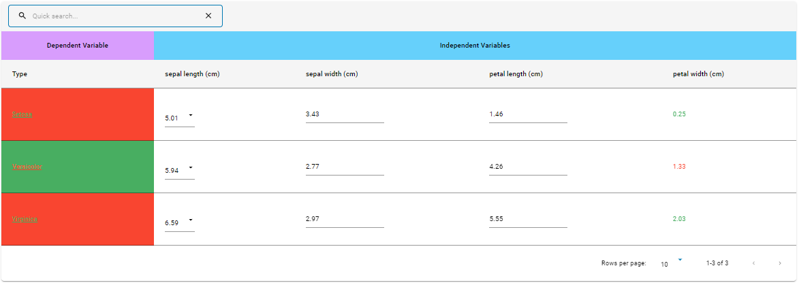

# Introduction
 
The grid table component helps to render a table with various functionalities like search, sticky column, pagination, custom cell color, popup screen, row and column freezing etc.
 


# Tooltip:

- Tooltips briefly describe a UI element. They're best used for labelling UI elements with no text, like icon-only buttons and fields.
- It is shown when user hover on the icon, text link, button.
- The will remain visible until user leaves that interaction area.

# Popover:

- Popover displays additional information in a temporary window. It can include rich content such as titles, long definitions, links and buttons
- Use when you need to display additional information in form of text on “i” icon.
- It is shown when user clicks on a word or icon.
- The window remains visible until they click “x” icon on popover.

# Arguments

- `df` (df, required): The pandas dataframe to be displayed as a table on the UI
- `col_props` (dict, optional): A dictionary of columns with required column properties must be passed. Refer below for the input format and available `Column Properties`

```
  {
    # Mention column name to have required column properties
    'column_name':{
      "editable": <boolean>, # True if cell is editable
      "cellEditor": <str: 'text' | 'select' | 'date' | 'dateTime' | 'checkbox' | 'rich-text'>,
      "cellEditorParams": {
        "variant": <str:  'outlined' | 'contained' | 'text'>,
        "options": <list>, # Dropdown list, required only when cellEditor is select
        "fullWidth": <boolean> # True for full width
      },
      "comparator": <fun: sorting comparator function>,
      "align": <str: 'left' | 'right' | 'center'>, # Default left. Alignment of cell and header content
      "width": <css width of a cell>,
      "cellRenderer": <str: 'icon' | 'date' | 'checkbox' | 'plotly' |'link'>,
      "validator": <str: a key to recognise when on cell value change it runs codestring to validate the new value>,
      "asterisk": <boolean>, # renders asterisk with column header name
      "sortable": <boolean> # column is sortable
    }
  }
```

- `grid_options` (dict, optional): A dictionary with table properties must be passed. Refer below for the input format and available `Grid Options`

```
  {
    "tableSize": <str: 'small' | 'medium'>,
    "editorMode": <boolean>, # True to enable cell editor
    "editModeSwitch": -1, # Adds toggle button for editing, applies when editorMode is true
    "tableMaxHeight": <css height for max table height>,
    "quickSearch": <boolean>, # True to enable quick search
    "enablePagination": <boolean>, # True to enable pagination option
    "paginationSettings":{
      "rowsPerPageOptions": [10, 20, 30], # Custom list can be passed
      "rowsPerPage": 10 # Custom number can be given
    },
    "outerActions":[
      {
        "text": <str: Button name to be displayed on the screen>,
        "name": <str: Name to be used as action_type>,
        "variant": <str:  'outlined' | 'contained' | 'text'>
      }
    ],
    "enableAddRow": <boolean>, # True to enable add row option
    "enableInRowDelete": <boolean>, # True to enable delete row option
    "enableRowCopy": <boolean>,# True to enable copying row data
    "enableRearrange": <boolean>, # True to enable rows to rearrange
    "multiSelectRows": <boolean>, # True for multiselect row
    "suppressFlash": <boolean>, # no flash on add row
    "tableTitle": <str: Custom title of the table>,
    "enableDuplicateRow": <boolean>,
    "addRowToTop": <boolean>, # on add row it adds row on the top
    "tableHeight": <css height for table height>,
    "caption": <caption> # table caption adds at bottom
    "freezing":<boolean>, #on True will enable row and column freezing
  }
```

- `group_headers` (list, optional): List of grouped column header must be passed. Sample input format for `group_headers` argument

```
  [
    [
      {
        'colSpan': <number>, # Span length
        'headerName': <str: Name of the grouped header>,
        'align': <str: 'center' | 'left' | 'right'>,
        'sticky': <boolean>, # True for sticky header
        'headerBgColor': <css color property>
      }
    ]
  ]
```

- `popups` (dict, optional): Data (df/fig) with respect to column to be displayed in popup screen must be passed. Sample input format for `popups` argument

```
  {
    # Name of the required column.
    "column_name":{
      # Mapping each value of the column with df or plotly fig object
      'cell_value_1': <df / plotly fig object>, # First value of the column_name
      'cell_value_2': <df / plotly fig object> # Second value of the column_name
      ...
    }
  }
```

- `popup_col` (list, optional): A list of column names which acts as trigger to popup screen must be passed.
- `popup_col_props` (dict, optional): used to specify properties of a column present in popup screen table. This applies only when popup screen has a table. Sample input format for `popup_col_props` argument

```
  {
    # Column name having popup screen table
    "main_table_column_name":{
      "popup_table_column_name": {} # same as `col_props` object
    }
  }
```

- `popup_grid_options` (dict, optional): used to specify the properties of the popup screen table. This applies only when popup screen has a table. Sample input format for `popup_grid_options` argument

```
  {
    # Column name having popup screen table
    "main_table_column_name": {} # Same as `grid_table` object
  }
```

- `popup_group_headers` (dict, optional): used to group multiple column headers and specify property of popup screen table. This applies only when popup screen has a table. Sample input format for `popup_group_headers` argument

```
{
  # Column name having popup screen table
  'main_table_column_name': [] # Same as `group_headers` list
}
```

# Tooltip:

- Tooltips briefly describe a UI element. They're best used for labelling UI elements with no text, like icon-only buttons and fields.
- It is shown when user hover on the icon, text link, button.
- The will remain visible until user leaves that interaction area


# Popover:
- Popover displays additional information in a temporary window. It can include rich content such as titles, long definitions, links and buttons
- Use when you need to display additional information in form of text on “i” icon.
- It is shown when user clicks on a word or icon.
- The window remains visible until they click “x” icon on popover.

# Attributes and Methods

- `json_string` : An attribute of the component conversion object which returns a JSON string for the component, which is used to render the component on the UI. Kindly refer the sample codes for usage.
- `add_tooltip` : A method which is used to add tooltip to provide contextual information about the feature. It can take the following parameters -

    - `isTooltip` (bool,optional,default=True) : A flag to determine to add tooltip or not.
    - `tooltip_text` (string, optional, default="This is a tooltip") : Title of the tooltip which displays when user hovers on it.
    - `placement` (string, optional, default="top") : Specifies the position of the tooltip. Values are "top", "bottom", "left", "right", "top-start", "top-end", "bottom-start", "bottom-end","left-start", "left-end", "right-start", "right-end"
- `component_dict` : An attribute which returns the dictionary/JSON structure of the component. Unlike `json_string` attribute which returns a JSON string, this returns a python dictionary.
- `add_information` : A method which is used to add information inputs (information icon which opens a pop-up on click). It can take the following parameters -

    - `visual_object` (widget factory lite visual object, required) : A widget factory lite visual object (example - Table, Graph, Insights), that needs to show on click of the information button
    - `title` (string, optional, default=None) : Title of the popup that comes up when the information button is clicked.
    See sample code section below to understand how to configure information inputs.

# Sample Codes

## Grid Table With Pagination, Sortable column and Search Bar

Pagination and Search bar can be set using `grid_options` argument. Sortable column can be set using `col_props` argument

```
import pandas as pd
from codex_widget_factory_lite.visuals.grid_table import GridTable
# Hardcoding a sample dataframe here, please ingest your dataset or create
sample_df = pd.DataFrame(data = [['tom', 'john', 10], ['nick', 'jack', 15], ['juli', 'jill', 12]],
                         columns=['Name', 'Parent', 'Age'])

# Creating grid_options object with pagination and quick search options
grid_options = {
    "enablePagination":True,
    "paginationSettings": {"rowsPerPageOptions": [10, 20, 30], "rowsPerPage": 10},
    "quickSearch": True
}

# Making 'Age' column sortable
col_props = {'Age':{'sortable':True}}
gridtable_output=GridTable(df = sample_df, col_props=col_props, grid_options=grid_options)
gridtable_output.add_tooltip(isTooltip=True,tooltip_text="This is a tooltip",placement="top")
dynamic_outputs = gridtable_output.json_string
```

## Grid Table With Editable Cells, Add Rows, Delete Rows, Rearrange Rows and Action Button
 
Editable cell can be configured using `col_props` argument. Row freezing, Column freezing, Add rows, delete Rows, rearrange rows and action button can be set using `grid_options`
 
```
import pandas as pd
from codex_widget_factory_lite.visuals.grid_table import GridTable
# Hardcoding a sample dataframe here, please ingest your dataset or create
sample_df = pd.DataFrame(data = [['tom', 'john', 10], ['nick', 'jack', 15], ['juli', 'jill', 12]],
                         columns=['Name', 'Parent', 'Age'])

# Creating save action button
action_buttons=[{
                    "text": "save", # Button Name
                    "name": "action_save", # Name to be used as action_type
                    "variant": 'contained' # 'outlined' | 'contained' | 'text'
                }]

# Creating grid_options object with Add Rows, Delete Rows, Copy row data, Rearrange Rows and Action Buttons options
grid_options = {
                "enableAddRow": True,
                "enableInRowDelete": True,
                "enableRowCopy": True,
                "enableRearrange": True,
                "editorMode":True,
                "editModeSwitch": -1,
                "outerActions":action_buttons,
                "freezing":True
                }

# Creating dropdown list for 'Name' column
dropdowns = ['tom', 'nick', 'juli']

# Making 'Name', 'Parent' and 'Age' editable
col_props = {'Name':{'cellEditor': "select", 'cellEditorParams' : {'options':dropdowns}, 'editable': True},
             'Parent':{'cellEditor': "text", 'editable': True },
             'Age':{'cellEditor': "number", 'editable': True }}

try:
    if action_type == 'action_save':
        ########
        # Add your custom business logic here
        ########
        # Example
        sample_df = pd.DataFrame(screen_data['rowData'])
except:
    pass
gridtable_output=GridTable(df = sample_df, col_props=col_props, grid_options=grid_options)
gridtable_output.add_tooltip(isTooltip=True,tooltip_text="This is a tooltip",placement="top")
dynamic_outputs =gridtable_output.json_string
```

## Grid Table With Grouped Column Headers

Column headers can be grouped using `group_headers` argument

```
import pandas as pd
from codex_widget_factory_lite.visuals.grid_table import GridTable
# Hardcoding a sample dataframe here, please ingest your dataset or create
sample_df = pd.DataFrame(data = [['tom', 10, 55], ['nick', 15, 60],
                                 ['juli', 14, 68]], columns=['Name', 'Age', 'Weight'])

# Grouping first column header to ID and last two column headers to Properities
group_headers =  [[
                    {'colSpan': 1,'headerName': 'ID','align': 'center','sticky': True,'headerBgColor': '#CF9FFF'},
                    {'colSpan': 2,'headerName': 'Properties', 'align': 'center','sticky': True,'headerBgColor': '#87cefa'}
                 ]]

dynamic_outputs = GridTable(df = sample_df, group_headers=group_headers).json_string
```

## Grid Table With Text Color and Background Color

Text color and background color can be applied by adding an extra column to the main dataframe as `column name + _color` and `column name + _bgcolor` with color codes as values to the column.

```
import pandas as pd
from codex_widget_factory_lite.visuals.grid_table import GridTable
# Hardcoding a sample dataframe here, please ingest your dataset or create
sample_df = pd.DataFrame(data = [['tom', 10, 55], ['nick', 15, 60],
                                 ['juli', 14, 68]], columns=['Name', 'Age', 'Weight'])

# Assigning cell color to each of the value in 'Name' column
sample_df['Name_color'] = ['red', 'green', 'green']
# Assigning cell color to each of the value in 'Age' column
sample_df['Age_bgcolor'] = ['green', 'red', 'green']

dynamic_outputs = GridTable(df = sample_df).json_string
```

## Grid Table With Popup Screen Table

Popup screen with table can be generated using `popups` and `popup_col` arguments

```
import pandas as pd
from codex_widget_factory_lite.visuals.grid_table import GridTable
# Hardcoding a sample dataframe here, please ingest your dataset or create
sample_df = pd.DataFrame(data = [['tom', 'john', 10, 55], ['nick', 'jack',15, 60]],
                         columns=['Name', 'Parent', 'Age', 'Weight'])

# Creating df to map it to value tom in 'Name' column
popup_table_tom = pd.DataFrame(data = [['Math', 90],['English', 87], ['Science', 91]],
                         columns=['Subject','Marks'])
# Creating df to map it to value nick in 'Name' column
popup_table_nick = pd.DataFrame(data = [['Math', 85],['English', 79], ['Science', 87]],
                         columns=['Subject','Marks'])

# Mapping the created dfs
popups={
    'Name':{'tom':popup_table_tom,'nick':popup_table_nick}
}

# Creating list of required columns to have the popup screen
popup_col = ['Name']

# Adding column property to the popup screen table column 'Marks'
popup_col_props = {'Name': {"Marks":{'sortable':True}}}

# Adding grid properties to the popup screen table
popup_grid_options = {'Name':  {"enablePagination":True,
                                "paginationSettings": {"rowsPerPageOptions": [10, 20, 30], "rowsPerPage": 10},
                                "quickSearch": True,
                              }
                     }

# Adding group headers to the popup screen table
popup_group_headers = {'Name':  [[
                                    {'colSpan': 2,'headerName': 'Student Scores','align': 'center','sticky': True,'headerBgColor': '#CF9FFF'},
                                ]]
                     }

# col_props is used to highlight the popup column. It's optional
col_props = {"Name": {"textDecoration": "underline"}}

dynamic_outputs = GridTable(df=sample_df,
                                col_props= col_props,
                                popups=popups,
                                popup_col=popup_col,
                                popup_col_props=popup_col_props,
                                popup_grid_options=popup_grid_options,   popup_group_headers=popup_group_headers).json_string
```

## Grid Table With Popup Screen Figure

Popup screen with figure can be generated using `popups` and `popup_col` arguments

```
import pandas as pd
import plotly.graph_objects as go
from codex_widget_factory_lite.visuals.grid_table import GridTable
# Hardcoding a sample dataframe here, please ingest your dataset or create
sample_df = pd.DataFrame(data = [['tom', 'john', 10, 55], ['nick', 'jack',15, 60]],
                         columns=['Name', 'Parent', 'Age', 'Weight'])

tom_df = pd.DataFrame(data = [['Math', 90],['English', 87], ['Science', 91]],
                         columns=['Subject','Marks'])
nick_df = pd.DataFrame(data = [['Math', 85],['English', 79], ['Science', 87]],
                         columns=['Subject','Marks'])

# Creating figure object to map it to value tom in 'Name' column
fig_tom = go.Figure([go.Bar(x=tom_df['Subject'], y= tom_df['Marks'])])
# Creating figure object to map it to value nick in 'Name' column
fig_nick = go.Figure([go.Bar(x=nick_df['Subject'], y= nick_df['Marks'])])

# Mapping the created figure object
popups={'Name':{'tom':fig_tom, 'nick':fig_nick}}

# Creating list of required columns to have the popup screen
popup_col = ['Name']

# col_props is used to highlight the popup column. It's optional
col_props = {"Name": {"textDecoration": "underline"}}

dynamic_outputs = GridTable(df=sample_df,
                                col_props= col_props,
                                popups=popups,
                                popup_col=popup_col).json_string
```

## Grid Table With Plotly Figure

A plotly figure can be rendered in a cell by passing the plotly data objects in df data value. You would also need to set `cellRenderer` for the respective column to `'plotly'` in `col_props`.

```
import pandas as pd
import plotly.graph_objects as go
from codex_widget_factory_lite.visuals.grid_table import GridTable
# Hardcoding a sample dataframe here, please ingest your dataset or create

plotly1 = {
    'data': [
        {
            'x': [1, 2, 3],
            'y': [2, 6, 3],
            'type': 'bar',
        },
        {'type': 'bar', 'x': [1, 2, 3], 'y': [2, 5, 3]},
    ],
    'layout': {'width': 200, 'height': 100}
}

plotly2 = {
    'data': [
        {
            'x': [1, 2, 3],
            'y': [2, 6, 3],
            'type': 'bar',
        },
        {'type': 'bar', 'x': [3, 1, 2], 'y': [5, 2, 3]},
    ],
    'layout': {'width': 200, 'height': 100}
}

sample_df = pd.DataFrame(data = [['tom', 'john', 10, 30, plotly1], ['nick', 'jack', 15, 60, plotly2]],
                         columns=['Name', 'Parent', 'Age', 'Weight', 'Distribution'])

col_props = {'Distribution': {'cellRenderer': 'plotly'}}

dynamic_outputs = GridTable(df=sample_df,
                            col_props=col_props).json_string
```

## Information Inputs

This component can be configured to have an information button, which opens up a pop up when clicked. The popup can be customized to contain the following visual components -

* Simple Table
* Expandable Table
* Insights
* Grid Table

Simulators are not supported as a component on the information inputs popup.

The example below illustrates how to configure information inputs for simple table where a plotly graph is shown in the popup.

```
# primary visual component - grid table
import pandas as pd
from codex_widget_factory_lite.visuals.grid_table import GridTable
# Hardcoding a sample dataframe here, please ingest you dataset or create
sample_df = pd.DataFrame(data = [['tom', 10], ['nick', 15],
    ['juli', 14]], columns=['Name', 'Age'])
grid_table_outputs = GridTable(df = sample_df)

# secondary visual component, shown as pop up on clicking information button
# this example shows plotly chart, you can add visual components such as tables, graphs, insights, etc.
# Simulators do not have information inputs support
from codex_widget_factory_lite.visuals.plotly_graph import PlotlyGraph
import plotly.graph_objects as go
fig = go.Figure(go.Waterfall(
    name = "20", orientation = "v",
    measure = ["relative", "relative", "total", "relative", "relative", "total"],
    x = ["Sales", "Consulting", "Net revenue", "Purchases",
        "Other expenses", "Profit before tax"],
    textposition = "outside",
    text = ["+60", "+80", "", "-40", "-20", "Total"],
    y = [60, 80, 0, -40, -20, 0],
    connector = {"line":{"color":"rgb(63, 63, 63)"}},
))
fig.update_layout(
    title = "Profit and loss statement 2018",
    showlegend = True
)
information_outputs = PlotlyGraph(plot_object = fig)

# combine primary and secondary visual components
grid_table_outputs.add_information(visual_object = information_outputs,
    title = "Deep Dive Graph")
dynamic_outputs = grid_table_outputs.json_string
```

# JSON Structure

The complete JSON structure of the component with sample data is captured below

```
{
  "is_grid_table": true,
  "tableProps": {
    "rowData": [
      {
        "Name": "tom",
        "Age": 10
      },
      {
        "Name": "nick",
        "Age": 15
      },
      {
        "Name": "juli",
        "Age": 14
      }
    ],
    "coldef": [
      {
        "headerName": "Name",
        "field": "Name",
        "cellParamsField": "Name_params",
        "cellEditor": "select",
        "cellEditorParams": {
          "options": [
            "tom",
            "nick",
            "juli"
          ]
        },
        "editable": true
      },
      {
        "headerName": "Age",
        "field": "Age",
        "cellParamsField": "Age_params"
      }
    ],
    "gridOptions": {
      "enablePagination": true,
      "paginationSettings": {
        "rowsPerPageOptions": [
          10,
          20,
          30
        ],
        "rowsPerPage": 10
      },
      "quickSearch": true,
      "editorMode": true
    }
  }
}
```

The example below illustrates the configuration of `hyperlink` col_props for a column and enabling row copy feature with `"cellRenderer"` and `"enableRowCopy"` properties respectively.

```
import pandas as pd
from codex_widget_factory_lite.visuals.grid_table import GridTable
# Hardcoding a sample dataframe here, please ingest your dataset or create
sample_df = pd.DataFrame(data = [["CPG","SoftDrinks","https://demo123.com"],
["Pharma","Injectibles","https://demo1234.com"]],
                         columns=['Industry',"products","hyperlink"])

# Creating grid_options object with pagination and row copy options
grid_options = {
    "enablePagination":True,
    "enableRowCopy": True,
    "paginationSettings": {"rowsPerPageOptions": [10, 20, 30], "rowsPerPage": 10},
}

# Adding link property to the hyperlink column
col_props = {'hyperlink':{'cellRenderer':"link"}}

dynamic_outputs = GridTable(df = sample_df, col_props=col_props, grid_options=grid_options).json_string
```

# JSON Structure
```
{
  "is_grid_table": true,
  "tableProps": {
    "rowData": [
      {
        "Industry": "CPG",
        "products": "SoftDrinks",
        "hyperlink": "https://demo123.com"
      },
      {
        "Industry": "Pharma",
        "products": "Injectibles",
        "hyperlink": "https://demo1234.com"
      }
    ],
    "coldef": [
      {
        "headerName": "Industry",
        "field": "Industry",
        "cellParamsField": "Industry_params"
      },
      {
        "headerName": "products",
        "field": "products",
        "cellParamsField": "products_params"
      },
      {
        "headerName": "hyperlink",
        "field": "hyperlink",
        "cellParamsField": "hyperlink_params",
        "cellRenderer": "link"
      }
    ],
    "gridOptions": {
      "enablePagination": true,
      "enableRowCopy": true,
      "paginationSettings": {
        "rowsPerPageOptions": [
          10,
          20,
          30
        ],
        "rowsPerPage": 10
      }
    }
  }
  "isTooltip": true,
  "tooltip_text": "This is a tooltip",
  "placement": "top"
}
```

