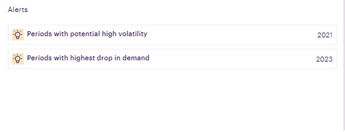
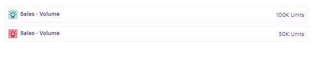
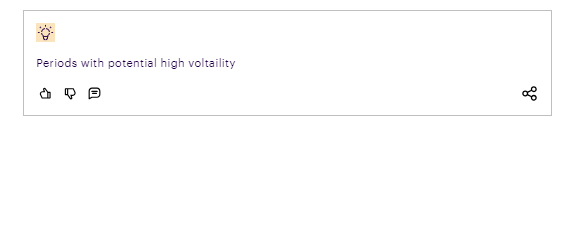

# Introduction

The insights component aids in rendering key information/takeaways to the users. Examples could include - anomalies in data, model performance indicators, etc. <br>



# Tooltip:

- Tooltips briefly describe a UI element. They're best used for labelling UI elements with no text, like icon-only buttons and fields.
- It is shown when user hover on the icon, text link, button.
- The will remain visible until user leaves that interaction area.

# Popover:

- Popover displays additional information in a temporary window. It can include rich content such as titles, long definitions, links and buttons
- Use when you need to display additional information in form of text on “i” icon.
- It is shown when user clicks on a word or icon.
- The window remains visible until they click “x” icon on popover.

# Arguments
- `insights_values` (list or pandas dataframe, required) : A list of dictionaries containing the data to be shown in the component. Each dictionary represents once insight, and has the following keys -

  * `label` (str): Contains the name of the each insight to be shown
  * `success` (boolean, optional): Describes the color to be used to render the insight ,if `success` is `True` green color is indicated.If this key is not passed or has `False` value then By default the color is set to yellow which is a default state
 * `failure` (boolean, optional): Describes the color to be used to render the insight ,if `failure` is `True` red color is indicated.If this key is not passed or has `False` value then By default the color is set to yellow which is a default state.
  * `value` (str): Value of the insight to be shown (Note : this will not be shown if the `insight_type` is `custom`).
  * `insight_type` (str, optional) : To render a custom insights, `insight_type` can be assigned with `custom` as a vlaue.
  * `icons` (boolean, optional) : By assigning True value to icons key, following icons can be added to insight component.
  * `dislikes`:(boolean, optional) True value will display dislike icon ,
  * `likes`:(boolean, optional) True value will display likes icon ,
  * `comments`:(boolean, optional) True value will display comments icon ,
  * `share`:(boolean, optional) True value will display share icon ,

Note :The keys - `icons`, `dislikes`, `likes`, `comments`, `share` are only supported in `custom insights` i.e. when the `insight_type` is `custom`.


  ```
  [
    {
      "label": "Periods with potential high voltaility",
      "value": "2021"
    }
  ]
  ```

## Insight exmaple with success and failure True respectively



  Alternatively, a pandas dataframe can be passed with columns `label`, and `value`, where each row value indicates the insight to be shown on the UI

# Tooltip:

- Tooltips briefly describe a UI element. They're best used for labelling UI elements with no text, like icon-only buttons and fields.
- It is shown when user hover on the icon, text link, button.
- The will remain visible until user leaves that interaction area.


# Popover:

- Popover displays additional information in a temporary window. It can include rich content such as titles, long definitions, links and buttons
- Use when you need to display additional information in form of text on “i” icon.
- It is shown when user clicks on a word or icon.
- The window remains visible until they click “x” icon on popover.

# Attributes and Methods

- `json_string` : An attribute of the component conversion object which returns a JSON string for the component, which is used to render the component on the UI. Kindly refer the sample codes for usage.
- `component_dict` : An attribute which returns the dictionary/JSON structure of the component. Unlike `json_string` attribute which returns a JSON string, this returns a python dictionary.
- `add_information` : A method which is used to add information inputs (information icon which opens a pop-up on click). It can take the following parameters -

    - `visual_object` (widget factory lite visual object, required) : A widget factory lite visual object (example - Table, Graph, Insights), that needs to shown on click of the information button
    - `title` (string, optional, default=None) : Title of the popup that comes up when the information button is clicked.
- `add_tooltip` : A method which is used to add tooltip to provide contextual information about the feature. It can take the following parameters -

    - `isTooltip` (bool,optional,default=True) : A flag to determine to add tooltip or not.
    - `tooltip_text` (string, optional, default="This is a tooltip") : Title of the tooltip which displays when user hovers on it.
    - `placement` (string, optional, default="top-start") : Specifies the position of the tooltip. Values are "top", "bottom", "left", "right", "top-start", "top-end", "bottom-start", "bottom-end","left-start", "left-end", "right-start", "right-end"

# Sample Codes

## Example of Simple Insights Component

The example illustrates a simple example for insights component.

```
from codex_widget_factory_lite.visuals.insights import Insights
dynamic_outputs = Insights(insights_values = [{
      "label": "Periods with potential high voltaility",
      "value": "2021"
    }]).json_string
```

# Example of Custom Insights with icons

## The example illustrates a Custom Insights with icons.



```
from codex_widget_factory_lite.visuals.insights import Insights
dynamic_outputs = Insights(insights_values = [{
      "label": "Periods with potential high voltaility",
      "insight_type":"custom",
      "icons":True,
      "dislikes":True,
      "likes":True,
      "comments":True,
      "share":True
    }]).json_string
```
# JSON Structure

The JSON structure of the component with sample data is captured below -


```
{
  "insight_data": [
    {
      "label": "Periods with potential high voltaility",
      "insight_type":"custom",
      "icons":True,
      "dislikes":True,
      "likes":True,
      "comments":True,
      "share":True
    },
    {
      "label": "Revenue",
      "value": "$134 M"
    },
    {
      "label": "Deviation from 1YP",
      "severity": "success",
      "value": "$17 M"
    }
  ],
}

```
## Information Inputs

This component can be configured to have an information button, which opens up a pop up when clicked. The popup can be customized to contain the following visual components -

* Simple Table
* Expandable Table
* Insights
* Grid Table

Simulators are not supported as a component on the information inputs popup.

The example below illustrates how to configure information inputs for insights component where a plotly graph is shown in the popup.

```
# primary visual component - insights component
from codex_widget_factory_lite.visuals.insights import Insights
insights_outputs = Insights(insights_values = [{
      "label": "Periods with potential high voltaility",
      "value": "100K Units"
    }])

# secondary visual component, shown as pop up on clicking information button
# this example shows plotly chart, you can add visual components such as tables, graphs, insights, etc.
# Simulators do not have information inputs support
from codex_widget_factory_lite.visuals.plotly_graph import PlotlyGraph
import plotly.graph_objects as go
fig = go.Figure(go.Waterfall(
    name = "20", orientation = "v",
    measure = ["relative", "relative", "total", "relative", "relative", "total"],
    x = ["Sales", "Consulting", "Net revenue", "Purchases",
        "Other expenses", "Profit before tax"],
    textposition = "outside",
    text = ["+60", "+80", "", "-40", "-20", "Total"],
    y = [60, 80, 0, -40, -20, 0],
    connector = {"line":{"color":"rgb(63, 63, 63)"}},
))
fig.update_layout(
    title = "Profit and loss statement 2018",
    showlegend = True
)
information_outputs = PlotlyGraph(plot_object = fig)

# combine primary and secondary visual components
insights_outputs.add_information(visual_object = information_outputs,
    title = "Deep Dive Graph")
insights_outputs.add_tooltip(isTooltip=True,tooltip_text="This is a tooltip" ,placement="top")
dynamic_outputs = insights_outputs.json_string

```

# JSON Structure

The complete JSON structure of the component with sample data is captured below -

```
{
  "insight_data": [
    {
      "label": "Sales - Volume",
      "value": "100K Units"
    },
    {
      "label": "Revenue",
      "value": "$134 M"
    },
    {
      "label": "Deviation from 1YP",
      "value": "$17 M"
    },
    {
      "label": "Estimated Reversal Cost",
      "value": "$1 M"
    }
  ],
  "assumptions": <Information inputs object>,
  "isTooltip": true,
  "tooltip_text": "This is a tooltip",
  "placement": "top"
}
```

