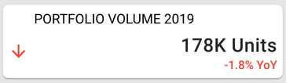

# Introduction

The metric component aids in showing Key Performance Indicators (KPIs) on a Co.dx application. Besides showing an overall value, the metric component also has features to show performance to a certain period - year on year, quarter on quarter, etc.



# Sample Code

```
from codex_widget_factory_lite.visuals.metric import Metric
# hard coded values, query from data source and populate these
metric_outputs = Metric(metric_value = "$ 100k",
  metric_additional_value="20% YoY",
  metric_additional_value_direction="down",
  alt_behavior= False,
  isTooltip=True,
  tooltip_text="This is a tooltip",
  placement="top")

dynamic_outputs = metric_outputs.json_string
```

# Tooltip:

- Tooltips briefly describe a UI element. They're best used for labelling UI elements with no text, like icon-only buttons and fields.
- It is shown when user hover on the icon, text link, button.
- The will remain visible until user leaves that interaction area.

# Popover:

- Popover displays additional information in a temporary window. It can include rich content such as titles, long definitions, links and buttons
- Use when you need to display additional information in form of text on “i” icon.
- It is shown when user clicks on a word or icon.
- The window remains visible until they click “x” icon on popover.

# Arguments

- `metric_value` (str or numeric, required): Number/text to be show as the value on the metric component.
- `metric_additional_value` (string,optional): Additional Data to be shown in the KPI, will be colored based on extra_dir
- `metric_additional_value_direction` (string,optional): Can be `up` or `down`, will add an arrow with green for up and red for down as the colors
- `alt_behavior` (bool, optional): Alter the behaviour of the extra_dir directive, green becomes red and vice versa.
- `isTooltip` (bool,optional,default=True) : A flag to determine to add tooltip or not.
- `tooltip_text` (string, optional, default="This is a tooltip") : Title of the tooltip which displays when user hovers on it.
- `placement` (string, optional, default="top") : Specifies the position of the tooltip. Values are "top", "bottom", "left", "right", "top-start", "top-end", "bottom-start", "bottom-end","left-start", "left-end", "right-start", "right-end"

# Attributes and Methods

- `json_string` : An attribute of the component conversion object which returns a JSON string for the component, which is used to render the component on the UI. Kindly refer the sample codes for usage.
- `component_dict` : An attribute which returns the dictionary/JSON structure of the component. Unlike `json_string` attribute which returns a JSON string, this returns a python dictionary.

# JSON Structure

The complete JSON structure of the component with sample data is captured below -

```
{
  "value": "$ 100k",
  "extra_dir": "down",
  "extra_value": "20% YoY",
  "alt_behaviour": false,
  "isTooltip": true,
  "tooltip_text": "This is a tooltip",
  "placement": "top"
}
```

