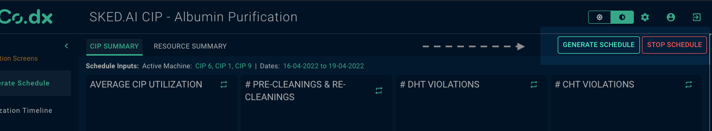

# Introduction

Screen level action buttons help in adding custom buttons to the Co.dx application screen navigation bar. These buttons are customizable in terms of how they appear on the screen, as well as the action/business logic that needs to be performed when the button is clicked. In this documentation, we will focus on the former.



# Arguments

- `button_label` (string, required) : Define the name of your button using this `argument`.
- `action_type` (string, required) :  Define a custom action type name here, **this will be used in action handler code section.**
- `colorVariant` (string, optional, default='success') : This argument updates the button color, and can take one of the following values - `success` or `warning`.
- `variant` (string, optional, default='outlined') : Used to define the fill type of the button. Can take the following values - `outlined`, `text`, `contained`
- `position` (string, optional, default='tab_nav_bar') : Used to define the position of the button. Can take the following values - `tab_nav_bar`, `screen_top_left`, `screen_top_right`.
- `shape` (string, optional, default='rectangle') : Used to define the shape of button.Default shape is rectangle. Can take the value - `rounded`.
- `start_icon` (dict, optional) : Used to define the image on left side of the button text.Can take the values - `url` , `name`.
- `end_icon` (dict, optional) : Used to define the image on right side of the button text.Can take the values - `url` , `name`.

# Attributes and Methods

- `json_string` : An attribute of the component conversion object which returns a JSON string for the component, which is used to render the component on the UI. Kindly refer the sample codes for usage.
- `append_action` (ScreenActionObject) : A method that combines two screen actions. This is used when there is more than one screen action to be configured.

# Code Examples


## Single Screen Action

Simple example of a action button added to the screen

```
from codex_widget_factory_lite.screen_actions.screen_actions_button_generator import ScreenActionButton
dynamic_outputs = ScreenActionButton(button_label = "Test button", # Give your button name here
  action_type = "test_button_action", # give a custom action type name here, this will be used in action handler code
  colorVariant = "success", # button color, use one of the following - 'success', 'error' or 'warning'
  variant = 'outlined', # button fill type, use one of the following - 'outlined', 'filled'
  position = 'tab_nav_bar', # button position, use one of the following - 'tab_nav_bar', 'screen_top_left', 'screen_top_right'
  shape = 'rounded', # button shape , use one of the following - 'rectangle', 'rounded'
  start_icon = {'url':' ', 'name':' '}, #image to the left of the text, place url inside dict.
  end_icon = {'url':' ' , 'name':' '} #image to the right of the text, place url inside dict.
  ).json_string
```

## Multiple Screen Actions

It is possible to configure multiple screen actions using the `append_action` attribute. The example below illustrates how a download action can be combined with an action button

```
from codex_widget_factory_lite.screen_actions.screen_actions_button_generator import ScreenActionButton
from codex_widget_factory_lite.screen_actions.screen_actions_download_link_generator import ScreenActionDownload

# initialise button action
buttonObj = ScreenActionButton(button_label = "Test button", # Give your button name here
  action_type = "test_button_action", # give a custom action type name here, this will be used in action handler code
  colorVariant = "success", # button color, use one of the following - 'success', 'error' or 'warning'
  variant = 'outlined', # button fill type, use one of the following - 'outlined', 'filled'
  position = 'tab_nav_bar', # button position, use one of the following - 'tab_nav_bar', 'screen_top_left', 'screen_top_right'
  shape = 'rounded', # button shape , use one of the following - 'rectangle', 'rounded'
  start_icon = {'url':' ', 'name' :' '}, #image to the left of the text, place url inside dict.
  end_icon = {'url':' ', 'name' :' '} #image to the right of the text, place url inside dict.
)

# initialise download action
downloadObj = ScreenActionDownload(button_label = "Test button 2", # Give your button tooltip here
  action_type = "test_download_action", # give a custom action type name here, this will be used in action handler code
  position = 'tab_nav_bar') # button position, use one of the following - 'tab_nav_bar', 'screen_top_left', 'screen_top_right'

# combine actions
buttonObj.append_action(downloadObj)

# generate dynamic actions
dynamic_outputs = buttonObj.json_string
```


# JSON Structure

The complete JSON structure of the component with sample data is captured below -

```
{
  "action_type": "cancel_pipeline",
  "component_type": "button",
  "params": {
    "text": "Stop Schedule",
    "colorVariant": "error",
    "variant": "outlined"
  },
  "position": {
    "portal": "tab_nav_bar"
  }
}
```

