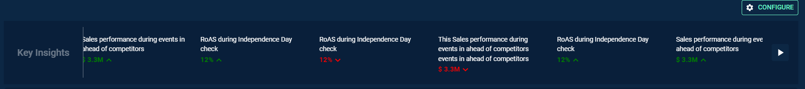

# Introduction

Marquee Slider can be used to add a running metric section in a dashboard for better experiences of viewing many key metrics.




# Arguments

- `action_type` (string, required) :  Define a custom action type name here, **this will be used in action handler code section.**
- `position` (string, optional, default='screen_top_left') : Used to define the position of the slider.
- `title` (string, optional) : Used to set the text to show as title.
- `height` (string, optional, default='15vh') : Used to define the height of the slider.
- `speed` (int, optional, default=50) : Used to define the speed of the movement of slider values.
- `direction` (string, optional, default='left') : Used to define the direction of the slider.
- `data` (list, required) : Used to define a list of data items with each item being a dictionary having mandatory key -id and rest of the details to be shown and customised.

# Attributes and Methods

- `json_string` : An attribute of the component conversion object which returns a JSON string for the component, which is used to render the component on the UI. Kindly refer the sample codes for usage.

# Code Examples


## Slider

Simple example of a Marquee Slider added to the top of the screen.

```
from codex_widget_factory_lite.screen_actions.screen_actions_marquee_slider import MarqueeSlider
dynamic_outputs = MarqueeSlider(
  action_type = 'generate_schedule', # give a custom action type name here, this will be used in action handler code
  position = 'screen_top_left', # Define the position of the slider.
  height='10vh' , # Define the height of the slider.
  speed= 50,  # Define the speed of the movement of slider values.
  direction = 'right',  # Define the direction of the slider.
  title="This is title",  # Set the text to show as title.
  data=[  # Define a list of data items with each item being a dictionary
    {
      "id": 1,
      "value": "Sales performance during events in ahead of competitors",
      "sub_value": "$ 3.3M ",
      "sub_value_color": "green",
      "direction": "up",
      "direction_color": "green"
    },
    {
      "id": 2,
      "value": "Sales performance during events in ahead of competitors",
      "sub_value": "$ 3.3M ",
      "sub_value_color": "green",
      "direction": "up",
      "direction_color": "green"
    }
  ]
).json_string
```

## Marquee Slider with Popup enabled

It is possible to configure slider with popup on click using the `popup_details` attribute. We are using Popup Form component to show Popup.The example below illustrates how a set a popup on click of data.

```
from codex_widget_factory_lite.screen_actions.screen_actions_marquee_slider import MarqueeSlider
dynamic_outputs = MarqueeSlider(
  action_type = 'generate_schedule', # give a custom action type name here, this will be used in action handler code
  position = 'screen_top_left', # Define the position of the slider.
  height='10vh' , # Define the height of the slider.
  speed= 50,  # Define the speed of the movement of slider values.
  direction = 'right',  # Define the direction of the slider.
  title="This is title",  # Set the text to show as title.
  data=[    # Define a list of data items with each item being a dictionary
    {
      "id": 1,
      "value": "Sales performance during events in ahead of competitors",
      "sub_value": "$ 3.3M ",
      "sub_value_color": "green",
      "direction": "up",
      "direction_color": "green"
    },
    {
      "id": 2,
      "value": "This Sales performance during events in ahead of competitors events in ahead of competitors",
      "sub_value": "$ 3.3M ",
      "sub_value_color": "red",
      "direction": "down",
      "direction_color": "red",
      "validator": "string",
      "popup_details": {
        "variant": "right-drawer",
        "dialog": {
          "title": "Generate Schedule"
        },
        "dialog_actions": [{
            "is_cancel": True,
            "text": "Cancel"
          },
          {
            "name": "generate",
            "text": "Generate",
            "variant": "contained"
          }
        ],
        "form_config": {
          "title": "",
          "fields": [{
              "id": 1,
              "name": "Active MC",
              "label": "Active Machine",
              "type": "select",
              "validator": "string",
              "value": [
                "CIP 1",
                "CIP 6",
                "CIP 9"
              ],
              "variant": "outlined",
              "multiple": True,
              "options": [
                "CIP 1",
                "CIP 6",
                "CIP 9"
              ],
              "margin": "none",
              "fullWidth": True,
              "inputprops": {
                "type": "select"
              },
              "placeholder": "Enter your Input",
              "grid": 6
            },
            {
              "id": 2,
              "name": "simulation_run",
              "label": "Simulation Run",
              "type": "checkbox",
              "value": False,
              "grid": 6
            }
          ]
        }
      }
    }
  ]
).json_string
```


# JSON Structure

The complete JSON structure of the component with sample data is captured below -

```
{
	"action_type": "generate_schedule",
	"component_type": "marquee_slider",
	"params": {
		"inputs": {
			"title": "Key Insights",
			"direction": "left",
			"speed": 100,
			"itemData": [{
					"id": 1,
					"value": "Sales performance during events in ahead of competitors",
					"sub_value": "$ 3.3M ",
					"sub_value_color": "green",
					"direction": "up",
					"direction_color": "green"
				},
				{
					"id": 2,
					"value": "Sales performance during events in ahead of competitors",
					"sub_value": "$ 3.3M ",
					"sub_value_color": "green",
					"direction": "up",
					"direction_color": "green"
				},
				{
					"id": 3,
					"value": "This Sales performance during events in ahead of competitors events in ahead of competitors",
					"sub_value": "$ 3.3M ",
					"sub_value_color": "red",
					"direction": "down",
					"direction_color": "red",
					"validator": "string",
					"popup_details": {
						"variant": "right-drawer",
						"dialog": {
							"title": "Generate Schedule"
						},
						"dialog_actions": [{
								"is_cancel": true,
								"text": "Cancel"
							},
							{
								"name": "generate",
								"text": "Generate",
								"variant": "contained"
							}
						],
						"form_config": {
							"title": "",
							"fields": [{
									"id": 1,
									"name": "Active MC",
									"label": "Active Machine",
									"type": "select",
									"validator": "string",
									"value": [
										"CIP 1",
										"CIP 6",
										"CIP 9"
									],
									"variant": "outlined",
									"multiple": true,
									"options": [
										"CIP 1",
										"CIP 6",
										"CIP 9"
									],
									"margin": "none",
									"fullWidth": true,
									"inputprops": {
										"type": "select"
									},
									"placeholder": "Enter your Input",
									"grid": 6
								},
								{
									"id": 2,
									"name": "simulation_run",
									"label": "Simulation Run",
									"type": "checkbox",
									"value": false,
									"grid": 6
								},
								{
									"id": 3,
									"name": "Start Date",
									"suppressUTC": true,
									"label": "Schedule Start Date",
									"type": "datepicker",
									"variant": "outlined",
									"margin": "none",
									"value": "2023-02-22T00:00:00",
									"inputprops": {
										"format": "DD/MM/yyyy",
										"variant": "inline"
									},
									"placeholder": "Enter StartDate",
									"fullWidth": true,
									"grid": 6
								}
							]
						}
					}
				},
				{
					"id": 4,
					"value": "RoAS during Independence Day check",
					"sub_value": "12% ",
					"sub_value_color": "green",
					"direction": "up",
					"direction_color": "green"
				}
			]
		}
	},
	"position": {
		"portal": "screen_top_left",
		"style": {
			"width": "100%",
			"height": "15vh"
		}
	}
}
```

