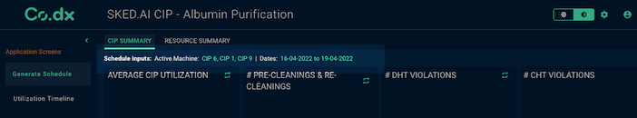

# Introduction

Screen level action buttons help in adding custom buttons to the Co.dx application screen navigation bar. These buttons are customizable in terms of how they appear on the screen, as well as the action/business logic that needs to be performed when the button is clicked. In this documentation, we will focus on the former.



# Arguments


- `action_type` (string, required) :  Define a custom action type name here, **this will be used in action handler code section.**
- `position` (string, optional, default='tab_nav_bar') : Used to define the position of the download button. Can take the following values - `tab_nav_bar`, `screen_top_left`, `screen_top_right`.


# Attributes and Methods

- `json_string` : An attribute of the component conversion object which returns a JSON string for the component, which is used to render the component on the UI. Kindly refer the sample codes for usage.
- `append_action` (ScreenActionObject) : A method that combines two screen actions. This is used when there is more than one screen action to be configured.

# Code Examples

## Single Screen Action

Simple example of a download action button added to the screen

Simple example of a action button added to the screen

```
from codex_widget_factory_lite.screen_actions.screen_actions_text_list_generator import ScreenActionText
dynamic_outputs = ScreenActionText(action_type = "test_text_action", # give a custom action type name here, this will be used in action handler code
  position = 'screen_top_left' # button position, use one of the following - 'tab_nav_bar', 'screen_top_left', 'screen_top_right'
  ).json_string
```


## Multiple Screen Actions

It is possible to configure multiple screen actions using the `append_action` attribute. The example below illustrates how a text action can be combined with an action button

```
from codex_widget_factory_lite.screen_actions.screen_actions_button_generator import ScreenActionButton
from codex_widget_factory_lite.screen_actions.screen_actions_text_list_generator import ScreenActionText

# initialise button action
buttonObj = ScreenActionButton(button_label = "Test button", # Give your button name here
  action_type = "test_button_action", # give a custom action type name here, this will be used in action handler code
  colorVariant = "success", # button color, use one of the following - 'success', 'error' or 'warning'
  variant = 'outlined', # button fill type, use one of the following - 'outlined', 'filled'
  position = 'tab_nav_bar') # button position, use one of the following - 'tab_nav_bar', 'screen_top_left', 'screen_top_right'

# initialise download action
textObj = ScreenActionText(action_type = "test_text_action", # give a custom action type name here, this will be used in action handler code
  position = 'screen_top_left') # button position, use one of the following - 'tab_nav_bar', 'screen_top_left', 'screen_top_right'

# combine actions
buttonObj.append_action(textObj)

# generate dynamic actions
dynamic_outputs = buttonObj.json_string
```


# JSON Structure

The complete JSON structure of the component with sample data is captured below -

```
{
  "action_type": "download_latest_schedule",
  "component_type": "download_link",
  "params": {
    "is_icon": true,
    "text": "Download Schedule",
    "fetch_on_click": true
  },
  "position": {
    "portal": "tab_nav_bar"
  }
}
```

