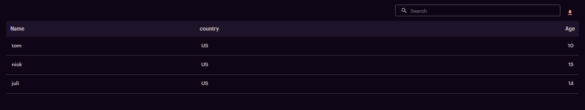

# Introduction

The Simple Table component helps to render data in a basic tabular format.


# Tooltip:

- Tooltips briefly describe a UI element. They're best used for labelling UI elements with no text, like icon-only buttons and fields.
- It is shown when user hover on the icon, text link, button.
- The will remain visible until user leaves that interaction area.

# Popover:

- Popover displays additional information in a temporary window. It can include rich content such as titles, long definitions, links and buttons
- Use when you need to display additional information in form of text on “i” icon.
- It is shown when user clicks on a word or icon.
- The window remains visible until they click “x” icon on popover.

# Arguments

- `df` (df, required) : The pandas dataframe to be displayed as a table on the UI
- `color_df` (df, optional): Pass an additional dataframe with color values to color code the cells. The example section shows sample code for the same. Some pointers around `color_df` properties -
  * Not all columns need to be included, only the ones that need to be color coded can be added
  * The number of rows need to be the same of that of `df`
  * The column names of `color_df` (for the columns that need color coding) need to be the same as that of `df`.
- `tableOptions`(dict,optional) :tableOptions parameter serves as an additional object or dictionary that can be utilized to add a range of functionalities or features

# Tooltip:

- Tooltips briefly describe a UI element. They're best used for labelling UI elements with no text, like icon-only buttons and fields.
- It is shown when user hover on the icon, text link, button.
- The will remain visible until user leaves that interaction area.


# Popover:

- Popover displays additional information in a temporary window. It can include rich content such as titles, long definitions, links and buttons
- Use when you need to display additional information in form of text on “i” icon.
- It is shown when user clicks on a word or icon.
- The window remains visible until they click “x” icon on popover.

# Attributes and Methods

- `json_string` : An attribute of the component conversion object which returns a JSON string for the component, which is used to render the component on the UI. Kindly refer the sample codes for usage.
- `add_tooltip` : A method which is used to add tooltip to provide contextual information about the feature. It can take the following parameters -

    - `isTooltip` (bool,optional,default=True) : A flag to determine to add tooltip or not.
    - `tooltip_text` (string, optional, default="This is a tooltip") : Title of the tooltip which displays when user hovers on it.
    - `placement` (string, optional, default="top") : Specifies the position of the tooltip. Values are "top", "bottom", "left", "right", "top-start", "top-end", "bottom-start", "bottom-end","left-start", "left-end", "right-start", "right-end"
- `component_dict` : An attribute which returns the dictionary/JSON structure of the component. Unlike `json_string` attribute which returns a JSON string, this returns a python dictionary.
- `add_information` : A method which is used to add information inputs (information icon which opens a pop-up on click). It can take the following parameters -

    - `visual_object` (widget factory lite visual object, required) : A widget factory lite visual object (example - Table, Graph, Insights), that needs to shown on click of the information button
    - `title` (string, optional, default=None) : Title of the popup that comes up when the information button is clicked.
    See sample code section below to understand how to configure information inputs.

`Note:Columns containing Numbers are right aligned by default for enhancing readability and visual consistency in documents `

# Additional Examples


# Simple Table

## usage

```
import pandas as pd
from codex_widget_factory_lite.visuals.simple_table import SimpleTable
# Hardcoding a sample dataframe here, please ingest you dataset or create
sample_df = pd.DataFrame(data = [['tom','US',10], ['nick','US',15],
    ['juli','US',14]], columns=['Name','country','Age'])
simpletable_output= SimpleTable(df = sample_df)
simpletable_output.add_tooltip(isTooltip=True,tooltip_text="This is a tooltip",placement="top")
dynamic_outputs = simpletable_output.json_string
```
 
# Simple Table With Search Bar And Row/Column Freezing
The search bar can be enabled by setting the `show_searchbar` attribute to `True`
The freezing functionality for both Row and Column can be enabled by setting the `freezing` attribute to `True`
 
## usage

```
import pandas as pd
from codex_widget_factory_lite.visuals.simple_table import SimpleTable
# Hardcoding a sample dataframe here, please ingest you dataset or create
sample_df = pd.DataFrame(data = [['tom','US',10], ['nick','US',15],
    ['juli','US',14]], columns=['Name','country','Age'])
simpletable_output= SimpleTable(df = sample_df, show_searchbar=True,freezing=True)
simpletable_output.add_tooltip(isTooltip=True,tooltip_text="This is a tooltip",placement="top")
dynamic_outputs = simpletable_output.json_string
```



# Color coding values

The cells can be color coded by passing another dataframe with color values.

## usgae

```
import pandas as pd
from codex_widget_factory_lite.visuals.simple_table import SimpleTable
# Hardcoding a sample dataframe here, please ingest you dataset or create
sample_df = pd.DataFrame(data = [['tom', 10], ['nick', 15],
    ['juli', 14]], columns=['Name', 'Age'])
color_df = pd.DataFrame(['red','green','red'], columns=['Age'])
dynamic_outputs = SimpleTable(df = sample_df, color_df=color_df).json_string
```


# Enhancing Tables with Additional Features Using Table Options.

`The tableOptions parameter serves as an additional object or dictionary that can be utilized to add a range of functionalities or features that are not inherently provided by default settings. By leveraging tableOptions, users can customize and enable specific capabilities tailored to their unique requirements`

## adding bookmark column to table , this feature hepls user to bookmark partcular row.

- To activate the bookmark functionality within a table, users can set `enableBookmark: True` within the tableOptions dictionary. By default, the bookmark column is labeled as "Bookmark"; however, for personalized naming conventions, users can include an additional key, `BookmarkColumn`, to specify a custom column name

## Example of adding Bookmark to table
```
import pandas as pd
from codex_widget_factory_lite.visuals.simple_table import SimpleTable
# Hardcoding a sample dataframe here, please ingest you dataset or create
sample_df = pd.DataFrame(data = [['tom','US',10], ['nick','US',15],
    ['juli','US',14]], columns=['Name','country','Age'])
tableOptions={
    "enableBookmark":True,
    # "BookmarkColumn":"custom name"  adding custom name to BookmarkColumn
}
simpletable_output=SimpleTable(df = sample_df, show_searchbar=True,tableOptions=tableOptions)
simpletable_output.add_tooltip(isTooltip=True,tooltip_text="This is a tooltip",placement="top")
dynamic_outputs = simpletable_output.json_string
```


## Example of adding Tags to table
tags can be added to simple table by passing a list of items to dataframe, where each item is dictinory consisting of `tagName` as key and its name as value.each tag can also be given custom background color by passing `tagColor` key and required color as value.

## usage
```
import pandas as pd
from codex_widget_factory_lite.visuals.simple_table import SimpleTable
# Hardcoding a sample dataframe here, please ingest you dataset or create
sample_df = pd.DataFrame(data = [['tom','US',[{"tagName":"one"}],10], ['nick','US',[{"tagName":"two"}],15],
    ['juli','US',[{"tagName":"three"}],14]], columns=['Name','country','Tags','Age'])
dynamic_outputs = SimpleTable(df = sample_df, show_searchbar=True,tableOptions=tableOptions).json_string
```

## customising tags with help of tableOptions
- `The tagOptions dictionary is a crucial parameter that should be included within the tableOptions dictionary. It allows for the customization of tags by accepting various key value pairs`
-  By passing `modify: True` in the tagOptions dictionary, users can create new tags in each row. This configuration triggers the display of an input box next to the existing tags in every row.
-  user cannot delete tags by default , to achieve this a key needs to be passed in tableOptions `delete`:`True` inside `tagOptions` dictionary
- Users have the ability to set a tag limit by passing `tagLimit` in `tagOptions` dictionary, ensuring that only tags up to this specified limit are initially displayed. Additional tags beyond this limit can be viewed by clicking on an expand button

## example of adding tags with various customisations like custom color and tag limit & delete tag options.
```
import pandas as pd
from codex_widget_factory_lite.visuals.simple_table import SimpleTable
# Hardcoding a sample dataframe here, please ingest you dataset or create
sample_df = pd.DataFrame(data = [['tom','US',[{"tagName":"one"},{"tagName":"test"},{"tagName":"four"},{"tagName":"five"}],10], ['nick','US',[{"tagName":"two"}],15],
    ['juli','US',[{"tagName":"three",'tagColor':'#FFA500'}],14]], columns=['Name','country','Tags','Age'])
tableOptions={
    "tagOptions":{
        "modify":True,
        "delete":True,
        "tagLimit":3
        }
}
dynamic_outputs = SimpleTable(df = sample_df, show_searchbar=True,tableOptions=tableOptions).json_string
```


## Adding action buttons.

Enabling an action button in a widget component involves passing a list of items as `outerActions`, where each item, represented as a dictionary or object, specifies distinct actions linked to the button

## Example of adding action buttons.
```
import pandas as pd
from codex_widget_factory_lite.visuals.simple_table import SimpleTable
# Hardcoding a sample dataframe here, please ingest you dataset or create
sample_df = pd.DataFrame(data = [['tom','US',10], ['nick','US',15],
    ['juli','US',14]], columns=['Name','country','Age'])
tableOptions={
    "outerActions": [
        {
          "text": "save",
          "name": "action_save",
          "variant": "contained"
        }
      ]
}
dynamic_outputs = SimpleTable(df = sample_df, show_searchbar=True,tableOptions=tableOptions).json_string
```


## Information Inputs

This component can be configured to have an information button, which opens up a pop up when clicked. The popup can be customized to contain the following visual components -

* Simple Table
* Expandable Table
* Insights
* Grid Table

Simulators are not supported as a component on the information inputs popup.

The example below illustrates how to configure information inputs for simple table where a plotly graph is shown in the popup.

```
# primary visual component - simple table
import pandas as pd
from codex_widget_factory_lite.visuals.simple_table import SimpleTable
# Hardcoding a sample dataframe here, please ingest you dataset or create
sample_df = pd.DataFrame(data = [['tom', 10], ['nick', 15],
    ['juli', 14]], columns=['Name', 'Age'])
simple_table_outputs = SimpleTable(df = sample_df, show_searchbar=True)

# secondary visual component, shown as pop up on clicking information button
# this example shows plotly chart, you can add visual components such as tables, graphs, insights, etc.
# Simulators do not have information inputs support
from codex_widget_factory_lite.visuals.plotly_graph import PlotlyGraph
import plotly.graph_objects as go
fig = go.Figure(go.Waterfall(
    name = "20", orientation = "v",
    measure = ["relative", "relative", "total", "relative", "relative", "total"],
    x = ["Sales", "Consulting", "Net revenue", "Purchases",
        "Other expenses", "Profit before tax"],
    textposition = "outside",
    text = ["+60", "+80", "", "-40", "-20", "Total"],
    y = [60, 80, 0, -40, -20, 0],
    connector = {"line":{"color":"rgb(63, 63, 63)"}},
))
fig.update_layout(
    title = "Profit and loss statement 2018",
    showlegend = True
)
information_outputs = PlotlyGraph(plot_object = fig)

# combine primary and secondary visual components
simple_table_outputs.add_information(visual_object = information_outputs,
    title = "Deep Dive Graph")
dynamic_outputs = simple_table_outputs.json_string
```


# JSON Structure

The complete JSON structure of the component with sample data is captured below -

```
{
  "table_headers": [
    "Name",
    "Age"
  ],
  "table_data": [
    [
      "tom",
      {
        "value": 10,
        "bgColor": "red"
      }
    ],
    [
      "nick",
      {
        "value": 15,
        "bgColor": "green"
      }
    ],
    [
      "juli",
      {
        "value": 14,
        "bgColor": "red"
      }
    ]
  ],
  "show_searchbar": false,
  "assumptions": <Information inputs object>
  "isTooltip": true,
  "tooltip_text": "This is a tooltip",
  "placement": "top"
}
```
