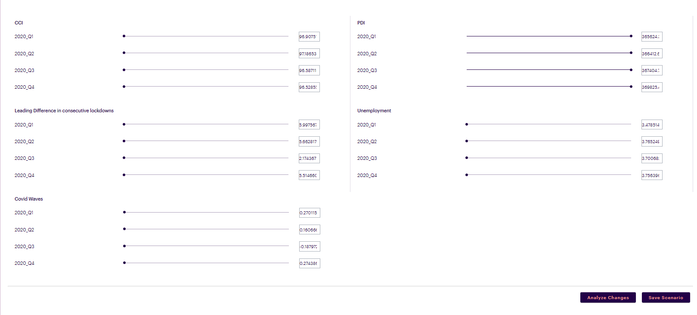
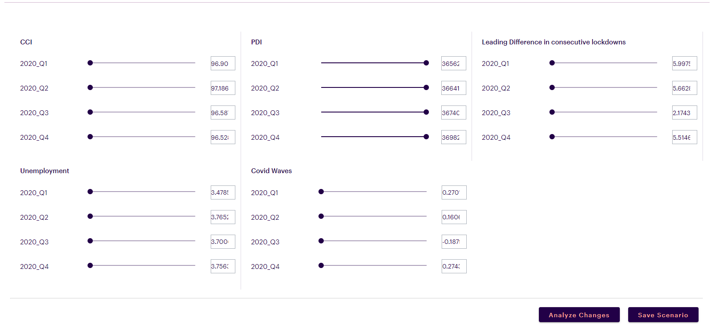

# Introduction
The simulator input component on NucliOS is designed to handle various inputs and configurations, such as sliders, input boxes, radios,text, number and actions. These inputs and actions are used to create and analyze various scenarios. User can analyze and save scenarios on this widget.
<br />



## Simulator Initiation Arguments

- `sim`: An instance of the Simulator class, initialized with the following:
         * "app_id" - The identifier for the application, set to 7 in this instance.
         * "base_url" - The base URL for the API endpoint. This is where the simulator sends its requests. It should be set to,
            - `https://nuclios-fastapi-dev.azurewebsites.net/nuclios-product-api`: for development
            - `https://nuclios-fastapi-qa.azurewebsites.net/nuclios-product-api`: for QA
            - `https://nuclios-fastapi-uat.azurewebsites.net/nuclios-product-api` : for UAT
            - `https://nuclios-fastapi.azurewebsites.net/nuclios-product-api` : for Prod
             <br/>
          NOTE: When on client environment replace base url with client's base url.
         * "token" - A secure string used to authenticate and authorize API requests. This token should be generated from Generate PAT under platform utilis to ensure safe and proper access to the simulator's function.


## Simulator initiation code

```
from codex_widget_factory_lite.utils.simulator.simulator import Simulator

#Creates a simulator object for given app_id . Initiaion of Simulator component

#pat_token - generated from platform utils.
#base_url -  The base URL for the API endpoint of current environment. Replace it with client API endpoint if you are client environment
token=pat_token
sim = Simulator(app_id=app_id,base_url=base_url,token=token)
```

# Simulator input methods
-`inputs`: A list that will contain simulator input components. Each component represents a user-controllable input in the simulator.
  - sim.slider(id, label, value, min, max, steps)
            - "id" - Identifier for the slider.
            - "label"- Label for the slider.
            - "value" - Default value of the slider.
            - "min" - Minimum value of the slider.
            - "max" - Maximum value of the slider.
            - "steps" - Step size for the slider.
  - sim.inputBox(id, label, value, min, max, steps)
            - "id"- Identifier for the input box.
            - "label" - Label for the input box.
            - "value" - Default value of the input box.
            - "min" - Minimum value of the input box.
            - "max" - Maximum value of the input box.
            - "steps" - Step size for the input box.
  - sim.radio(id, label, options)
            - "id" - Identifier for the radio input.
            - "label" - Label for the radio input.
            - "options" - Options available for the radio input. Eg: ["OPTION1","OPTION2"]
  - sim.text(id, label, value)
            - "id" - Identifier for the text input.
            - "label" - Label for the text input.
            - "value" -  Default value of the text input.
  - sim.number(id, label, value)
            - "id" - Identifier for the number input.
            - "label" - Label for the number input.
            - "value" - Default value of the number input.
  - sim.action(name, variant, type, action, action_flag_type)
            - "name" - string, Name of the button
            - "variant" - string, button variant - "outlined" / "contained"
            - "type" - string, Not used. specify "primary" / "upload" / "reset" / "submit" etc.,
            - "action" - string, Not used. specify "modify" / "upload" / "reset" / "submit" etc.,
            - "action_flag_type" - string, Used for tracking. Give a unique name of action_flag_type so as to identify the button click.


- `grid`: This attribute defines the layout of the UI components within a section. A grid value of 6 indicates that the section is set up with a grid configuration that spans a certain width, potentially aligning the inputs horizontally. Maximum value of grid is 12 (the width of the screen) and minimum value is 1.

## Simulator inputs code
```
  data = []
  data.append({
    "header": header,
    "inputs": [
        #Creates a slider with arguments (id,label,value,min,max,steps)
        sim.slider('2024-Q1', '2024-Q1', value, 10000,100000,1000) for quarter, value in values.items()
               ],
                    # to configure inputBox
                    #        sim.inputBox('2024-Q1', '2024-Q1', value, 10000,100000,1000) for quarter, value in values.items()

                    #       to configure radio
                    #        sim.radio('2024-Q1', '2024-Q1',["option1","option2"] ) for quarter, value in values.items()

                    #       to configure text
                    #       sim.text('2024-Q1', '2024-Q1','2024-Q1' ) for quarter, value in values.items()

                    #       to configure number
                    #       sim.number('2024-Q1', '2024-Q1',2000) for quarter, value in values.items()
               #value of grid max - 12
               "grid":6
    })
```

## Simulator Actions code
```
actions=[
# Generate action button through simulator object . Arguments required (name,variant,type,action,action_flag_type)
sim.action("Analyze Changes","contained","Primary","change","Slidersection Analyse Changes"),
sim.action("Save Scenario","contained","Primary","submit",False)
      ]
```

# Simulator create method

- `sim.create_simulator` : Assembles and returns a dictionary representing the complete simulator configuration with sections and actions.


## Simulator Creation code
```
data = sim.create_simulator(data,actions=actions)
## data['linked_tab'] = 'Compare Scenario'
## Uncomment and pass the compare scenario TAB name when clicked on compare button on savedscenarios popup .
dynamic_outputs = json.dumps(data)
```

# Simulator Arguments
- `linked_tab` : When you select 3 or more saved scenarios on savedscenarios popup from this screen a compare button appears on the popup .
On click the compare scenario tab is opened up . linked_tab argument is the tab name of compare scenario tab.

# Sample Code Attributes and Methods

- `json_string` : An attribute of the component conversion object which returns a JSON string for the component, which is used to render the component on the UI. Kindly refer the sample codes for usage.
- `get_json` : Retrieves and parses JSON data from a specified blob in Azure Blob Storage.
- `get_ingested_data` : Reads a CSV file from Azure Blob Storage into a pandas DataFrame.
- `set_datetime` : Converts a specified column to datetime format and sets it as the index of the DataFrame.
- `_get_value_info` : Returns a dictionary with the number of digits before and after the decimal point in the given numeric value.
- `_get_steps_value` :  Determines the increment steps based on the value's digit information.
- `codex_tags`: A dictionary containing metadata about the storage and retrieval of the simulator’s data:
        - "account" - Name of the account used in the file path.
        - "channel" - Channel name, part of the file path.
        - "product" - Product name, part of the file path.
        - "connection_url" - The connection string for the Azure Blob Storage.

## Sample Code

```
import json
import numpy as np
import pandas as pd
from sqlalchemy import create_engine
from azure.storage.blob import BlockBlobService
from io import StringIO
from pathlib import Path
from codex_widget_factory_lite.utils.simulator.simulator import Simulator

#Creates a simulator object for given app_id . Initiaion of Simulator component
#pat_token - generated from platform utils.
#base_url -  The base URL for the API endpoint of current environment. Replace it with client API endpoint if you are client environment
token=pat_token
sim = Simulator(app_id=app_id,base_url=base_url,token=token)

def get_json(datasource_type='azure_blob_storage', connection_uri=None, container_name=None, blob_name=None):
    block_blob_service = BlockBlobService(connection_string=connection_uri)
    blob_item = block_blob_service.get_blob_to_bytes(container_name, blob_name)
    data = blob_item.content
    return json.loads(data)

def get_ingested_data(path, datasource_type, connection_uri):
    container_name = '/'.join(path.parts[:-1])
    file_path = path.parts[-1]
    block_blob_service = BlockBlobService(connection_string=connection_uri)
    blob_data = block_blob_service.get_blob_to_text(container_name=container_name, blob_name=file_path)
    ingested_df = pd.read_csv(StringIO(blob_data.content))
    return ingested_df

def set_datetime(df, date_col):
    df[date_col] = pd.to_datetime(df[date_col])
    return df.set_index(date_col)

def _get_value_info(value_n):
    value_str = str(value_n)
    if '.' in value_str:
           split_value_str = value_str.split(".")
           value_digits = len(split_value_str[0])
           value_decimal_digits = len(split_value_str[1])
    else:
           value_digits = len(value_str)
           value_decimal_digits = 0

    return {"value_digits": value_digits, "value_decimal_digits": value_decimal_digits}


def _get_steps_value(value_n):
    return _get_increment_steps(_get_value_info(value_n))

def _make_simulator_df(default_simulator_dict, exog_names):
       data = []
       for header, values in default_simulator_dict.items():
           data.append({
               "header": header,
               "inputs": [
                   #Creates a slider with arguments (id,label,value,min,max,steps)
                   sim.slider(quarter, quarter, value, 10000,100000,1000) for quarter, value in values.items()
               ],
                    # to configure inputBox
                    #        sim.inputBox(quarter, quarter, value, 10000,100000,1000) for quarter, value in values.items()

                    #       to configure radio
                    #        sim.radio(quarter, quarter,["option1","option2"] ) for quarter, value in values.items()

                    #       to configure text
                    #       sim.text(quarter, quarter,quarter ) for quarter, value in values.items()

                    #       to configure number
                    #       sim.number(quarter, quarter,2000) for quarter, value in values.items()
               #value of grid max - 12
               "grid":6
               })
       return data

codex_tags = {
       "account": "mars-petcare",
       "channel": "SPT",
       "product": 'SPT DRY FOOD',
       "connection_url": "DefaultEndpointsProtocol=https;AccountName=willbedeletedsoon;AccountKey=qa5A74pLx0IQxOJk4MGoQChO8kJW6u9rjUBQj8gOeL3bPADodK27ExoEMY/Gq1BIY1tDk9hEWQT+JcnhDO79SQ==;EndpointSuffix=core.windows.net"
       }

# 1. Create the file path to retrieve data from blob storage
file_path = codex_tags['account'] + '/' + codex_tags['channel'] + '/' + codex_tags['product']

# 2. Create the simulator_info_json
simulator_info = get_json(datasource_type='azure_blob_storage', connection_uri=codex_tags['connection_url'], container_name=file_path,  blob_name='simulator_info.json')

# 3. Read future driver values table
exog_forecasts = get_ingested_data(Path(file_path + '/' + 'exog_forecasts.csv'), 'azure_blob_storage', codex_tags['connection_url'])
exog_forecasts = exog_forecasts.rename(columns={'Month_Year': 'DATE'})
exog_forecasts = set_datetime(exog_forecasts, 'DATE')

# 4. Get default simulator inputs
default_simulator_inputs = get_json(datasource_type='azure_blob_storage', connection_uri=codex_tags['connection_url'], container_name=file_path, blob_name='default_simulator_inputs.json')
actions=[
# Generate action button through simulator object . Arguments required (name,variant,type,action,action_flag_type)
sim.action("Analyze Changes","contained","Primary","change","Slidersection Analyse Changes"),
sim.action("Save Scenario","contained","Primary","submit",False)
      ]
# Generate simulator options
data = _make_simulator_df(default_simulator_inputs, list(default_simulator_inputs.keys()))
data = sim.create_simulator(data,actions=actions)
dynamic_outputs = json.dumps(data)
```


## Example of Grid configuration for Grid:4


## Example of Grid configuration for Grid:6


## JSON Structure
    {
        "isRevampedSim": true,
        "simulator_options": {
        "sections": [
            {
                "header": "CCI",
                "inputs": [
                    {
                        "input_type": "slider",
                        "id": "2020_Q1",
                        "label": "2020_Q1",
                        "value": 96.9075107362088,
                        "min": 10000,
                        "max": 100000,
                        "steps": 1000
                     },
            {
                "input_type": "slider",
                "id": "2020_Q2",
                "label": "2020_Q2",
                "value": 97.18653056932975,
                "min": 10000,
                "max": 100000,
                "steps": 1000
            },
            {
                "input_type": "slider",
                "id": "2020_Q3",
                "label": "2020_Q3",
                "value": 96.5871103688159,
                "min": 10000,
                "max": 100000,
                "steps": 1000
            },
            {
                "input_type": "slider",
                "id": "2020_Q4",
                "label": "2020_Q4",
                "value": 96.52855915826954,
                "min": 10000,
                "max": 100000,
                "steps": 1000
            }
          ],
        "grid": 6
      },
      {
        "header": "PDI",
        "inputs": [
          {
            "input_type": "slider",
            "id": "2020_Q1",
            "label": "2020_Q1",
            "value": 365624.3011310816,
            "min": 10000,
            "max": 100000,
            "steps": 1000
          },
          {
            "input_type": "slider",
            "id": "2020_Q2",
            "label": "2020_Q2",
            "value": 366412.6235781233,
            "min": 10000,
            "max": 100000,
            "steps": 1000
          },
          {
            "input_type": "slider",
            "id": "2020_Q3",
            "label": "2020_Q3",
            "value": 367404.7821285744,
            "min": 10000,
            "max": 100000,
            "steps": 1000
          },
          {
            "input_type": "slider",
            "id": "2020_Q4",
            "label": "2020_Q4",
            "value": 369825.49633141904,
            "min": 10000,
            "max": 100000,
            "steps": 1000
          }
        ],
        "grid": 6
      },
      {
        "header": "Leading Difference in consecutive lockdowns ",
        "inputs": [
          {
            "input_type": "slider",
            "id": "2020_Q1",
            "label": "2020_Q1",
            "value": 5.997567588806799,
            "min": 10000,
            "max": 100000,
            "steps": 1000
          },
          {
            "input_type": "slider",
            "id": "2020_Q2",
            "label": "2020_Q2",
            "value": 5.6628171340194235,
            "min": 10000,
            "max": 100000,
            "steps": 1000
          },
          {
            "input_type": "slider",
            "id": "2020_Q3",
            "label": "2020_Q3",
            "value": 2.1743671394438677,
            "min": 10000,
            "max": 100000,
            "steps": 1000
          },
          {
            "input_type": "slider",
            "id": "2020_Q4",
            "label": "2020_Q4",
            "value": 5.514660290187958,
            "min": 10000,
            "max": 100000,
            "steps": 1000
          }
        ],
        "grid": 6
      },
      {
        "header": "Unemployment",
        "inputs": [
          {
            "input_type": "slider",
            "id": "2020_Q1",
            "label": "2020_Q1",
            "value": 3.4785141938504833,
            "min": 10000,
            "max": 100000,
            "steps": 1000
          },
          {
            "input_type": "slider",
            "id": "2020_Q2",
            "label": "2020_Q2",
            "value": 3.7652496780703864,
            "min": 10000,
            "max": 100000,
            "steps": 1000
          },
          {
            "input_type": "slider",
            "id": "2020_Q3",
            "label": "2020_Q3",
            "value": 3.700682800388638,
            "min": 10000,
            "max": 100000,
            "steps": 1000
          },
          {
            "input_type": "slider",
            "id": "2020_Q4",
            "label": "2020_Q4",
            "value": 3.756396008057326,
            "min": 10000,
            "max": 100000,
            "steps": 1000
          }
        ],
        "grid": 6
      },
      {
        "header": "Covid Waves",
        "inputs": [
          {
            "input_type": "slider",
            "id": "2020_Q1",
            "label": "2020_Q1",
            "value": 0.27011518505382237,
            "min": 10000,
            "max": 100000,
            "steps": 1000
          },
          {
            "input_type": "slider",
            "id": "2020_Q2",
            "label": "2020_Q2",
            "value": 0.16066645151330566,
            "min": 10000,
            "max": 100000,
            "steps": 1000
          },
          {
            "input_type": "slider",
            "id": "2020_Q3",
            "label": "2020_Q3",
            "value": -0.18797266512417551,
            "min": 10000,
            "max": 100000,
            "steps": 1000
          },
          {
            "input_type": "slider",
            "id": "2020_Q4",
            "label": "2020_Q4",
            "value": 0.27438633500793164,
            "min": 10000,
            "max": 100000,
            "steps": 1000
          }
        ],
        "grid": 6
      }
    ],
    "section_orientation": "Horizontal",
    "actions": [
      {
        "name": "Analyze Changes",
        "variant": "contained",
        "type": "Primary",
        "action": "change",
        "action_flag_type": "Slidersection Analyse Changes"
      },
      {
        "name": "Save Scenario",
        "variant": "contained",
        "type": "Primary",
        "action": "submit",
        "action_flag_type": false
            }
            ]
        }
    }
