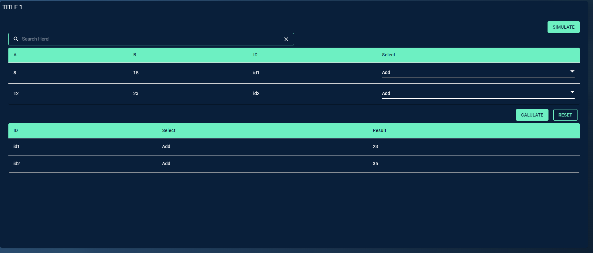

# Introduction
The table simulator component on Codx helps to make scenarios on the table data along with the option to receive user-driven inputs on a simulator section. Here, we have provision for representing the data in two tables such as a main table, auxiliary table. An optional simulator component is also available on the UI, which opens up based on the click of “Simulate“ button.

 
The JSON structure for the table simulator is given below.
 
It contains keys such as aux_table, main_table, simulator_options.

 
The Class helps to make a table simulator with a main table and an auxiliary table along with simulator section.
 
The tables have options to add input boxes, dropdowns, action-icons etc.,
 
Simulator has options of slider, upload, radio, dropdown, input text, input number etc.,
There is also control input option which can be set to make section sliders,
or input sum not exceed the value specified on control option.
 

# Tooltip:

- Tooltips briefly describe a UI element. They're best used for labelling UI elements with no text, like icon-only buttons and fields.
- It is shown when user hover on the icon, text link, button.
- The will remain visible until user leaves that interaction area.

# Popover:

- Popover displays additional information in a temporary window. It can include rich content such as titles, long definitions, links and buttons
- Use when you need to display additional information in form of text on “i” icon.
- It is shown when user clicks on a word or icon.
- The window remains visible until they click “x” icon on popover.

## Arguments

- `main_table` : pandas dataframe, required

    The main_table is a dataframe of n_rows, n_columns.
    It contains values that need to shown on the main table of the screen.
    A scroll option is applied on UI if n_rows is high.

- `aux_table` : pandas dataframe, required

    The aux_table is a dataframe of n_rows, n_columns.
    It contains values that need to shown on the auxiliary table
    of the screen.
    A scroll option is applied on UI if n_rows is high.

- `simulator_options_table` : pandas dataframe, required

    The simulator options table is a dataframe that contains the properties
    for the simulator section.
    The table contains columns such as :
        "header", "input_type", "label", "id", "value", "options", "max", "min", "steps", "control"
    The simulator on the screen, contains various sections.
    "header" - string, Contains the name of headers.
        Each section is identifed by headers.
        The Header given here is applied to section name
    "input-type" - string, The name of the input type.
        Can be one of - "slider", "upload", "radio", "text", "number", "dropdown"
        The properties required by each of the input type is provided below.
            "slider" - "label", "id", "value", "max", "min", "steps", "control"
            "upload" - "label", "id", "value"
            "radio" - "label", "id", "value", "options"
            "text" - "label", "id", "value"
            "number" - "label", "id", "value", "max", "min", "steps", "control"
            "dropdown" - "label", "id", "value", "options"
    "label" - string, The name of the simulator option.
        This name is shown on the UI.
    "id" - string, The identifier for the simulator option.
        This name can be used for the tracking of changes.
    "value" - int, string, list, The value of the simulator option.
        We can set a default value to appear on screen.
        The value is a list for the upload input-type, due to possibility of
        multiple files to be uploaded.
    "options" - list, The list of options to be shown on the UI.
        The options are useful for dropdown input, radio input.
    "max" - int, float, The maximum value for the simulator input.
    "min" - int, float, The minimum value for the simulator input.
    "steps" - int, float, The steps that can be applied to the value.
        Increase / Decrease the value by the given no.of steps / multiple of steps
    "control": list, Contains the keys of other inputs which should be controlled
        Specify this option for the input that shall control other inputs.
        Can be applied for only number/decimal type inputs.

- `main_buttons_table` : pandas dataframe, required

    The dataframe contains buttons properties for main table section.
    The columns are "name", "variant", "type", "action", "action_flag_type"
    Each row contains the properties for the buttons.
    "name" - string, Name of the button
    "variant" - string, button variant - "outlined" / "contained"
    "type" - string, Not used. specify "primary" / "upload" / "reset" / "submit" etc.,
    "action" - string, Not used. specify "modify" / "upload" / "reset" / "submit" etc.,
    "action_flag_type" - string, Used for tracking.
        Give a unique name of action_flag_type so as to identify the button click.

- `aux_buttons_table` : pandas dataframe, required

    The dataframe contains buttons properties for aux table section.
    The columns are "name", "variant", "type", "action", "action_flag_type"
    Each row contains the properties for the buttons.
    "name" - string, Name of the button
    "variant" - string, button variant - "outlined" / "contained"
    "type" - string, Not used. specify "primary" / "upload" / "reset" / "submit" etc.,
    "action" - string, Not used. specify "modify" / "upload" / "reset" / "submit" etc.,
    "action_flag_type" - string, Used for tracking.
        Give a unique name of action_flag_type so as to identify the button click.

- `simulator_buttons_table` : pandas dataframe, required

    The dataframe contains buttons properties for simulator section.
    The columns are "name", "variant", "type", "action", "action_flag_type"
    Each row contains the properties for the buttons.
    "name" - string, Name of the button
    "variant" - string, button variant - "outlined" / "contained"
    "type" - string, Not used. specify "primary" / "upload" / "reset" / "submit" etc.,
    "action" - string, Not used. specify "modify" / "upload" / "reset" / "submit" etc.,
    "action_flag_type" - string, Used for tracking.
        Give a unique name of action_flag_type so as to identify the button click.

- `main_table_name` : string, required

    The name of main table.

- `aux_table_name` : string, required

    The name of auxiliary table.

- `screen_json` : dict, required

    Provide the screen json with the value that comes from UI.
    The screen json is the screen_data.

- `main_indicator_option_table` : pandas dataframe or string, optional (default="")

    An indicator for all cells or certain cells of main_table.
    A string value, when the indicator is same for all cells in main
    table. The value can be one of - "", "Up", "Down", "dropdown", "input", "action-icon".
    A dataframe is given when we need different indicators in different cells.
    If dataframe, the main_indicator_option_table should have shape
    as the shape of main_table provided.
    If indicator is required to certain cell of a column, row pair then,
    pass the indicator at those cells in the main_indicator_option_table.
    Below mentioned indicators can be used accordingly to the use case,
        "" - empty string implies No indicator
        "Up" - To show the value in green color.
        "Down" - To show the value in red color.
        "dropdown" - gives a dropdown on the UI
        "action-icon" - gives a action like delete icon etc., on the UI
        "input" - gives a input box on the UI.

- `aux_indicator_option_table` : pandas dataframe or string, optional (default="")

    An indicator for all cells or certain cells of aux_table.
    A string value, when the indicator is same for all cells in auxiliary
    table. The value can be one of - "",
    A dataframe is given when we need different indicators in different cells.
    If dataframe, the aux_indicator_option_table should have shape
    as the shape of aux_table provided.
    If indicator is required to certain cell of a column, row pair then,
    pass the indicator at those cells in the the aux_indicator_option_table.
    Below mentioned indicators can be used accordingly to the use case,
        "" - empty string implies No indicator.
        "Up" - To show the value in green color.
        "Down" - To show the value in red color.

- `main_alt_behaviour_table` : pandas dataframe or bool, optional (default="")

    Alternate behaviour value.
    A bool value, when the alternate behaviour is needed for all cells in
    main table. The value can be True / False
    A dataframe is given when we need different alt_behaviour in different cells.
    If dataframe, the main_alt_behaviour_table should have shape
    as the shape of main_table provided.
    If alt_behaviour is required to certain cell of a column, row pair then,
    pass the True/False at those cells in the main_alt_behaviour_table.

- `aux_alt_behaviour_table` : pandas dataframe or bool, optional (default="")

    Alternate behaviour value.
    A bool value, when the alternate behaviour is needed for all cells in
    auxiliary table. The value can be True / False
    A dataframe is given when we need different alt_behaviour in different cells.
    If dataframe, the aux_alt_behaviour_table should have shape
    as the shape of main_table provided.
    If alt_behaviour is required to certain cell of a column, row pair then,
    pass the True/False at those cells in the aux_alt_behaviour_table.

- `main_suffix_option_table` : pandas dataframe or string, optional (default="")

    Suffix option value.
    A string value, when the suffix is same for all cells in main table.
    The suffix value will be shown as suffix to the value in main table of UI.
    A dataframe is given when we need different suffixes in different cells.
    If dataframe, the main_suffix_option_table should have shape
    as the shape of main_table provided.
    If suffix is required to certain cell of a column, row pair then,
    pass the suffix value at those cells in the main_suffix_option_table.

- `aux_suffix_option_table` : pandas dataframe or string, optional (default="")

    Suffix option value.
    A string value, when the suffix is same for all cells in auxiliary table.
    The suffix value will be shown as suffix to the value in auxiliary table of UI.
    A dataframe is given when we need different suffixes in different cells.
    If dataframe, the aux_suffix_option_table should have shape
    as the shape of aux_table provided.
    If suffix is required to certain cell of a column, row pair then,
    pass the suffix value at those cells in the aux_suffix_option_table.

- `main_prefix_option_table` : pandas dataframe or string, optional (default="")

    Prefix option value.
    A string value, when the prefix is same for all cells in main table.
    The prefix value will be shown as prefix to the value in main table of UI.
    A dataframe is given when we need different prefixes in different cells.
    If dataframe, the main_prefix_option_table should have shape
    as the shape of main_table provided.
    If prefix is required to certain cell of a column, row pair then,
    pass the prefix value at those cells in the main_prefix_option_table.

- `aux_prefix_option_table` : pandas dataframe or string, optional (default="")

    Prefix option value.
    A string value, when the prefix is same for all cells in auxiliary table.
    The prefix value will be shown as prefix to the value in auxiliary table of UI.
    A dataframe is given when we need different prefixes in different cells.
    If dataframe, the aux_prefix_option_table should have shape
    as the shape of aux_table provided.
    If prefix is required to certain cell of a column, row pair then,
    pass the prefix value at those cells in the aux_prefix_option_table.

- `main_formatted_option_table` : pandas dataframe or bool, optional (default="")

    Format option value.
    Formats the number by adding commas to the value in main table of UI.
    A bool value, when the formatting is needed for all cells in
    main table. The value can be True / False
    A dataframe is given when we need formatting in different cells.
    If dataframe, the main_formatted_option_table should have shape
    as the shape of main_table provided.
    If formatting is required to certain cell of a column, row pair then,
    pass the True/False at those cells in the main_formatted_option_table.

- `aux_formatted_option_table` : pandas dataframe or bool, optional (default="")

    Format option value.
    Formats the number by adding commas to the value in auxiliary table of UI.
    A bool value, when the formatting is needed for all cells in
    auxiliary table. The value can be True / False
    A dataframe is given when we need formatting in different cells.
    If dataframe, the aux_formatted_option_table should have shape
    as the shape of aux_table provided.
    If formatting is required to certain cell of a column, row pair then,
    pass the True/False at those cells in the aux_formatted_option_table.

- `main_extra_values` : dict, optional (default={})

    The main_extra_values is requried when the action-icon, dropdowns are
    added to main_table as indicators.
    It's a key-value pair of column name and values relevant to given indicator.
    If indicator for column is 'action-icon', then value contains a dict.
        The dict format is - {'type': "delete",
                            'icon_color': <hex_code_of_color>,
                            'action_flag_type': <name of action to trace>}
    If indicator for column is 'dropdown', then value contains a list.

- `show_search_bar` : bool, optional (default=True)

    The option to whether or not, provide a search bar for main table.

# Tooltip:

- Tooltips briefly describe a UI element. They're best used for labelling UI elements with no text, like icon-only buttons and fields.
- It is shown when user hover on the icon, text link, button.
- The will remain visible until user leaves that interaction area

# Popover:

- Popover displays additional information in a temporary window. It can include rich content such as titles, long definitions, links and buttons
- Use when you need to display additional information in form of text on “i” icon.
- It is shown when user clicks on a word or icon.
- The window remains visible until they click “x” icon on popover.

# Attributes and Methods

- `json_string` : An attribute of the component conversion object which returns a JSON string for the component, which is used to render the component on the UI. Kindly refer the sample codes for usage.
- `add_tooltip` : A method which is used to add tooltip to provide contextual information about the feature. It can take the following parameters -

    - `isTooltip` (bool,optional,default=True) : A flag to determine to add tooltip or not.
    - `tooltip_text` (string, optional, default="This is a tooltip") : Title of the tooltip which displays when user hovers on it.
    - `placement` (string, optional, default="top") : Specifies the position of the tooltip. Values are "top", "bottom", "left", "right", "top-start", "top-end", "bottom-start", "bottom-end","left-start", "left-end", "right-start", "right-end"
- `component_dict` : An attribute which returns the dictionary/JSON structure of the component. Unlike `json_string` attribute which returns a JSON string, this returns a python dictionary.
- `get_simulator_screen_variables`:
    ### Description
    The function helps to get the screen variables when using a
    simulator component.
    ### Parameters
    No Parameters
    ### Returns
    A tuple containing - action_type, screen_data, selected_filters

- `get_simulator_option_default_input`:
    ### Description
    The function helps to get the simulator options which is
    modified by the user in the UI.
    The returned dict Contains values of all headers and Id's.
    ### Parameters

simulator_options_table: pandas dataframe, required
    The simulator options table is a dataframe that contains the properties
    for the simulator section.
    The table contains columns such as :
        "header", "input_type", "label", "id", "value", "options", "max", "min", "steps", "control"
    The simulator on the screen, contains various sections.
    "header" - string, Contains the name of headers.
        Each section is identifed by headers.
        The Header given here is applied to section name
    "input-type" - string, The name of the input type.
        Can be one of - "slider", "upload", "radio", "text", "number", "dropdown"
        The properties required by each of the input type is provided below.
            "slider" - "label", "id", "value", "max", "min", "steps", "control"
            "upload" - "label", "id", "value"
            "radio" - "label", "id", "value", "options"
            "text" - "label", "id", "value"
            "number" - "label", "id", "value", "max", "min", "steps", "control"
            "dropdown" - "label", "id", "value", "options"
    "label" - string, The name of the simulator option.
        This name is shown on the UI.
    "id" - string, The identifier for the simulator option.
        This name can be used for the tracking of changes.
    "value" - int, string, list, The value of the simulator option.
        We can set a default value to appear on screen.
        The value is a list for the upload input-type, due to possibility of
        multiple files to be uploaded.
    "options" - list, The list of options to be shown on the UI.
        The options are useful for dropdown input, radio input.
    "max" - int, float, The maximum value for the simulator input.
    "min" - int, float, The minimum value for the simulator input.
    "steps" - int, float, The steps that can be applied to the value.
        Increase / Decrease the value by the given no.of steps / multiple of steps
    "control": list, Contains the keys of other inputs which should be controlled
        Specify this option for the input that shall control other inputs.
        Can be applied for only number/decimal type inputs.
 
simulator_buttons_table : pandas dataframe, required
    The dataframe contains buttons properties for simulator section.
    The columns are "name", "variant", "type", "action", "action_flag_type"
    Each row contains the properties for the buttons.
    "name" - string, Name of the button
    "variant" - string, button variant - "outlined" / "contained"
    "type" - string, Not used. specify "primary" / "upload" / "reset" / "submit" etc.,
    "action" - string, Not used. specify "modify" / "upload" / "reset" / "submit" etc.,
    "action_flag_type" - string, Used for tracking.
        Give a unique name of action_flag_type so as to identify the button click.

    ### Returns
    The dict object (simulator_dict)
        The returned dict contains keys as headers and value as a dict
        which has keys as id's and values as value modified by user.

- `get_simulator_option_user_input`:
    ### Description
    The function helps to get the simulator options which is
    modified by the user in the UI.

    The returned dict Contains values of all headers and Id's.

    ### Parameters

    screen_json : dict, required
        The screen data that comes from UI.

    ### Returns
    The dict object (simulator_dict)
        The returned dict contains keys as headers and value as a dict
        which has keys as id's and values as value modified by user.

- `get_main_table_user_input`:
    ### Description
    The function helps to get the main table which is
    modified by the user in the UI.

    ### Parameters

    screen_json : dict, required
        The screen data that comes from UI.

    ### Returns
    The pandas dataframe (main_df)
        Contains values of all cells in main table as dataframe.

## Sample Code
    import pandas
    import pandas as pd
    from codex_widget_factory_lite.visuals.table_simulator import TableSimulator

    def generate_simulator_df():
        columns = ['header', 'input_type', 'id', 'label', 'value', 'options', 'max', 'min', 'steps', 'control']
        data = [['inputs', 'number', 'A', 'A', 12, '', 100, 0, 1, ''],
                ['inputs', 'number', 'B', 'B', 31, '', 100, 0, 1, ''],
                ['inputs', 'text', 'ID', 'ID', 'id3', '', '', '', '', '']]
        simulator_data = pd.DataFrame(columns=columns, data=data)
        return simulator_data

    def generate_main_df(simulator_options):
        df = pd.DataFrame(data=[[8, 15, 'id1'], [12, 23, 'id2']], columns=['A', 'B', 'ID'])
        if len(simulator_options.keys())>0:
            sim_input_dict = {option:[value] for option, value in simulator_options.items()}
            new_entry = pd.DataFrame(sim_input_dict)
            temp = df.copy()
            temp = pd.concat([temp, new_entry], ignore_index=True)
            main_df = temp.copy()
        else:
            main_df = df.copy()
        main_df['Select'] = 'Add'
        main_df.reset_index(inplace=True,drop=True)
        return main_df

    def generate_aux_df(main_data,flag=None,old_main_df=None):
        aux_temp = main_data.copy()
        aux_temp['Result'] = aux_temp.apply(lambda x: x['A']+x['B'] if x['Select']=='Add' else x['A']*x['B'], axis=1)
        aux_df = aux_temp[['ID', 'Select', 'Result']]
        return aux_df

    main_buttons = pd.DataFrame([
        {
            "name": "Calulate",
            "variant": "contained",
            "type": "primary",
            "action": "change",
            "action_flag_type": "User Input Finalize"
        },
        {
            "name": "Reset",
            "variant": "outlined",
            "type": "reset",
            "action": "reset",
            "action_flag_type": "random"
        },
        ])

    aux_buttons = pd.DataFrame([
        {
            "name": "Download Scenario Sheet",
            "variant": "contained",
            "type": "primary",
            "action": "download",
            "action_flag_type": "Download Scenario"
        }
        ])

    simulator_buttons = pd.DataFrame([
        {
            "name": "Analyze Changes",
            "variant": "contained",
            "type": "primary",
            "action": "change",
            "action_flag_type": "Simlator Analyse Changes"
        },
        {
            "name": "Reset to Defalut",
            "variant": "outlined",
            "type": "reset",
            "action": "reset",
            "action_flag_type": "random"
        }])

    def get_simulator_option_input(self, simulator_screen_json):
        options_dict = {}
        for section_n in simulator_screen_json["simulator_options"]["sections"]:
            for input_n in section_n["inputs"]:
                try:
                    options_dict[input_n["id"]] = input_n["value"]
                except:
                    temp_val = 1
        return options_dict

    import copy

    simulator_df = generate_simulator_df()
    if "action_type" in globals().keys():
        if action_type=="Simlator Analyse Changes":
            simulator_options = get_simulator_option_input(screen_data)
            main_df = generate_main_df(simulator_options)
            aux_df = generate_aux_df(main_df)
        elif action_type=="User Input Finalize":
            main_df = get_main_table_user_input(screen_data)
            aux_df = generate_aux_df(main_df)
        else:
            main_df = generate_main_df({})
            aux_df = generate_aux_df(main_df)
        main_indicator_df = pd.DataFrame([[""]*3+["dropdown"]]*main_df.shape[0], columns=main_df.columns)
        main_extra_values = {"Select": ['Add', 'Multiply']}
        table_output = TableSimulator(main_table=main_df, aux_table=aux_df, simulator_options_table=simulator_df,
                                    main_indicator_option_table=main_indicator_df, aux_indicator_option_table="",
                                    main_alt_behaviour_table=False, aux_alt_behaviour_table=False,
                                    main_suffix_option_table="", aux_suffix_option_table="",
                                    main_prefix_option_table="", aux_prefix_option_table="",
                                    main_formatted_option_table=False, aux_formatted_option_table=False,
                                    main_buttons_table=main_buttons, aux_buttons_table=aux_buttons,
                                    simulator_buttons_table=simulator_buttons, main_table_name="",aux_table_name="",
                                    main_extra_values=main_extra_values,screen_json = screen_data)
        table_output.add_tooltip(isTooltip=True, tooltip_text="This is a tooltip", placement="top")
        output=table_output.json_string
    else:
        main_df = generate_main_df({})
        aux_df =  generate_aux_df(main_df)
        main_indicator_df = pd.DataFrame([[""]*3+["dropdown"]]*main_df.shape[0], columns=main_df.columns)
        main_extra_values = {"Select": ['Add', 'Multiply']}
        table_output = TableSimulator(main_table=main_df, aux_table=aux_df, simulator_options_table=simulator_df,
                                    main_indicator_option_table=main_indicator_df, aux_indicator_option_table="",
                                    main_alt_behaviour_table=False, aux_alt_behaviour_table=False,
                                    main_suffix_option_table="", aux_suffix_option_table="",
                                    main_prefix_option_table="", aux_prefix_option_table="",
                                    main_formatted_option_table=False, aux_formatted_option_table=False,
                                    main_buttons_table=main_buttons, aux_buttons_table=aux_buttons,
                                    simulator_buttons_table=simulator_buttons, main_table_name="",aux_table_name="",
                                    main_extra_values=main_extra_values, screen_json = None)
        table_output.add_tooltip(isTooltip=True, tooltip_text="This is a tooltip", placement="top")
        output=table_output.json_string
    import json
    dynamic_outputs = output

 ## JSON Structure
    {
        "aux_table": { //aux table where results from an analysis will be shown
            "name": "",
            "columns": [

            ],
            "rows": [
                [
                    {
                        "value": "Current Status", // value to be shown in cell
                        "indicator": "",
                        "alt_behaviour": false,
                        "suffix": "",
                        "prefix": "",
                        "formatted": false
                    },
                    {
                        "value": 2,
                        "indicator": "",
                        "alt_behaviour": false,
                        "suffix": "Mn",
                        "prefix": "",
                        "formatted": false
                    }
                ],
                [
                    {
                        "value": "Scenario Based",
                        "indicator": "",
                        "alt_behaviour": false,
                        "suffix": "",
                        "prefix": "",
                        "formatted": false
                    },
                    {
                        "value": 156000,
                        "indicator": "Down", // Down indicator means the text will be red by deafult
                        "alt_behaviour": false, // alt_behaviour alternates the color of the indicated value
                        "suffix": "",
                        "prefix": "",
                        "formatted": true
                    },
                    {
                        "value": 1.5,
                        "indicator": "Down",
                        "alt_behaviour": false,
                        "suffix": "Mn", // suffix is added after the value Mn, K, % etc
                        "prefix": "", // prefix is added before the value $, USD etc
                        "formatted": false // if true the number will be formated with commas
                    }
                ]
            ],
            "buttons": [
                {
                    "name": "Download Scenario Sheet",
                    "variant": "contained",
                    "type": "primary",
                    "action": "download",
                    "action_flag_type": ""
                }
            ]
        },
        "is_table_simulator": true,
        "main_table": { //main table where the inputs will be taken
            "name": "",
            "columns": [ // contains a list of columns to be shown on the table
            ],
            "rows": [
                [
                    {
                        "value": "OEP AAA",
                        "indicator": "",
                        "alt_behaviour": false,
                        "suffix": "",
                        "prefix": "",
                        "formatted": false
                    },
                    {
                        "value": "2500",
                        "indicator": "up", // up will be green
                        "alt_behaviour": false,
                        "suffix": "",
                        "prefix": "",
                        "formatted": false
                    },
                    {
                        "value": "27",
                        "indicator": "down", //down will be red
                        "alt_behaviour": false,
                        "suffix": "",
                        "prefix": "",
                        "formatted": false
                    },
                    {
                        "value": "85",
                        "indicator": "neutral", // neutral will be color #FF9800 for text
                        "alt_behaviour": false,
                        "suffix": "",
                        "prefix": "",
                        "formatted": false
                    },
                    {
                        "value": "83",
                        "indicator": "",
                        "alt_behaviour": false,
                        "suffix": "",
                        "prefix": "",
                        "formatted": false
                    },
                    {
                        "indicator": "dropdown",
                        "select_values": [
                            "Confirm",
                            "List",
                            "Delist"
                        ],
                        "value": "Confirm"
                    }
                ]
            ],
            "buttons": [
                {
                    "name": "Analyze Changes",
                    "variant": "contained",
                    // "type": "primary", // can be "primary", "reset", "submit", "upload" but will be used for dummy purpose only
                    "action": "change", // actions will be used for dummy projects
                    "action_flag_type":""

                },
                {
                    "name": "Reset to Defalut",
                    "variant": "outlined",
                    // "type": "reset",
                    "action": "reset", // Can be change, reset, submit, upload, download
                    "action_flag_type": ""
                },
                {
                    "name": "Submit",
                    "variant": "outlined",
                    // "type": "submit",
                    "action": "submit",
                    "action_flag_type": ""
                },
                {
                    "name": "Upload Latest Constraints",
                    "variant": "outlined",
                    // "type": "upload",
                    "action": "upload",
                    "action_flag_type": ""
                }
            ]
        },
        "simulator_options": {
            "sections": [
                {
                    "header": "headername", // section Header name
                    "inputs": [ // List of items which will be shown in the sections
                        // items can be *slider*, *upload* button, *radio* / *checkboxes* options, *text*/*number* inputs
                        // properties to be sent for each of these inputs are given below.
                        {
                            "input_type": "slider",
                            "value": "default value", //will be a number
                            "max": "max value", //will be a number
                            "min": "min value", // will be a number
                            "label": "Name", // lable will be used to display the name
                            "id": "", // id will be used internally
                            "steps": "value of steps"
                        },
                        {
                            "input_type": "upload",
                            "label": "Name of the button",
                            "id": ""
                        },
                        {
                            "input_type": "radio",
                            "name": "",
                            "options":["option 1", "option 2"]
                        },
                        {
                            "input_type": "text",
                            "id": "",
                            "label":"",
                            "value":""
                        },
                        {
                            "input_type": "number",
                            "id": "",
                            "label": "",
                            "value":300
                        }
                    ]
                }
            ],
            "actions": [ // holds overall actions on the simulators
                {
                    "name": "Analyse Change",
                    "action_flag_type": "analyseChange1", // action_flag_type will be the flag which will be sent to the codestring to run necessary functions
                    "variant":"contained",// "outlined"
                    // "type":"primary", // "secondary"
                    "action":"" //can be ignored when action_flag_type is given
                },
                {
                    "name": "Reset Change",
                    "action_flag_type": "", // no flag or blank string or None for actions flag types where you do not want to run backend code
                    "variant": "contained", // "outlined"
                    // "type": "reset", // "secondary"
                    "action": "" //can be ignored when action_flag_type is given
                }
            ]
        },
        "isTooltip": true,
        "tooltip_text": "This is a tooltip",
        "placement": "top-start"
    }

### Links:

<a href="https://mathco.atlassian.net/wiki/spaces/CODX/pages/1930166311" target="_blank" style="color:inherit">📎 Simulator Implementation</a>
 