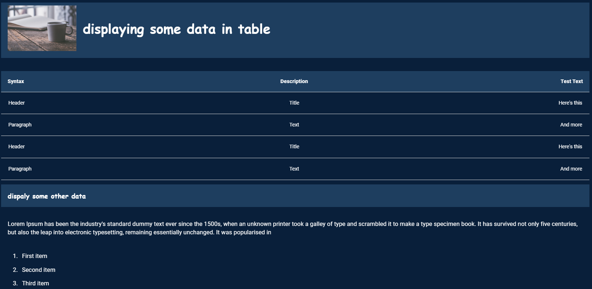

# Introduction

The typography component helps to visualize and customize the typography to utilize the real estate available to present all the required information to the end user for better consumption.



# Tooltip:

- Tooltips briefly describe a UI element. They're best used for labelling UI elements with no text, like icon-only buttons and fields.
- It is shown when user hover on the icon, text link, button.
- The will remain visible until user leaves that interaction area.

# Popover:

- Popover displays additional information in a temporary window. It can include rich content such as titles, long definitions, links and buttons
- Use when you need to display additional information in form of text on “i” icon.
- It is shown when user clicks on a word or icon.
- The window remains visible until they click “x” icon on popover.

# Arguments

- `content` (string, required): List of markdown items with different styles are given inside the content parameter

# Attributes and Methods

- `json_string` : An attribute of the component conversion object which returns a JSON string for the component, which is used to render the component on the UI. Kindly refer the sample codes for usage.
- `add_tooltip` : A method which is used to add tooltip to provide contextual information about the feature. It can take the following parameters -

    - `isTooltip` (bool,optional,default=True) : A flag to determine to add tooltip or not.
    - `tooltip_text` (string, optional, default="This is a tooltip") : Title of the tooltip which displays when user hovers on it.
    - `placement` (string, optional, default="top") : Specifies the position of the tooltip. Values are "top", "bottom", "left", "right", "top-start", "top-end", "bottom-start", "bottom-end","left-start", "left-end", "right-start", "right-end"


- `component_dict` : An attribute which returns the dictionary/JSON structure of the component. Unlike `json_string` attribute which returns a JSON string, this returns a python dictionary.

# Sample Codes

## Typography with mandatory data

```
import json
from codex_widget_factory_lite.visuals.typography import Typography

content = """
<h3 style="background-color:#1E3E5F;font-size:4rem;padding:2rem;display:flex;align-items:center;font-family: Cursive;"> displaying some data in table</h3>

| Syntax      | Description | Test Text     |
| :---        |    :----:   |          ---: |
| Header      | Title       | Here's this   |
| Paragraph   | Text        | And more      |
| Header      | Title       | Here's this   |
| Paragraph   | Text        | And more      |


 <h1 style="font-family: Cursive">dispaly some other data</h1>

 Lorem Ipsum has been the industry's standard dummy text ever since the 1500s, when an unknown printer took a galley of type and scrambled it to make a type specimen book. It has survived not only five centuries, but also the leap into electronic typesetting, remaining essentially unchanged. It was popularised in\n

1. First item
2. Second item
3. Third item
4. Fourth item

- First item
- Second item
- Third item


# testing this
**testing this** \n
*italic statement*\n
This text is ***really important***
<p style="font-size:1.8rem">~~The world is flat.~~ We now know that the world is round.</p>
I need to highlight these ==very important words==.
<hr style="border-style:dashed"/>

"""
output=Typography(
    content = content
)
output.add_tooltip(isTooltip=True,tooltip_text="This is a tooltip" ,placement="top")
dynamic_outputs = output.json_string
```
# JSON Structure

The complete JSON structure of the component with basic sample data is captured below

```
{
  "componentType": "custom:customTypography",
  "content": "\n<h3 style=\"background-color:#1E3E5F;font-size:4rem;padding:2rem;display:flex;align-items:center;font-family: Cursive;\"> displaying some data in table</h3>\n\n| Syntax      | Description | Test Text     |\n| :---        |    :----:   |          ---: |\n| Header      | Title       | Here's this   |\n| Paragraph   | Text        | And more      |\n| Header      | Title       | Here's this   |\n| Paragraph   | Text        | And more      |\n\n\n <h1 style=\"font-family: Cursive\">dispaly some other data</h1>\n\n Lorem Ipsum has been the industry's standard dummy text ever since the 1500s, when an unknown printer took a galley of type and scrambled it to make a type specimen book. It has survived not only five centuries, but also the leap into electronic typesetting, remaining essentially unchanged. It was popularised in\n\n\n1. First item\n2. Second item\n3. Third item\n4. Fourth item\n\n- First item\n- Second item\n- Third item\n\n\n\n# testing this\n**testing this** \n\n*italic statement*\n\nThis text is ***really important***\n<p style=\"font-size:1.8rem\">~~The world is flat.~~ We now know that the world is round.</p>\nI need to highlight these ==very important words==.\n<hr style=\"border-style:dashed\"/>\n\n"
}

```