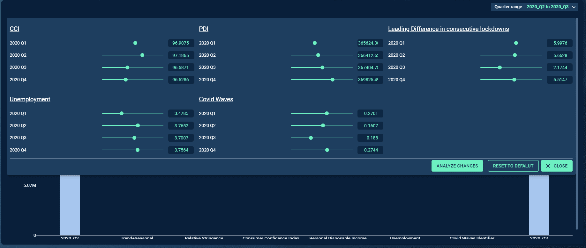

# Introduction
The visual simulator component on Codx helps to make scenarios on the graph/chart data along with the option to receive user-driven inputs on a simulator section. Here, we have provision for representing the data in the form of plotly chart. An optional simulator component is also available on the UI, which opens up based on the click of “Simulate“ button.
 

## Arguments

- `figure_obj` : plotly figure, required
    A plotly figure object that needs to shown on UI.
- `simulator_options_table` : pandas dataframe, required

    The simulator options table is a dataframe that contains the properties
    for the simulator section.
    The table contains columns such as :
        "header", "input_type", "label", "id", "value", "options", "max", "min", "steps", "control"
    The simulator on the screen, contains various sections.
    "header" - string, Contains the name of headers.
        Each section is identifed by headers.
        The Header given here is applied to section name
    "input-type" - string, The name of the input type.
        Can be one of - "slider", "upload", "radio", "text", "number", "dropdown"
        The properties required by each of the input type is provided below.
            "slider" - "label", "id", "value", "max", "min", "steps", "control"
            "upload" - "label", "id", "value"
            "radio" - "label", "id", "value", "options"
            "text" - "label", "id", "value"
            "number" - "label", "id", "value", "max", "min", "steps", "control"
            "dropdown" - "label", "id", "value", "options"
    "label" - string, The name of the simulator option.
        This name is shown on the UI.
    "id" - string, The identifier for the simulator option.
        This name can be used for the tracking of changes.
    "value" - int, string, list, The value of the simulator option.
        We can set a default value to appear on screen.
        The value is a list for the upload input-type, due to possibility of
        multiple files to be uploaded.
    "options" - list, The list of options to be shown on the UI.
        The options are useful for dropdown input, radio input.
    "max" - int, float, The maximum value for the simulator input.
    "min" - int, float, The minimum value for the simulator input.
    "steps" - int, float, The steps that can be applied to the value.
        Increase / Decrease the value by the given no.of steps / multiple of steps
    "control": list, Contains the keys of other inputs which should be controlled
        Specify this option for the input that shall control other inputs.
        Can be applied for only number/decimal type inputs.

- `simulator_buttons_table` : pandas dataframe, required

    The dataframe contains buttons properties for simulator section.
    The columns are "name", "variant", "type", "action", "action_flag_type"
    Each row contains the properties for the buttons.
    "name" - string, Name of the button
    "variant" - string, button variant - "outlined" / "contained"
    "type" - string, Not used. specify "primary" / "upload" / "reset" / "submit" etc.,
    "action" - string, Not used. specify "modify" / "upload" / "reset" / "submit" etc.,
    "action_flag_type" - string, Used for tracking.
        Give a unique name of action_flag_type so as to identify the button click.

- `screen_json` : dict, required

    Provide the screen json with the value that comes from UI.
    The screen json is the screen_data.

# Tooltip:

- Tooltips briefly describe a UI element. They're best used for labelling UI elements with no text, like icon-only buttons and fields.
- It is shown when user hover on the icon, text link, button.
- The will remain visible until user leaves that interaction area.

# Popover:

- Popover displays additional information in a temporary window. It can include rich content such as titles, long definitions, links and buttons
- Use when you need to display additional information in form of text on “i” icon.
- It is shown when user clicks on a word or icon.
- The window remains visible until they click “x” icon on popover.

# Attributes and Methods

- `json_string` : An attribute of the component conversion object which returns a JSON string for the component, which is used to render the component on the UI. Kindly refer the sample codes for usage.
- `add_tooltip` : A method which is used to add tooltip to provide contextual information about the feature. It can take the following parameters -

    - `isTooltip` (bool,optional,default=True) : A flag to determine to add tooltip or not.
    - `tooltip_text` (string, optional, default="This is a tooltip") : Title of the tooltip which displays when user hovers on it.
    - `placement` (string, optional, default="top") : Specifies the position of the tooltip. Values are "top", "bottom", "left", "right", "top-start", "top-end", "bottom-start", "bottom-end","left-start", "left-end", "right-start", "right-end"
- `component_dict` : An attribute which returns the dictionary/JSON structure of the component. Unlike `json_string` attribute which returns a JSON string, this returns a python dictionary.
- `get_simulator_option_user_input`:
    ### Description
    The function helps to get the simulator options which is
    modified by the user in the UI.

    The returned dict Contains values of all headers and Id's.
    ### Parameters
    - `screen_json` : dict, required

        The screen data that comes from UI.

    ### Returns
    The dict object (simulator_dict)

        The returned dict contains keys as headers and value as a dict
        which has keys as id's and values as value modified by user.

## Sample Code
    import json
    import re
    import ast
    import copy
    import sqlalchemy
    import requests
    import pandas
    import pandas as pd
    import numpy as np
    import itertools
    import plotly.figure_factory as ff
    import plotly.graph_objects as go
    from plotly.io import to_json
    from sqlalchemy import create_engine
    from itertools import chain
    from io import StringIO
    from azure.storage.blob import BlockBlobService
    from millify import millify
    from codex_widget_factory_lite.visuals.visual_simulator import VisualSimulator

    def get_json(datasource_type = 'azure_blob_storage', connection_uri = None, container_name = None, blob_name=None):
        block_blob_service = BlockBlobService(connection_string=connection_uri)
        blob_item= block_blob_service.get_blob_to_bytes(container_name, blob_name)
        data = blob_item.content
        return json.loads(data)

    def get_ingested_data(path, datasource_type, connection_uri):
        container_name='/'.join(path.parts[:-1])
        file_path=path.parts[-1]
        block_blob_service = BlockBlobService(connection_string=connection_uri)
        blob_data = block_blob_service.get_blob_to_text(container_name=container_name,
                                                        blob_name=file_path)
        ingested_df = pd.read_csv(StringIO(blob_data.content))
        return ingested_df

    def set_datetime(df, date_col):
        df[date_col] = pd.to_datetime(df[date_col])
        return df.set_index(date_col)

    def get_default_simulator_inputs(exog_forecasts, driver_aggregation_mapping):
        quarterly_grouped = pd.DataFrame()
        difference_df = pd.DataFrame()
        for key in driver_aggregation_mapping.keys():
            if driver_aggregation_mapping[key] == 'sum':
                quarterly_grouped[key] = exog_forecasts[key].resample('Q', convention='start').sum()
            else:
                quarterly_grouped[key] = exog_forecasts[key].resample('Q', convention='start').mean()
        quarterly_grouped['year']=list(quarterly_grouped.index.year)
        quarterly_grouped['quarter']=list(quarterly_grouped.index.quarter)
        quarterly_grouped.index = quarterly_grouped['year'].astype(str)+'_Q'+quarterly_grouped['quarter'].astype(str)
        quarterly_grouped.drop(['year','quarter'], inplace=True, axis=1)

        return quarterly_grouped.to_dict()

    #########################################################################################################################

    def get_simulator_screen_variables():
        """
        The function helps to get the screen variables when using a
        simulator component.

        Returns
        -------
        A tuple containing - action_type, screen_data, selected_filters
        """
        selected_filters = None
        if "action_type" in globals().keys():
            action_type = globals()["action_type"]
            screen_data = globals()["screen_data"]
            if "filter_data" in globals().keys():
                selected_filters = globals()["filter_data"]
        else:
            action_type = None
            screen_data = None
            if "selected_filters" in globals().keys():
                selected_filters = globals()["selected_filters"]

        return action_type, screen_data, selected_filters
    #########################################################################################################################

    ##########################################################################################################################

    def setyaxis_range(contributions):
        contrib=contributions.copy()
        vals = list(contrib.values())
        vals = vals[:len(vals)-2]
        vals = list(np.cumsum(vals))
        max_val = max(vals)*1.15
        min_val = 0
        if min(vals)<0:
            min_val = min(vals)*1.15
    #     dtick_val = (max_val-min_val)/4
        return min_val,max_val

    def plot_waterfall_chart_quarterly(contributions):
        contrib=contributions.copy()
        measure = ['relative' for i in range(len(contrib))]
        measure[0] = 'absolute'
        measure[len(contrib)-1] ='total'
        vals = list(contrib.values())
        vals = list(np.cumsum(vals))
        text = [millify(i, precision=2) for i in list(contrib.values())]
        text = ['0' if x=='-0' else x for x in text]
        max_val = max(vals)*1.1
        min_val = 0
        if min(vals)<0:
            min_val = min(vals)*1.1
        dtick_val = (max_val-min_val)/4
        return go.Waterfall(
            x = list(contrib.keys()),
            measure = measure,
            y = list(contrib.values()),
            textposition = "outside",
            text = text,
            width = 0.3,
            decreasing = {'marker': {'color': "#e20f52", 'line':{'color':"#e20f52",'width':2}}},
            increasing = { 'marker': {'color': "#027b51" }},
            totals =  { 'marker': { 'color': "#1c3ca7", 'line': {'color':'#1c3ca7','width':3}}},
            connector = { 'line': { 'color': "#91cfc4" }})

    def get_changed_variable(change_df):
        temp = (change_df==0).all()
        return list(temp[temp==False].index)

    def get_updated_contribution(exog_forecasts, change_df, coeff_dict, contribution_df, Q_base, Q_final, driver_aggregation_mapping):
        contribution_df.drop('Forecasts', axis=1, inplace=True)
        exog_forecasts['year_quarter'] = list(exog_forecasts.index.year.astype(str)+'_Q'+exog_forecasts.index.quarter.astype(str))
        changed_variables = get_changed_variable(change_df)

        for col in changed_variables:
            change_mapping_dict = change_df[col].to_dict()
            exog_forecasts[col+'_change']=exog_forecasts['year_quarter'].map(change_mapping_dict)
            if driver_aggregation_mapping[col]=='sum':
                exog_forecasts[col]+=(exog_forecasts[col+'_change']/3)
            else:
                exog_forecasts[col]+=(exog_forecasts[col+'_change'])
            exog_forecasts.drop(col+'_change', axis=1, inplace=True)
        for key, val in coeff_dict.items():
            contribution_df[key]=coeff_dict[key]*exog_forecasts[key]
        contribution_df['Forecasts'] = contribution_df.sum(axis=1)
        quarterly_grouped = contribution_df.resample('Q', convention='start').sum()
        quarterly_grouped.index = quarterly_grouped.index.year.astype(str)+'_Q'+quarterly_grouped.index.quarter.astype(str)

        contribution = {}
        base = quarterly_grouped.loc[Q_base]['Forecasts']
        final = quarterly_grouped.loc[Q_final]['Forecasts']
        contribution.update({Q_base:base})
        driver_contrib = quarterly_grouped.drop('Forecasts',axis=1).loc[Q_final]-quarterly_grouped.drop('Forecasts',axis=1).loc[Q_base]
        contribution.update(driver_contrib)
        contribution.update({Q_final:final})
        return contribution, contribution_df['Forecasts']

    def generate_sim_plot(ads, coeff_table, exog_forecasts, predictions, dep_var, default_simulator_inputs, simulator_inputs, driver_name_mapping, driver_aggregation_mapping):
        #------Simulate Scenarios------#

        # 1. Get dictionary of coefficients
        coeff_table = coeff_table[['regressor', "coef"]]
        coeff_table.set_index('regressor', inplace=True)
        coeff_dict = coeff_table.to_dict()['coef']

        # 2. Rename the dependent variable
        predictions.rename(columns = {dep_var+'_predictions': 'Forecasts'}, inplace=True)

        # 3. Exog forecasts rename indexed column
        exog_forecasts = exog_forecasts.rename(columns = {'ds':predictions.index.name})

        # 4. Generate contributions dataframe
        contribution_df = pd.DataFrame()
        for key, val in coeff_dict.items():
            contribution_df[key]=coeff_dict[key]*exog_forecasts[key]

        # 5. Generate Quarterly Contributions
        contribution_df['Trend+Seasonal'] = predictions['Forecasts']-contribution_df.sum(axis=1)
        contribution_df['Forecasts'] = predictions['Forecasts']

        quarterly_grouped = contribution_df.resample('Q', convention='start').sum()
        quarterly_grouped['year']=list(quarterly_grouped.index.year)
        quarterly_grouped['quarter']=list(quarterly_grouped.index.quarter)
        quarterly_grouped.index = quarterly_grouped['year'].astype(str)+'_Q'+quarterly_grouped['quarter'].astype(str)
        quarterly_grouped.drop(['year','quarter'], inplace=True, axis=1)
        quarters = list(quarterly_grouped.index)
        quarter_combination = []
        for combo in itertools.combinations(quarters,2):
            quarter_combination.append(combo)

        contribution_dict = {}

        waterfall_fig = go.Figure()
        waterfall_max_val = 0
        waterfall_buttons = []
        temp_exog_forecasts = exog_forecasts.copy()
        waterfall_index = 0
        for combo in quarter_combination:
            exog_forecasts = temp_exog_forecasts.copy()
            Q_base = combo[0]
            Q_final = combo[1]
            contribution = {}
            base = quarterly_grouped.loc[Q_base]['Forecasts']
            final = quarterly_grouped.loc[Q_final]['Forecasts']
            contribution.update({Q_base:base})
            driver_contrib = quarterly_grouped.drop('Forecasts',axis=1).loc[Q_final]-quarterly_grouped.drop('Forecasts',axis=1).loc[Q_base]
            contribution.update(driver_contrib)
            for driver in driver_contrib.keys():
                if driver!='Trend+Seasonal':
                    contribution[driver_name_mapping[driver]] = contribution.pop(driver)

            contribution.update({Q_final:final})
            change_df = pd.DataFrame(simulator_inputs) - pd.DataFrame(default_simulator_inputs)
            forecasts = contribution_df['Forecasts']
            if (change_df == 0).all().all()==False:
                contribution, forecasts = get_updated_contribution(exog_forecasts, change_df, coeff_dict, contribution_df, Q_base, Q_final, driver_aggregation_mapping)

            waterfall_plt = plot_waterfall_chart_quarterly(contribution)
            min_val,max_val = setyaxis_range(contribution)
            dtick_val = (max_val-min_val)/4
            contribution_dict.update({'contribution_'+Q_base+'_'+Q_final: contribution})
            if waterfall_index == 0:
                waterfall_plt['visible'] = True
            else:
                waterfall_plt['visible'] = False

            if waterfall_max_val < max(waterfall_plt['y']):
                waterfall_max_val = max(waterfall_plt['y'])

            waterfall_fig.add_trace(waterfall_plt)
            visible = []
            while len(visible) < len(quarter_combination):
                visible.append(False)

            visible[waterfall_index] = True

            waterfall_buttons.append({
                'args': [{'visible': visible}],
                'label': Q_base + " to " + Q_final,
                'method': "update"
            })
            waterfall_index = waterfall_index + 1

        waterfall_fig.update_layout(
            updatemenus=[
                {
                    'type': "buttons",
                    'direction': "left",
                    'buttons': waterfall_buttons,
                    'name': 'Quarter range',
                    'active': 0
                }
            ],
            waterfallgap= 0.3,
            yaxis = {
                'title': 'Incremental/Decremental contributions',
                'tickfont': {'size': 15},
                'range': [min_val,max_val],
                'dtick': dtick_val
            },
            autosize=False, width=1000, height=450
        )
        return waterfall_fig

    ########################################################################################################################

    def _get_value_info(value_n):
        value_str = str(value_n)
        if '.' in value_str:
            split_value_str = value_str.split(".")
            value_digits = len(split_value_str[0])
            value_decimal_digits = len(split_value_str[1])
        else:
            value_digits = len(value_str)
            value_decimal_digits = 0

        return {"value_digits": value_digits,
                "value_decimal_digits": value_decimal_digits}

    def _get_increment_steps(value_info):
        if value_info["value_decimal_digits"] == 0:
            inc_steps_str = "1" + "0" *             (0 if value_info["value_digits"] ==
                1 else value_info["value_digits"]-2)
            inc_steps = int(inc_steps_str)
        else:
            inc_steps_str = "0" + "." + "0"*(value_info["value_decimal_digits"] - 1) +             "1" if value_info["value_digits"] == 1 else "1" +             "0"*(value_info["value_digits"]-2)
            inc_steps = float(inc_steps_str)
        return inc_steps

    def _get_max_value(value_mean, value_std):
        return round(value_mean + (4 * value_std), 4)

    def _get_min_value(value_mean, value_std):
        return round(value_mean - (4 * value_std), 4)

    def _get_steps_value(value_n):
        return _get_increment_steps(_get_value_info(value_n))

    def _make_simulator_df(default_simulator_dict, exog_names, slider_control_info=np.nan):
        col_names = ["header", "input_type", "id", "label", "value", "options", "max", "min", "steps", "control"]
        simulator_df = pd.DataFrame(columns=col_names)
        for exog_n in exog_names:
            temp_simulator_df = pd.DataFrame(index=np.arange(0, len(default_simulator_dict[exog_n]), 1), columns=col_names)
            temp_simulator_df["header"] = exog_n
            temp_simulator_df["input_type"] = "slider"
            temp_simulator_df["id"] = list(default_simulator_dict[exog_n].keys())
            temp_simulator_df["label"] = temp_simulator_df["id"].str.replace("_", " ")
            temp_simulator_df["value"] = list(default_simulator_dict[exog_n].values())
            temp_simulator_df["value"] = temp_simulator_df["value"].round(4)
            temp_simulator_df["options"] = ""
            value_mean = temp_simulator_df["value"].mean()
            value_std = temp_simulator_df["value"].std()
            temp_simulator_df["max"] = _get_max_value(value_mean, value_std)
            temp_simulator_df["min"] = _get_min_value(value_mean, value_std)
            temp_simulator_df["steps"] = temp_simulator_df["value"].apply(_get_steps_value)
            temp_simulator_df["control"] = slider_control_info
            simulator_df = simulator_df.append(temp_simulator_df).reset_index(drop=True)
        return simulator_df

    ########################################################################################################################

    codex_tags = {"account":"mars-petcare", "channel": "SPT", "product": 'SPT DRY FOOD', "connection_url":"DefaultEndpointsProtocol=https;AccountName=willbedeletedsoon;AccountKey=qa5A74pLx0IQxOJk4MGoQChO8kJW6u9rjUBQj8gOeL3bPADodK27ExoEMY/Gq1BIY1tDk9hEWQT+JcnhDO79SQ==;EndpointSuffix=core.windows.net"}
    # 1. Create the file path to retrieve data from blob storage
    file_path = codex_tags['account']+'/'+codex_tags['channel']+'/'+codex_tags['product']

    # 2. Create the simulator_info_json
    simulator_info = get_json(datasource_type = 'azure_blob_storage', connection_uri = codex_tags['connection_url'], container_name = file_path, blob_name='simulator_info.json')

    # 3. Read future driver values table
    from pathlib import Path
    from io import StringIO
    exog_forecasts = get_ingested_data(Path(file_path+'/'+'exog_forecasts.csv'),'azure_blob_storage',codex_tags['connection_url'])
    exog_forecasts = exog_forecasts.rename(columns = {'Month_Year':'DATE'})
    exog_forecasts = set_datetime(exog_forecasts, 'DATE')

    # 4. Get default simulator inputs
    # Note: The default view of the simulator scenarios is powered through this file.
    #default_simulator_inputs = get_default_simulator_inputs(exog_forecasts, simulator_info["driver_aggregation_mapping"])
    default_simulator_inputs = get_json(datasource_type = 'azure_blob_storage', connection_uri = codex_tags['connection_url'], container_name = file_path, blob_name='default_simulator_inputs.json')

    # 5. Get changed simulator inputs
    # simulator_inputs = default_simulator_inputs.copy()

    # 6. Read coefficient table
    coeff_table = get_ingested_data(Path(file_path+'/'+'coeff_table.csv'),'azure_blob_storage',codex_tags['connection_url'])

    # 7. Read future dependent variable prediction
    predictions = get_ingested_data(Path(file_path+'/'+'predictions.csv'),'azure_blob_storage',codex_tags['connection_url'])
    predictions = predictions.rename(columns = {'Month_Year':'DATE'})
    predictions = set_datetime(predictions, 'DATE')

    # 8. Read ADS
    ads = get_ingested_data(Path(file_path+'/'+'ADS.csv'),'azure_blob_storage',codex_tags['connection_url'])
    ads = ads.rename(columns = {'Month_Year':'DATE'})
    ads = set_datetime(ads, 'DATE')

    #################################################
    sim_options = _make_simulator_df(default_simulator_inputs,list(default_simulator_inputs.keys()),)

    simulator_buttons = pd.DataFrame([
                                    {
                                        "name": "Analyze Changes",
                                        "variant": "contained",
                                        "type": "primary",
                                        "action": "change",
                                        "action_flag_type": "Slider section Analyse Changes"
                                    },
                                    {
                                        "name": "Reset to Defalut",
                                        "variant": "outlined",
                                        "type": "reset",
                                        "action": "reset",
                                        "action_flag_type": "random"
                                    }
                                    ])

    action_type, screen_data, selected_filters = get_simulator_screen_variables()

    if action_type:
        # Component items are assigned with modified values according to user inputs
        if action_type=="Slider section Analyse Changes":
            simulator_inputs = VisualSimulator.get_simulator_option_user_input(screen_data)
        else:
            simulator_inputs = default_simulator_inputs
    else:
        simulator_inputs = default_simulator_inputs

    simulator_outputs = generate_sim_plot(ads, coeff_table, exog_forecasts, predictions, simulator_info["dependent_variable"], default_simulator_inputs, simulator_inputs, simulator_info["driver_name_mapping"],  simulator_info["driver_aggregation_mapping"])
    vs = VisualSimulator(simulator_outputs,sim_options,simulator_buttons,screen_data)
    vs.add_tooltip(isTooltip=True,tooltip_text="This is a tooltip",placement="top")
    dynamic_outputs = vs.json_string

 ## JSON Structure
    {
        <plotly graph dict>
        "simulator_options": {
            "sections": [
                {
                    "header": "headername", // section Header name
                    "inputs": [ // List of items which will be shown in the sections
                        // items can be *slider*, *upload* button, *radio* / *checkboxes* options, *text*/*number* inputs
                        // properties to be sent for each of these inputs are given below.
                        {
                            "input_type": "slider",
                            "value": "default value", //will be a number
                            "max": "max value", //will be a number
                            "min": "min value", // will be a number
                            "label": "Name", // lable will be used to display the name
                            "id": "", // id will be used internally
                            "steps": "value of steps"
                        },
                        {
                            "input_type": "upload",
                            "label": "Name of the button",
                            "id": ""
                        },
                        {
                            "input_type": "radio",
                            "name": "",
                            "options":["option 1", "option 2"]
                        },
                        {
                            "input_type": "text",
                            "id": "",
                            "label":"",
                            "value":""
                        },
                        {
                            "input_type": "number",
                            "id": "",
                            "label": "",
                            "value":300
                        }
                    ]
                }
            ],
            "actions": [ // holds overall actions on the simulators
                {
                    "name": "Analyse Change",
                    "action_flag_type": "analyseChange1", // action_flag_type will be the flag which will be sent to the codestring to run necessary functions
                    "variant":"contained",// "outlined"
                    // "type":"primary", // "secondary"
                    "action":"" //can be ignored when action_flag_type is given
                },
                {
                    "name": "Reset Change",
                    "action_flag_type": "", // no flag or blank string or None for actions flag types where you do not want to run backend code
                    "variant": "contained", // "outlined"
                    // "type": "reset", // "secondary"
                    "action": "" //can be ignored when action_flag_type is given
                }
            ]
        },
        "isTooltip": true,
        "tooltip_text": "This is a tooltip",
        "placement": "top"
    }
