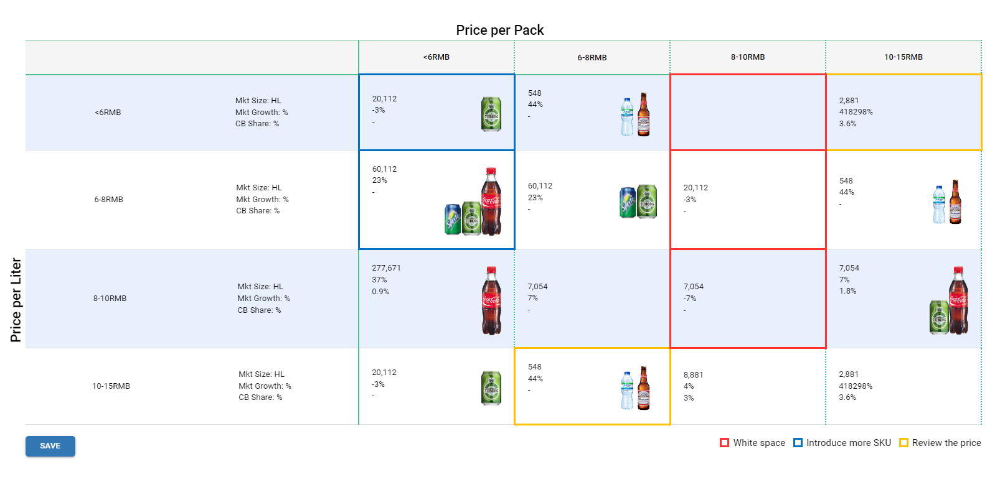

# Introduction

The white space detector component helps to visualize and calculate white space opportunities to identify gaps in the market and potential opportunities for new products based on the defined logic.



# Tooltip:

- Tooltips briefly describe a UI element. They're best used for labelling UI elements with no text, like icon-only buttons and fields.
- It is shown when user hover on the icon, text link, button.
- The will remain visible until user leaves that interaction area.

# Popover:

- Popover displays additional information in a temporary window. It can include rich content such as titles, long definitions, links and buttons
- Use when you need to display additional information in form of text on “i” icon.
- It is shown when user clicks on a word or icon.
- The window remains visible until they click “x” icon on popover.


# Arguments

- `column_head_data` (list, required): List of columns head content with each column head dictionary containing id and head as mandatory keys

```
[
    {
        "id": <str: column unique identifier>,
        "head": <str: text to be shown as the column head>
    }
]
```

- `row_head_data` (list, required): List of rows head content with each row head dictionary containing id, head as mandatory and subhead as optional keys

```
[
    {
        "id": <str: row unique identifier>,
        "head": <str: text to be shown as the row head>,
        "subhead": [<str>, <str>] # Optional list of text to be shown as row subhead
    }
]
```

- `cells_data` (dict, required): Dictionary of rows with each key as row head id and value as dictionary of columns with each key as column head id

```
{
    <row unique identifier>: {
        <column unique identifier>: {
            "content": [<str>, <str>], # text content to be shown in the cell
            "icons": [<str: icon url>], # list of icons to be shown in the cell
            "options": {
                <legend unique identifier>: <boolean> # True to show this legend on this cell
            }
        }
    }
}
```

- `legends` (list, optional): List of legends with each legend dictionary having mandatory id and name

```
[
    {
        "id": <str: legend unique identifier>,
        "name": <str: name/text to be shown in the legend>,
        "style": {
            "borderColor": <str: border color hexcode of the legend>, # e.g. "#ff3232"
            "borderWidth": <str: border width of the legend in pixels>, # e.g. "3px"
            "borderStyle": <str: "solid" | "dotted" | "dashed" | "double" | "inset" | "groove">
        }
    }
]
```

- `axis_headers` (dict, optional): Dictionary of x and y axis headers text

```
{
    "x": <str: text to appear on x-axis>,
    "y": <str: text to appear on y-axis>
}
```

- `icons_list` (list, optional): List of icons to be shown in cell dropdown having text and url for each icon

```
[
    {
        "text": <str: name text to appear for the icon>,
        "url": <str: url of the icon>
    }
]
```

- `actions` (list, optional): List of action buttons to be added with text, name and variant

```
[
    {
        "text": <str: button text>,
        "name": <str: this value appears as action_type>, # e.g. "action_save"
        "variant": <str: button variant - "outlined" | "contained" | "text">
    }
]
```

- `style_options` (dict, optional): Dictionary of custom styles to be applied

```
{
    "cellSize": {
        "width": <str: cell width in pixels>, # e.g. "140px"
        "height": <str: cell height in pixels>
    },
    "rowHeadWidth": <str: row head width in pixels>,
    "legendsAlignment": <str: legends alignment - "bottom-right" | "bottom-center" | "top-right">,
    "shiftCellIconsUp": <str: upwards vertical shift in pixels>, # e.g. "50px"
    "cellIconMaxWidth": <str: max-width of the cell icon to control the size of the icon in a cell> # e.g. "25px"
}
```

- `settings` (dict, optional): Dictionary of custom settings to be applied

```
{
    "iconsPerCell": <number: number of icons visible per cell>
}
```

# Tooltip:

- Tooltips briefly describe a UI element. They're best used for labelling UI elements with no text, like icon-only buttons and fields.
- It is shown when user hover on the icon, text link, button.
- The will remain visible until user leaves that interaction area.

# Popover:


- Popover displays additional information in a temporary window. It can include rich content such as titles, long definitions, links and buttons
- Use when you need to display additional information in form of text on “i” icon.
- It is shown when user clicks on a word or icon.
- The window remains visible until they click “x” icon on popover.

# Attributes and Methods

- `json_string` : An attribute of the component conversion object which returns a JSON string for the component, which is used to render the component on the UI. Kindly refer the sample codes for usage.
- `add_tooltip` : A method which is used to add tooltip to provide contextual information about the feature. It can take the following parameters -

    - `isTooltip` (bool,optional,default=True) : A flag to determine to add tooltip or not.
    - `tooltip_text` (string, optional, default="This is a tooltip") : Title of the tooltip which displays when user hovers on it.
    - `placement` (string, optional, default="top") : Specifies the position of the tooltip. Values are "top", "bottom", "left", "right", "top-start", "top-end", "bottom-start", "bottom-end","left-start", "left-end", "right-start", "right-end"
- `component_dict` : An attribute which returns the dictionary/JSON structure of the component. Unlike `json_string` attribute which returns a JSON string, this returns a python dictionary.

# Sample Codes

## White Space Detector with mandatory data

```
import json
from codex_widget_factory_lite.visuals.white_space_detector import WhiteSpaceDetector


column_head_data = [
    {
        "id": "columnHead1",
        "head": "<6RMB"
    },
    {
        "id": "columnHead2",
        "head": "6-8RMB"
    },
    {
        "id": "columnHead3",
        "head": "8-10RMB"
    },
    {
        "id": "columnHead4",
        "head": "10-15RMB"
    }
]

row_head_data = [
    {
        "id": "rowHead1",
        "head": "<6RMB",
        "subhead": [
            "Mkt Size: HL",
            "Mkt Growth: %",
            "CB Share: %"
        ]
    },
    {
        "id": "rowHead2",
        "head": "6-8RMB",
        "subhead": [
            "Mkt Size: HL",
            "Mkt Growth: %",
            "CB Share: %"
        ]
    },
    {
        "id": "rowHead3",
        "head": "8-10RMB",
        "subhead": [
            "Mkt Size: HL",
            "Mkt Growth: %",
            "CB Share: %"
        ]
    },
    {
        "id": "rowHead4",
        "head": "10-15RMB",
        "subhead": [
            "Mkt Size: HL",
            "Mkt Growth: %",
            "CB Share: %"
        ]
    }
]

cells_data = {
    "rowHead1": {
        "columnHead1": {
            "content": [
                "20,112",
                "-3%"
            ],
            "icons": [
                "https://willbedeletedsoon.blob.core.windows.net/test-uploads/tuborg-can.png"
            ]
        },
        "columnHead2": {
            "content": [
                "548",
                "44%"
            ],
            "icons": [
                "https://willbedeletedsoon.blob.core.windows.net/test-uploads/buxton-mineral-water.png",
                "https://willbedeletedsoon.blob.core.windows.net/test-uploads/budweiser-bottle.png"
            ]
        },
        "columnHead4": {
            "content": [
                "2,881",
                "418298%",
                "3.6%"
            ],
            "icons": []
        }
    },
    "rowHead2": {
        "columnHead1": {
            "content": [
                "60,112",
                "23%"
            ],
            "icons": [
                "https://willbedeletedsoon.blob.core.windows.net/test-uploads/sprite-can.png",
                "https://willbedeletedsoon.blob.core.windows.net/test-uploads/tuborg-can.png",
                "https://willbedeletedsoon.blob.core.windows.net/test-uploads/coca-cola-bottle.png"
            ]
        },
        "columnHead2": {
            "content": [
                "60,112",
                "23%"
            ],
            "icons": [
                "https://willbedeletedsoon.blob.core.windows.net/test-uploads/sprite-can.png",
                "https://willbedeletedsoon.blob.core.windows.net/test-uploads/tuborg-can.png"
            ]
        },
        "columnHead3": {
            "content": [
                "20,112",
                "-3%"
            ],
            "icons": []
        },
        "columnHead4": {
            "content": [
                "548",
                "44%"
            ],
            "icons": [
                "https://willbedeletedsoon.blob.core.windows.net/test-uploads/buxton-mineral-water.png",
                "https://willbedeletedsoon.blob.core.windows.net/test-uploads/budweiser-bottle.png"
            ]
        }
    },
    "rowHead3": {
        "columnHead1": {
            "content": [
                "277,671",
                "37%",
                "0.9%"
            ],
            "icons": [
                "https://willbedeletedsoon.blob.core.windows.net/test-uploads/coca-cola-bottle.png"
            ]
        },
        "columnHead2": {
            "content": [
                "7,054",
                "7%"
            ],
            "icons": []
        },
        "columnHead3": {
            "content": [
                "7,054",
                "-7%"
            ],
            "icons": []
        },
        "columnHead4": {
            "content": [
                "7,054",
                "7%",
                "1.8%"
            ],
            "icons": [
                "https://willbedeletedsoon.blob.core.windows.net/test-uploads/tuborg-can.png",
                "https://willbedeletedsoon.blob.core.windows.net/test-uploads/coca-cola-bottle.png"
            ]
        }
    },
    "rowHead4": {
        "columnHead1": {
            "content": [
                "20,112",
                "-3%"
            ],
            "icons": [
                "https://willbedeletedsoon.blob.core.windows.net/test-uploads/tuborg-can.png"
            ]
        },
        "columnHead2": {
            "content": [
                "548",
                "44%"
            ],
            "icons": [
                "https://willbedeletedsoon.blob.core.windows.net/test-uploads/buxton-mineral-water.png",
                "https://willbedeletedsoon.blob.core.windows.net/test-uploads/budweiser-bottle.png"
            ]
        },
        "columnHead3": {
            "content": [
                "8,881",
                "4%",
                "3%"
            ],
            "icons": []
        },
        "columnHead4": {
            "content": [
                "2,881",
                "418298%",
                "3.6%"
            ],
            "icons": []
        }
    }
}

output=WhiteSpaceDetector(
    column_head_data = column_head_data,
    row_head_data = row_head_data,
    cells_data = cells_data
)
output.add_tooltip(isTooltip=True,tooltip_text="This is a tooltip" ,placement="top")
dynamic_outputs = output.json_string
```

## White Space Detector with legends and axis headers

```
import json
from codex_widget_factory_lite.visuals.white_space_detector import WhiteSpaceDetector


column_head_data = [
    {
        "id": "columnHead1",
        "head": "<6RMB"
    },
    {
        "id": "columnHead2",
        "head": "6-8RMB"
    },
    {
        "id": "columnHead3",
        "head": "8-10RMB"
    },
    {
        "id": "columnHead4",
        "head": "10-15RMB"
    }
]

row_head_data = [
    {
        "id": "rowHead1",
        "head": "<6RMB",
        "subhead": [
            "Mkt Size: HL",
            "Mkt Growth: %",
            "CB Share: %"
        ]
    },
    {
        "id": "rowHead2",
        "head": "6-8RMB",
        "subhead": [
            "Mkt Size: HL",
            "Mkt Growth: %",
            "CB Share: %"
        ]
    },
    {
        "id": "rowHead3",
        "head": "8-10RMB",
        "subhead": [
            "Mkt Size: HL",
            "Mkt Growth: %",
            "CB Share: %"
        ]
    },
    {
        "id": "rowHead4",
        "head": "10-15RMB",
        "subhead": [
            "Mkt Size: HL",
            "Mkt Growth: %",
            "CB Share: %"
        ]
    }
]

cells_data = {
    "rowHead1": {
        "columnHead1": {
            "content": [
                "20,112",
                "-3%"
            ],
            "icons": [
                "https://willbedeletedsoon.blob.core.windows.net/test-uploads/tuborg-can.png"
            ],
            "options": {
                "introduce-more-sku": True
            }
        },
        "columnHead2": {
            "content": [
                "548",
                "44%"
            ],
            "icons": [
                "https://willbedeletedsoon.blob.core.windows.net/test-uploads/buxton-mineral-water.png",
                "https://willbedeletedsoon.blob.core.windows.net/test-uploads/budweiser-bottle.png"
            ]
        },
        "columnHead3": {
            "options": {
                "white-space": True
            }
        },
        "columnHead4": {
            "content": [
                "2,881",
                "418298%",
                "3.6%"
            ],
            "icons": [],
            "options": {
                "review-price": True
            }
        }
    },
    "rowHead2": {
        "columnHead1": {
            "content": [
                "60,112",
                "23%"
            ],
            "icons": [
                "https://willbedeletedsoon.blob.core.windows.net/test-uploads/sprite-can.png",
                "https://willbedeletedsoon.blob.core.windows.net/test-uploads/tuborg-can.png",
                "https://willbedeletedsoon.blob.core.windows.net/test-uploads/coca-cola-bottle.png"
            ],
            "options": {
                "introduce-more-sku": True
            }
        },
        "columnHead2": {
            "content": [
                "60,112",
                "23%"
            ],
            "icons": [
                "https://willbedeletedsoon.blob.core.windows.net/test-uploads/sprite-can.png",
                "https://willbedeletedsoon.blob.core.windows.net/test-uploads/tuborg-can.png"
            ]
        },
        "columnHead3": {
            "content": [
                "20,112",
                "-3%"
            ],
            "icons": [],
            "options": {
                "white-space": True
            }
        },
        "columnHead4": {
            "content": [
                "548",
                "44%"
            ],
            "icons": [
                "https://willbedeletedsoon.blob.core.windows.net/test-uploads/buxton-mineral-water.png",
                "https://willbedeletedsoon.blob.core.windows.net/test-uploads/budweiser-bottle.png"
            ]
        }
    },
    "rowHead3": {
        "columnHead1": {
            "content": [
                "277,671",
                "37%",
                "0.9%"
            ],
            "icons": [
                "https://willbedeletedsoon.blob.core.windows.net/test-uploads/coca-cola-bottle.png"
            ]
        },
        "columnHead2": {
            "content": [
                "7,054",
                "7%"
            ],
            "icons": []
        },
        "columnHead3": {
            "content": [
                "7,054",
                "-7%"
            ],
            "icons": [],
            "options": {
                "white-space": True
            }
        },
        "columnHead4": {
            "content": [
                "7,054",
                "7%",
                "1.8%"
            ],
            "icons": [
                "https://willbedeletedsoon.blob.core.windows.net/test-uploads/tuborg-can.png",
                "https://willbedeletedsoon.blob.core.windows.net/test-uploads/coca-cola-bottle.png"
            ]
        }
    },
    "rowHead4": {
        "columnHead1": {
            "content": [
                "20,112",
                "-3%"
            ],
            "icons": [
                "https://willbedeletedsoon.blob.core.windows.net/test-uploads/tuborg-can.png"
            ]
        },
        "columnHead2": {
            "content": [
                "548",
                "44%"
            ],
            "icons": [
                "https://willbedeletedsoon.blob.core.windows.net/test-uploads/buxton-mineral-water.png",
                "https://willbedeletedsoon.blob.core.windows.net/test-uploads/budweiser-bottle.png"
            ]
        },
        "columnHead3": {
            "content": [
                "8,881",
                "4%",
                "3%"
            ],
            "icons": []
        },
        "columnHead4": {
            "content": [
                "2,881",
                "418298%",
                "3.6%"
            ],
            "icons": []
        }
    }
}

legends = [
    {
        "id": "white-space",
        "name": "White space",
        "style": {
            "borderColor": "#ff3232",
            "borderWidth": "3px",
            "borderStyle": "solid"
        }
    },
    {
        "id": "introduce-more-sku",
        "name": "Introduce more SKU",
        "style": {
            "borderColor": "#0070c0",
            "borderWidth": "3px",
            "borderStyle": "solid"
        }
    },
    {
        "id": "review-price",
        "name": "Review the price",
        "style": {
            "borderColor": "#ffc000",
            "borderWidth": "3px",
            "borderStyle": "solid"
        }
    }
]

axis_headers = {
    "x": "Price per Pack",
    "y": "Price per Liter"
}

output=WhiteSpaceDetector(
    column_head_data = column_head_data,
    row_head_data = row_head_data,
    cells_data = cells_data,
    legends = legends,
    axis_headers = axis_headers
)
output.add_tooltip(isTooltip=True,tooltip_text="This is a tooltip" ,placement="top")
dynamic_outputs = output.json_string
```

## White Space Detector with icons list dropdown and action button

```
import json
from codex_widget_factory_lite.visuals.white_space_detector import WhiteSpaceDetector


column_head_data = [
    {
        "id": "columnHead1",
        "head": "<6RMB"
    },
    {
        "id": "columnHead2",
        "head": "6-8RMB"
    },
    {
        "id": "columnHead3",
        "head": "8-10RMB"
    },
    {
        "id": "columnHead4",
        "head": "10-15RMB"
    }
]

row_head_data = [
    {
        "id": "rowHead1",
        "head": "<6RMB",
        "subhead": [
            "Mkt Size: HL",
            "Mkt Growth: %",
            "CB Share: %"
        ]
    },
    {
        "id": "rowHead2",
        "head": "6-8RMB",
        "subhead": [
            "Mkt Size: HL",
            "Mkt Growth: %",
            "CB Share: %"
        ]
    },
    {
        "id": "rowHead3",
        "head": "8-10RMB",
        "subhead": [
            "Mkt Size: HL",
            "Mkt Growth: %",
            "CB Share: %"
        ]
    },
    {
        "id": "rowHead4",
        "head": "10-15RMB",
        "subhead": [
            "Mkt Size: HL",
            "Mkt Growth: %",
            "CB Share: %"
        ]
    }
]

cells_data = {
    "rowHead1": {
        "columnHead1": {
            "content": [
                "20,112",
                "-3%"
            ],
            "icons": [
                "https://willbedeletedsoon.blob.core.windows.net/test-uploads/tuborg-can.png"
            ],
            "options": {
                "introduce-more-sku": True
            }
        },
        "columnHead2": {
            "content": [
                "548",
                "44%"
            ],
            "icons": [
                "https://willbedeletedsoon.blob.core.windows.net/test-uploads/buxton-mineral-water.png",
                "https://willbedeletedsoon.blob.core.windows.net/test-uploads/budweiser-bottle.png"
            ]
        },
        "columnHead3": {
            "options": {
                "white-space": True
            }
        },
        "columnHead4": {
            "content": [
                "2,881",
                "418298%",
                "3.6%"
            ],
            "icons": [],
            "options": {
                "review-price": True
            }
        }
    },
    "rowHead2": {
        "columnHead1": {
            "content": [
                "60,112",
                "23%"
            ],
            "icons": [
                "https://willbedeletedsoon.blob.core.windows.net/test-uploads/sprite-can.png",
                "https://willbedeletedsoon.blob.core.windows.net/test-uploads/tuborg-can.png",
                "https://willbedeletedsoon.blob.core.windows.net/test-uploads/coca-cola-bottle.png"
            ],
            "options": {
                "introduce-more-sku": True
            }
        },
        "columnHead2": {
            "content": [
                "60,112",
                "23%"
            ],
            "icons": [
                "https://willbedeletedsoon.blob.core.windows.net/test-uploads/sprite-can.png",
                "https://willbedeletedsoon.blob.core.windows.net/test-uploads/tuborg-can.png"
            ]
        },
        "columnHead3": {
            "content": [
                "20,112",
                "-3%"
            ],
            "icons": [],
            "options": {
                "white-space": True
            }
        },
        "columnHead4": {
            "content": [
                "548",
                "44%"
            ],
            "icons": [
                "https://willbedeletedsoon.blob.core.windows.net/test-uploads/buxton-mineral-water.png",
                "https://willbedeletedsoon.blob.core.windows.net/test-uploads/budweiser-bottle.png"
            ]
        }
    },
    "rowHead3": {
        "columnHead1": {
            "content": [
                "277,671",
                "37%",
                "0.9%"
            ],
            "icons": [
                "https://willbedeletedsoon.blob.core.windows.net/test-uploads/coca-cola-bottle.png"
            ]
        },
        "columnHead2": {
            "content": [
                "7,054",
                "7%"
            ],
            "icons": []
        },
        "columnHead3": {
            "content": [
                "7,054",
                "-7%"
            ],
            "icons": [],
            "options": {
                "white-space": True
            }
        },
        "columnHead4": {
            "content": [
                "7,054",
                "7%",
                "1.8%"
            ],
            "icons": [
                "https://willbedeletedsoon.blob.core.windows.net/test-uploads/tuborg-can.png",
                "https://willbedeletedsoon.blob.core.windows.net/test-uploads/coca-cola-bottle.png"
            ]
        }
    },
    "rowHead4": {
        "columnHead1": {
            "content": [
                "20,112",
                "-3%"
            ],
            "icons": [
                "https://willbedeletedsoon.blob.core.windows.net/test-uploads/tuborg-can.png"
            ]
        },
        "columnHead2": {
            "content": [
                "548",
                "44%"
            ],
            "icons": [
                "https://willbedeletedsoon.blob.core.windows.net/test-uploads/buxton-mineral-water.png",
                "https://willbedeletedsoon.blob.core.windows.net/test-uploads/budweiser-bottle.png"
            ]
        },
        "columnHead3": {
            "content": [
                "8,881",
                "4%",
                "3%"
            ],
            "icons": []
        },
        "columnHead4": {
            "content": [
                "2,881",
                "418298%",
                "3.6%"
            ],
            "icons": []
        }
    }
}

legends = [
    {
        "id": "white-space",
        "name": "White space",
        "style": {
            "borderColor": "#ff3232",
            "borderWidth": "3px",
            "borderStyle": "solid"
        }
    },
    {
        "id": "introduce-more-sku",
        "name": "Introduce more SKU",
        "style": {
            "borderColor": "#0070c0",
            "borderWidth": "3px",
            "borderStyle": "solid"
        }
    },
    {
        "id": "review-price",
        "name": "Review the price",
        "style": {
            "borderColor": "#ffc000",
            "borderWidth": "3px",
            "borderStyle": "solid"
        }
    }
]

axis_headers = {
    "x": "Price per Pack",
    "y": "Price per Liter"
}

icons_list = [
    {
        "text": "Budweiser bottle",
        "url": "https://willbedeletedsoon.blob.core.windows.net/test-uploads/budweiser-bottle.png"
    },
    {
        "text": "Buxton mineral water",
        "url": "https://willbedeletedsoon.blob.core.windows.net/test-uploads/buxton-mineral-water.png"
    },
    {
        "text": "Coca cola bottle",
        "url": "https://willbedeletedsoon.blob.core.windows.net/test-uploads/coca-cola-bottle.png"
    },
    {
        "text": "Sprite can",
        "url": "https://willbedeletedsoon.blob.core.windows.net/test-uploads/sprite-can.png"
    },
    {
        "text": "Tuborg can",
        "url": "https://willbedeletedsoon.blob.core.windows.net/test-uploads/tuborg-can.png"
    },
    {
        "text": "Whiskey bottle",
        "url": "https://willbedeletedsoon.blob.core.windows.net/test-uploads/whiskey-bottle.png"
    }
]

actions = [
    {
        "text": "Save",
        "name": "action_save",
        "variant": "contained"
    }
]

try:
    if action_type == 'action_save':
        ########
        # Add your custom business logic here
        ########
        # Example
        cells_data = screen_data['cellsData']
except:
    pass

output=WhiteSpaceDetector(
    column_head_data = column_head_data,
    row_head_data = row_head_data,
    cells_data = cells_data,
    legends = legends,
    axis_headers = axis_headers,
    icons_list = icons_list,
    actions = actions
)
output.add_tooltip(isTooltip=True,tooltip_text="This is a tooltip" ,placement="top")
dynamic_outputs = output.json_string
```

## White Space Detector with custom settings and style options

```
import json
from codex_widget_factory_lite.visuals.white_space_detector import WhiteSpaceDetector


column_head_data = [
    {
        "id": "columnHead1",
        "head": "<6RMB",
        "columnWidth" : "140px"    #optional: Set column width
    },
    {
        "id": "columnHead2",
        "head": "6-8RMB",
        "columnWidth" : "140px"    #optional: Set column width
    },
    {
        "id": "columnHead3",
        "head": "8-10RMB",
        "columnWidth" : "140px"    #optional: Set column width
    },
    {
        "id": "columnHead4",
        "head": "10-15RMB",
        "columnWidth" : "140px"    #optional: Set column width
    }
]

row_head_data = [
    {
        "id": "rowHead1",
        "head": "<6RMB",
        "subhead": [
            "Mkt Size: HL",
            "Mkt Growth: %",
            "CB Share: %"
        ],
        "rowHeight" : "140px"        #optional: Set row height
    },
    {
        "id": "rowHead2",
        "head": "6-8RMB",
        "subhead": [
            "Mkt Size: HL",
            "Mkt Growth: %",
            "CB Share: %"
        ],
        "rowHeight" : "140px"        #optional: Set row height
    },
    {
        "id": "rowHead3",
        "head": "8-10RMB",
        "subhead": [
            "Mkt Size: HL",
            "Mkt Growth: %",
            "CB Share: %"
        ],
        "rowHeight" : "140px"        #optional: Set row height
    },
    {
        "id": "rowHead4",
        "head": "10-15RMB",
        "subhead": [
            "Mkt Size: HL",
            "Mkt Growth: %",
            "CB Share: %"
        ],
        "rowHeight" : "140px"        #optional: Set row height
    }
]

cells_data = {
    "rowHead1": {
        "columnHead1": {
            "content": [
                "20,112",
                "-3%"
            ],
            "icons": [
                "https://willbedeletedsoon.blob.core.windows.net/test-uploads/tuborg-can.png"
            ],
            "options": {
                "introduce-more-sku": True
            }
        },
        "columnHead2": {
            "content": [
                "548",
                "44%"
            ],
            "icons": [
                "https://willbedeletedsoon.blob.core.windows.net/test-uploads/buxton-mineral-water.png",
                "https://willbedeletedsoon.blob.core.windows.net/test-uploads/budweiser-bottle.png"
            ]
        },
        "columnHead3": {
            "options": {
                "white-space": True
            }
        },
        "columnHead4": {
            "content": [
                "2,881",
                "418298%",
                "3.6%"
            ],
            "icons": [],
            "options": {
                "review-price": True
            }
        }
    },
    "rowHead2": {
        "columnHead1": {
            "content": [
                "60,112",
                "23%"
            ],
            "icons": [
                "https://willbedeletedsoon.blob.core.windows.net/test-uploads/sprite-can.png",
                "https://willbedeletedsoon.blob.core.windows.net/test-uploads/tuborg-can.png",
                "https://willbedeletedsoon.blob.core.windows.net/test-uploads/coca-cola-bottle.png"
            ],
            "options": {
                "introduce-more-sku": True
            }
        },
        "columnHead2": {
            "content": [
                "60,112",
                "23%"
            ],
            "icons": [
                "https://willbedeletedsoon.blob.core.windows.net/test-uploads/sprite-can.png",
                "https://willbedeletedsoon.blob.core.windows.net/test-uploads/tuborg-can.png"
            ]
        },
        "columnHead3": {
            "content": [
                "20,112",
                "-3%"
            ],
            "icons": [],
            "options": {
                "white-space": True
            }
        },
        "columnHead4": {
            "content": [
                "548",
                "44%"
            ],
            "icons": [
                "https://willbedeletedsoon.blob.core.windows.net/test-uploads/buxton-mineral-water.png",
                "https://willbedeletedsoon.blob.core.windows.net/test-uploads/budweiser-bottle.png"
            ]
        }
    },
    "rowHead3": {
        "columnHead1": {
            "content": [
                "277,671",
                "37%",
                "0.9%"
            ],
            "icons": [
                "https://willbedeletedsoon.blob.core.windows.net/test-uploads/coca-cola-bottle.png"
            ]
        },
        "columnHead2": {
            "content": [
                "7,054",
                "7%"
            ],
            "icons": []
        },
        "columnHead3": {
            "content": [
                "7,054",
                "-7%"
            ],
            "icons": [],
            "options": {
                "white-space": True
            }
        },
        "columnHead4": {
            "content": [
                "7,054",
                "7%",
                "1.8%"
            ],
            "icons": [
                "https://willbedeletedsoon.blob.core.windows.net/test-uploads/tuborg-can.png",
                "https://willbedeletedsoon.blob.core.windows.net/test-uploads/coca-cola-bottle.png"
            ]
        }
    },
    "rowHead4": {
        "columnHead1": {
            "content": [
                "20,112",
                "-3%"
            ],
            "icons": [
                "https://willbedeletedsoon.blob.core.windows.net/test-uploads/tuborg-can.png"
            ]
        },
        "columnHead2": {
            "content": [
                "548",
                "44%"
            ],
            "icons": [
                "https://willbedeletedsoon.blob.core.windows.net/test-uploads/buxton-mineral-water.png",
                "https://willbedeletedsoon.blob.core.windows.net/test-uploads/budweiser-bottle.png"
            ],
            "options": {
                "review-price": True
            }
        },
        "columnHead3": {
            "content": [
                "8,881",
                "4%",
                "3%"
            ],
            "icons": []
        },
        "columnHead4": {
            "content": [
                "2,881",
                "418298%",
                "3.6%"
            ],
            "icons": []
        }
    }
}

legends = [
    {
        "id": "white-space",
        "name": "White space",
        "style": {
            "borderColor": "#ff3232",
            "borderWidth": "3px",
            "borderStyle": "solid"
        }
    },
    {
        "id": "introduce-more-sku",
        "name": "Introduce more SKU",
        "style": {
            "borderColor": "#0070c0",
            "borderWidth": "3px",
            "borderStyle": "solid"
        }
    },
    {
        "id": "review-price",
        "name": "Review the price",
        "style": {
            "borderColor": "#ffc000",
            "borderWidth": "3px",
            "borderStyle": "solid"
        }
    }
]

axis_headers = {
    "x": "Price per Pack",
    "y": "Price per Liter"
}

icons_list = [
    {
        "text": "Budweiser bottle",
        "url": "https://willbedeletedsoon.blob.core.windows.net/test-uploads/budweiser-bottle.png"
    },
    {
        "text": "Buxton mineral water",
        "url": "https://willbedeletedsoon.blob.core.windows.net/test-uploads/buxton-mineral-water.png"
    },
    {
        "text": "Coca cola bottle",
        "url": "https://willbedeletedsoon.blob.core.windows.net/test-uploads/coca-cola-bottle.png"
    },
    {
        "text": "Sprite can",
        "url": "https://willbedeletedsoon.blob.core.windows.net/test-uploads/sprite-can.png"
    },
    {
        "text": "Tuborg can",
        "url": "https://willbedeletedsoon.blob.core.windows.net/test-uploads/tuborg-can.png"
    },
    {
        "text": "Whiskey bottle",
        "url": "https://willbedeletedsoon.blob.core.windows.net/test-uploads/whiskey-bottle.png"
    }
]

actions = [
    {
        "text": "Save",
        "name": "action_save",
        "variant": "contained"
    }
]

settings = {
    "iconsPerCell": 3
}

style_options = {
    "cellSize": {
        "width": "200px",
        "height": ""
    },
    "rowHeadWidth": "",
    "legendsAlignment": "bottom-right",
    "shiftCellIconsUp": "40px",
    "cellIconMaxWidth": "25px"
}

try:
    if action_type == 'action_save':
        cells_data = screen_data['cellsData']
except:
    pass

output=WhiteSpaceDetector(
    column_head_data = column_head_data,
    row_head_data = row_head_data,
    cells_data = cells_data,
    legends = legends,
    axis_headers = axis_headers,
    icons_list = icons_list,
    actions = actions,
    settings = settings,
    style_options = style_options
)
output.add_tooltip(isTooltip=True,tooltip_text="This is a tooltip" ,placement="top")
dynamic_outputs = output.json_string

```

## White Space Detector with assumptions

```
import json
import pandas as pd
import plotly

import plotly.graph_objects as go
from plotly.io import to_json

categories = ['A', 'B', 'C', 'D']
values = [20, 35, 30, 15]

# Create a bar plot
fig = go.Figure(data=[go.Bar(
    x=categories,
    y=values,
    marker=dict(color='rgb(26, 118, 255)') # Change color if desired
)])

# Customize layout
fig.update_layout(
    title='Sample Bar Chart',
    xaxis=dict(title='Categories'),
    yaxis=dict(title='Values'),
    bargap=0.1, # Gap between bars
    bargroupgap=0.05 # Gap between groups of bars
)


def get_button(comp_list, comp_title):
    
    """
    This function is used to get the button switch component on codx UI.

    Args:
        comp_list (list, required): This list must consist of the name of pandas dataframes and/or figure objects. 
        comp_title (list, required): This list must consist of the titles of the component. These titles will be shown on the buttons on UI.

    Returns:
        dict: a button switch dictionary
    
    """

    comp_dict = {}

    view_list = []
    for index, comp in enumerate(comp_list):

        if isinstance(comp, plotly.graph_objects.Figure):
            comp_json = json.loads(plotly.io.to_json(comp))
        else:
            comp_json = json.loads(json.dumps(comp))
    
        view_dict = {}
        view_dict = {
                'data': {'value': comp_json}
        }

        view_list.append(view_dict)
    
    comp_dict['views'] = view_list
    comp_dict['switch_view'] = True
    comp_dict['buttons'] = comp_title

    return comp_dict


import json
from codex_widget_factory_lite.visuals.white_space_detector import WhiteSpaceDetector


column_head_data = [
    {
        "id": "columnHead1",
        "head": "<6RMB"
    },
    {
        "id": "columnHead2",
        "head": "6-8RMB"
    },
    {
        "id": "columnHead3",
        "head": "8-10RMB"
    },
    {
        "id": "columnHead4",
        "head": "10-15RMB"
    }
]

row_head_data = [
    {
        "id": "rowHead1",
        "head": "<6RMB",
        "subhead": [
            "Mkt Size: HL",
            "Mkt Growth: %",
            "CB Share: %"
        ]
    },
    {
        "id": "rowHead2",
        "head": "6-8RMB",
        "subhead": [
            "Mkt Size: HL",
            "Mkt Growth: %",
            "CB Share: %"
        ]
    },
    {
        "id": "rowHead3",
        "head": "8-10RMB",
        "subhead": [
            "Mkt Size: HL",
            "Mkt Growth: %",
            "CB Share: %"
        ]
    },
    {
        "id": "rowHead4",
        "head": "10-15RMB",
        "subhead": [
            "Mkt Size: HL",
            "Mkt Growth: %",
            "CB Share: %"
        ]
    }
]

cells_data = {
    "rowHead1": {
        "columnHead1": {
            "content": [
                "20,112",
                "-3%"
            ],
            "icons": [
                "https://willbedeletedsoon.blob.core.windows.net/test-uploads/tuborg-can.png"
            ],
            "assumptions": {
                "data": json.loads(to_json(fig)),
                "placement": "bottomRight"              #optional : placement of the info icon , values :  topLeft, bottomRight, bottomLeft
            }
        },
        "columnHead2": {
            "content": [
                "548",
                "44%"
            ],
            "icons": [
                "https://willbedeletedsoon.blob.core.windows.net/test-uploads/buxton-mineral-water.png",
                "https://willbedeletedsoon.blob.core.windows.net/test-uploads/budweiser-bottle.png"
            ]
        },
        "columnHead4": {
            "content": [
                "2,881",
                "418298%",
                "3.6%"
            ],
            "icons": []
        }
    },
    "rowHead2": {
        "columnHead1": {
            "content": [
                "60,112",
                "23%"
            ],
            "icons": [
                "https://willbedeletedsoon.blob.core.windows.net/test-uploads/sprite-can.png",
                "https://willbedeletedsoon.blob.core.windows.net/test-uploads/tuborg-can.png",
                "https://willbedeletedsoon.blob.core.windows.net/test-uploads/coca-cola-bottle.png"
            ]
        },
        "columnHead2": {
            "content": [
                "60,112",
                "23%"
            ],
            "icons": [
                "https://willbedeletedsoon.blob.core.windows.net/test-uploads/sprite-can.png",
                "https://willbedeletedsoon.blob.core.windows.net/test-uploads/tuborg-can.png"
            ]
        },
        "columnHead3": {
            "content": [
                "20,112",
                "-3%"
            ],
            "icons": []
        },
        "columnHead4": {
            "content": [
                "548",
                "44%"
            ],
            "icons": [
                "https://willbedeletedsoon.blob.core.windows.net/test-uploads/buxton-mineral-water.png",
                "https://willbedeletedsoon.blob.core.windows.net/test-uploads/budweiser-bottle.png"
            ]
        }
    },
    "rowHead3": {
        "columnHead1": {
            "content": [
                "277,671",
                "37%",
                "0.9%"
            ],
            "icons": [
                "https://willbedeletedsoon.blob.core.windows.net/test-uploads/coca-cola-bottle.png"
            ]
        },
        "columnHead2": {
            "content": [
                "7,054",
                "7%"
            ],
            "icons": []
        },
        "columnHead3": {
            "content": [
                "7,054",
                "-7%"
            ],
            "icons": []
        },
        "columnHead4": {
            "content": [
                "7,054",
                "7%",
                "1.8%"
            ],
            "icons": [
                "https://willbedeletedsoon.blob.core.windows.net/test-uploads/tuborg-can.png",
                "https://willbedeletedsoon.blob.core.windows.net/test-uploads/coca-cola-bottle.png"
            ]
        }
    },
    "rowHead4": {
        "columnHead1": {
            "content": [
                "20,112",
                "-3%"
            ],
            "icons": [
                "https://willbedeletedsoon.blob.core.windows.net/test-uploads/tuborg-can.png"
            ]
        },
        "columnHead2": {
            "content": [
                "548",
                "44%"
            ],
            "icons": [
                "https://willbedeletedsoon.blob.core.windows.net/test-uploads/buxton-mineral-water.png",
                "https://willbedeletedsoon.blob.core.windows.net/test-uploads/budweiser-bottle.png"
            ]
        },
        "columnHead3": {
            "content": [
                "8,881",
                "4%",
                "3%"
            ],
            "icons": []
        },
        "columnHead4": {
            "content": [
                "2,881",
                "418298%",
                "3.6%"
            ],
            "icons": []
        }
    }
}

output=WhiteSpaceDetector(
    column_head_data = column_head_data,
    row_head_data = row_head_data,
    cells_data = cells_data
)
output.add_tooltip(isTooltip=True,tooltip_text="This is a tooltip" ,placement="top")
dynamic_outputs = output.json_string
```


# JSON Structure

The complete JSON structure of the component with basic sample data is captured below

```
{
  "is_white_space_detector": true,
  "columnHeadData": [
    {
      "id": "columnHead1",
      "head": "<6RMB"
    },
    {
      "id": "columnHead2",
      "head": "6-8RMB"
    },
    {
      "id": "columnHead3",
      "head": "8-10RMB"
    },
    {
      "id": "columnHead4",
      "head": "10-15RMB"
    }
  ],
  "rowHeadData": [
    {
      "id": "rowHead1",
      "head": "<6RMB",
      "subhead": [
        "Mkt Size: HL",
        "Mkt Growth: %",
        "CB Share: %"
      ]
    },
    {
      "id": "rowHead2",
      "head": "6-8RMB",
      "subhead": [
        "Mkt Size: HL",
        "Mkt Growth: %",
        "CB Share: %"
      ]
    },
    {
      "id": "rowHead3",
      "head": "8-10RMB",
      "subhead": [
        "Mkt Size: HL",
        "Mkt Growth: %",
        "CB Share: %"
      ]
    },
    {
      "id": "rowHead4",
      "head": "10-15RMB",
      "subhead": [
        "Mkt Size: HL",
        "Mkt Growth: %",
        "CB Share: %"
      ]
    }
  ],
  "cellsData": {
    "rowHead1": {
      "columnHead1": {
        "content": [
          "20,112",
          "-3%"
        ],
        "icons": [
          "https://willbedeletedsoon.blob.core.windows.net/test-uploads/tuborg-can.png"
        ]
      },
      "columnHead2": {
        "content": [
          "548",
          "44%"
        ],
        "icons": [
          "https://willbedeletedsoon.blob.core.windows.net/test-uploads/buxton-mineral-water.png",
          "https://willbedeletedsoon.blob.core.windows.net/test-uploads/budweiser-bottle.png"
        ]
      },
      "columnHead4": {
        "content": [
          "2,881",
          "418298%",
          "3.6%"
        ],
        "icons": []
      }
    },
    "rowHead2": {
      "columnHead1": {
        "content": [
          "60,112",
          "23%"
        ],
        "icons": [
          "https://willbedeletedsoon.blob.core.windows.net/test-uploads/sprite-can.png",
          "https://willbedeletedsoon.blob.core.windows.net/test-uploads/tuborg-can.png",
          "https://willbedeletedsoon.blob.core.windows.net/test-uploads/coca-cola-bottle.png"
        ]
      },
      "columnHead2": {
        "content": [
          "60,112",
          "23%"
        ],
        "icons": [
          "https://willbedeletedsoon.blob.core.windows.net/test-uploads/sprite-can.png",
          "https://willbedeletedsoon.blob.core.windows.net/test-uploads/tuborg-can.png"
        ]
      },
      "columnHead3": {
        "content": [
          "20,112",
          "-3%"
        ],
        "icons": []
      },
      "columnHead4": {
        "content": [
          "548",
          "44%"
        ],
        "icons": [
          "https://willbedeletedsoon.blob.core.windows.net/test-uploads/buxton-mineral-water.png",
          "https://willbedeletedsoon.blob.core.windows.net/test-uploads/budweiser-bottle.png"
        ]
      }
    },
    "rowHead3": {
      "columnHead1": {
        "content": [
          "277,671",
          "37%",
          "0.9%"
        ],
        "icons": [
          "https://willbedeletedsoon.blob.core.windows.net/test-uploads/coca-cola-bottle.png"
        ]
      },
      "columnHead2": {
        "content": [
          "7,054",
          "7%"
        ],
        "icons": []
      },
      "columnHead3": {
        "content": [
          "7,054",
          "-7%"
        ],
        "icons": []
      },
      "columnHead4": {
        "content": [
          "7,054",
          "7%",
          "1.8%"
        ],
        "icons": [
          "https://willbedeletedsoon.blob.core.windows.net/test-uploads/tuborg-can.png",
          "https://willbedeletedsoon.blob.core.windows.net/test-uploads/coca-cola-bottle.png"
        ]
      }
    },
    "rowHead4": {
      "columnHead1": {
        "content": [
          "20,112",
          "-3%"
        ],
        "icons": [
          "https://willbedeletedsoon.blob.core.windows.net/test-uploads/tuborg-can.png"
        ]
      },
      "columnHead2": {
        "content": [
          "548",
          "44%"
        ],
        "icons": [
          "https://willbedeletedsoon.blob.core.windows.net/test-uploads/buxton-mineral-water.png",
          "https://willbedeletedsoon.blob.core.windows.net/test-uploads/budweiser-bottle.png"
        ]
      },
      "columnHead3": {
        "content": [
          "8,881",
          "4%",
          "3%"
        ],
        "icons": []
      },
      "columnHead4": {
        "content": [
          "2,881",
          "418298%",
          "3.6%"
        ],
        "icons": []
      }
    }
  },
  "legends": [],
  "axisHeaders": {},
  "iconsList": [],
  "actions": [],
  "styleOptions": {},
  "settings": {},
  "isTooltip": true,
  "tooltip_text": "This is a tooltip",
  "placement": "top"
}
```