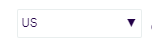
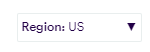
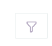
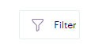
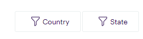
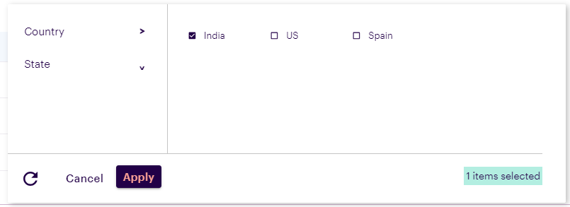
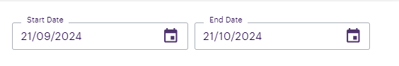
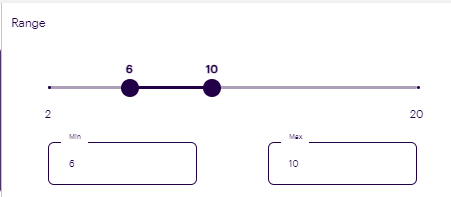
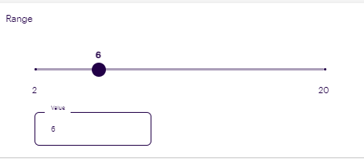

# Introduction

The widget level filters to allow users to tailor the data displayed within each widget, enhancing flexibility and control over dashboard content


## Arguments and methods

- `WidgetFilter()`: This function allows users to configure the widget filter with various options. It accepts the following parameters:
    - `display_type`: This parameter defines the icon type for the dropdown menu. The following four types are available, with filter_icon set as the default.
        - `value_dropdown`: A dropdown displaying the currently selected choice. This option is not available when dropdown_type is detailed.
    
        - `title_value_dropdown` : A dropdown option showing both the label and the selected choice for clarity. This option is not available when dropdown_type is detailed.
    
        - `icon` : A compact filter icon designed to optimize space in the user interface.
    
        - `filter_icon` :  A distinct filter icon accompanied by the text "Filter," providing a clear visual indication of its function. 
    <br/>
    When configured as a simple dropdown, the filter will display the label of the options, as shown.
    
    
<br/>
<br/>

    - `dropdown_type`: This parameter enables users to select the dropdown format. There are two available types, with detailed set as the default.
        - `simple`: This option presents a standard single-select dropdown, allowing users to choose one option from the list.This is the default value<br/>
    

        - `detailed` : This option displays a detailed dropdown, where multiple options are organized in a structured format within the same interface, facilitating easier navigation and selection.<br/>
 
    

    - `filter_type`: This parameter allows users to select the filtering method for dropdown options. Two types are available:
        - `non-hierarchical`: Provides a predefined set of values in a dropdown, allowing users to select from a fixed list of options.This is the default value.<br/>

        - `hierarchical` : Offers dropdown options that update dynamically in real-time, adapting based on the user's selections.<br/>

    - ##Sample Code:
    ```
    widget_filter = WidgetFilter(display_type="filter_icon",dropdown_type="detailed",filter_type="hierarchical")
    ```
<br/><br/>

- `add_filter()`: This function is used to configure all options for the dropdown. It accepts the following parameters: 
    - `label`: The label for the dropdown, visible on the filter icon when display_type is set to title_value_dropdown and on the filter icon when dropdown_type is set to detailed.
    - `values`: A list of values for the dropdown.The different types of values are as follows:
        - `Simple dropdown ["India","US","Spain"]`: Pass the dropdown values as each item in the list.
        - `Hierarchicial dropdown ["Karnataka","Maharashtra"]`: Pass the default values and configure the options in add_hierarchy_data().
        - `Date range ["2024-09-21T18:18:58","2024-10-21T18:18:58"]`: The first value should be the start date, and the second should be the end date. If only one value is provided, it will be considered the start date. Please ensure the format is followed correctly.
        
        - `Number Range [min,max,step,enableInputBox,rangeSelector]`: 
            - `Min`: The minimum value of the slider
            - `Max`: The maximum value of the slider
            - `Step`: The increment value for the slider.
            - `EnableInputBox`: A boolean value to display the input box.
            - `rangeSelector`: This comes in two types:
                - `[10,20]`: Adds multiple sliders, where the first value represents the default for the first slider, the second for the second slider, and this pattern continues for any additional sliders added.
                
                - `[10]`: Adds a single slider with this value as its default.
                
            - Example 
            ```
            widget_filter.add_filter("Range",[2,20,2,"true",[6,20]],select_type="number_range")
            ```
        
    - `select_type`: Defines the type of selection for the dropdown options. The available types are as follows:
        - `single`: Configures the dropdown to display radio buttons, allowing users to select only one option. This is the default value.
        - `multiple`: Configures the dropdown to display checkboxes, allowing users to select multiple options
        - `date_range`: Configures the dropdown to display date selectors, allowing users to choose a start and end date. This option can be configured only when dropdown_type is set to detailed.
        - `number_range`: Configures the dropdown to display sliders, enabling users to filter based on a range of numbers. This option can be configured only when dropdown_type is set to detailed.
    - `is_hierarchical`: This boolean value should be set to true when these options need to be included as part of hierarchical filtering.
    - ## Sample Code:

    ```
    widget_filter.add_filter("Country",["India","US","Spain"], select_type="single",is_hierarchical=True)
    widget_filter.add_filter("Country",["India","US","Spain"], select_type="multiple")
    widget_filter.add_filter("Date",["2024-09-21T18:18:58","2024-10-21T18:18:58"],select_type="date_range")
    widget_filter.add_filter("Range",[2,20,2,"true",[6,20]],select_type="number_range")
    ```


- `add_hierarchy_data()`: This function enables the addition of options for hierarchical filtering. It accepts the following parameters:
    - `parent_label`: The exact label of the parent option.
    - `child_label`: The exact label of the child option.
    - `data`: All options should be configured based on the parent value, structured as shown in the sample code.
    - ## Sample Code:

    ```
    widget_filter.add_filter( values=['USA', 'Canada', 'India'],label='Country', is_hierarchical=True)
    widget_filter.add_filter('State', [], is_hierarchical=True)
    widget_filter.add_hierarchy_data('Country', 'State', {
    'USA': ['California', 'Texas'],
    'Canada': ['Ontario', 'Quebec'],
    'India': ['Maharashtra', 'Karnataka']
})
    ```

- `update_hierarchical_filters()`: This function allows filtering of options based on the parent selection. The selected parameters should be passed within this function.
    - ## Sample Code:

    ```
    current_filter_params = globals().get('selected', None)
    if current_filter_params and current_filter_params['current_filter'] == 'Country':
        widget_filter.update_hierarchical_filters(current_filter_params)
    elif current_filter_params and current_filter_params['current_filter'] == 'State':
        current_filter_params['current_filter'] = 'Country'
        widget_filter.update_hierarchical_filters(current_filter_params)
    ```
<br/>

    <br/>

<br/>

# Return Type :
Visualizaion UIAC can be modified to make it dynamic based on the return type

  - `filterType: 'hierarchicial'`: The selected filters are returned as a dictionary, where each key represents a filter category, and its corresponding value is an array containing the selected filter values for that category.
        - {"Country": ["India", "US"], "State": ["Karnataka", "New York"]}
  - `filterType: 'non-hierarchicial and dropdownType: 'simple'` : The selected filter is returned as a simple key-value pair where the key represents the filter category and the value is the selected option.
        - {"Country": "India"}
  - `filterType: 'non-hierarchicial and dropdownType: 'detailed'` : The selected filters are returned as a dictionary, where each key represents a filter category, and its corresponding value is an array containing the selected filter values for that category.
        - {"Country": ["India", "US"], "State": ["Karnataka", "New York"]}
  - `select_type: date_range`: When this selection type is used, the selected dates are returned in the form of a dictionary. The key "Date" contains another dictionary with "start_date" and "end_date" keys that represent the chosen date range.
        - {Date: {start_date: "2024-09-20T12:48:58.000Z", end_date: "2024-10-23T17:17:36"}}
  - `select_type: number_range (multiple sliders)`: For multiple sliders, the selected range of values is returned as a dictionary. The key "Range" contains an array of values, where each value represents the selected range for the sliders.
        - {Range: [6, 14]}
  - `select_type: number_range (single slider)`: When a single slider is used, the selected value is returned as a dictionary. The key "Range" contains an array with one value that indicates the chosen position of the slider.
        - {Range: [8]}

## Action Code to be included in Visualization UIAC

```
def get_simulator_screen_variables():
    """
    The function helps to get the screen variables

    Returns
    -------
    A tuple containing - action_type, screen_data, selected_filters
    """
    if "action_type" in globals().keys():
        action_type = globals()["action_type"]
        screen_data = globals()["screen_data"]
    else:
        action_type = None
        screen_data = {}
    return action_type, screen_data

# Retrieve the action_type and screen_data
action_type, screen_data = get_simulator_screen_variables()

# Check if there's an action triggered and screen_data has selected_filter
if action_type:
    if action_type == "Widget Level Filter Trigger":
        selected_filter = screen_data.get("selected_filter")
```

# Sample Codes

## Visualization UIAC to render a simple table and make it respond to the selected filter [FOR SIMPLE DROPDOWN].
      
 ```
#This code should be added to the Visualization UIAC
table_data = [
    ["tom", "Europe", 10], 
    ["nick", "US", 15],
    ["juli", "Uk", 14] 
] 

def get_simulator_screen_variables():
    """
    The function helps to get the screen variables

    Returns
    -------
    A tuple containing - action_type, screen_data, selected_filters
    """ 
    selected_filters = None
    if "action_type" in globals().keys():
        action_type = globals()["action_type"]
        screen_data = globals()["screen_data"]
    else:
        action_type = None
        screen_data = {}
    return action_type, screen_data

action_type, screen_data = get_simulator_screen_variables()

#Check if there's an action triggered and screen_data has selected_filter
if action_type:
    if action_type == "Widget Level Filter Trigger":
        selected_filter = screen_data.get("selected_filter")
        if selected_filter:
            # Filter the table_data based on the selected_filter dynamically
            table_data = [row for row in table_data if selected_filter in row]

#Construct the output dictionary
x = {
    "table_headers": [
        "Name",
        "Region",
        "Age"
    ],
    "table_data": table_data,
    "show_searchbar": False,
    "tableOptions": {},
    "isTooltip": True,
    "tooltip_text": "This is a tooltip",
    "placement": "top",
}

#Convert the dictionary to a JSON string
import json
dynamic_outputs = json.dumps(x)
```

## Filter UIAC to configure filters with simple dropdown
            
```
from codex_widget_factory_lite.visuals.widget_filter import WidgetFilter
widget_filter = WidgetFilter(display_type="title_value_dropdown",dropdown_type="simple")
current_filter_params = globals().get('selected', None)
widget_filter.add_filter("Region",["Europe","US","Uk"])
dynamic_outputs = widget_filter.get_json() 
 ```
    
<br/>


## Filter UIAC to configure multiple filters with simple dropdown

```
from codex_widget_factory_lite.visuals.widget_filter import WidgetFilter
widget_filter = WidgetFilter(display_type="filter_icon",dropdown_type="simple")
current_filter_params = globals().get('selected', None)
widget_filter.add_filter("Region",["Europe","US","Uk"])
widget_filter.add_filter("Name",["tom","nick","juli"])
dynamic_outputs = widget_filter.get_json() 
```
<br/>

## Visualization UIAC to configure a simple table to handle filters with detailed dropdown

```
#This code should be added to the Visualization UIAC
import json

table_data = [
    ["Tom", "India", "Karnataka", 10],
    ["Nick", "US", "California", 15],
    ["Juli", "Spain", "Madrid", 14],
    ["Ravi", "India", "Karnataka", 22],
    ["Anil", "India", "New Delhi", 28]
]

def get_simulator_screen_variables():
    """
    The function helps to get the screen variables

    Returns
    -------
    A tuple containing - action_type, screen_data, selected_filters
    """
    if "action_type" in globals().keys():
        action_type = globals()["action_type"]
        screen_data = globals()["screen_data"]
    else:
        action_type = None
        screen_data = {}
    return action_type, screen_data

#Retrieve the action_type and screen_data
action_type, screen_data = get_simulator_screen_variables()

#Check if there's an action triggered and screen_data has selected_filter
if action_type:
    if action_type == "Widget Level Filter Trigger":
        selected_filter = screen_data.get("selected_filter")

if action_type and "selected_filter" in screen_data:
    selected_filter = screen_data["selected_filter"]
    
    #Logic to filter data based on the selected data
    def filter_table_data(data, filter_criteria):
        headers = ["Name", "Country", "State", "Age"]  
        filtered_data = []
        for row in data:
            match = True
            for key, values in filter_criteria.items():
                col_index = headers.index(key)
                if row[col_index] not in values:
                    match = False
                    break
            if match:
                filtered_data.append(row)
        return filtered_data

    table_data = filter_table_data(table_data, selected_filter)

#Construct the output dictionary
x = {
    "table_headers": [
        "Name",
        "Country",
        "State",
        "Age"
    ],
    "table_data": table_data,
    "show_searchbar": False,
    "tableOptions": {},
    "isTooltip": True,
    "tooltip_text": "This is a tooltip",
    "placement": "top",
}

#Convert the dictionary to a JSON string
dynamic_outputs = json.dumps(x)
```


## Filter UIAC to configure filters with detailed dropdown and non-hierarchical filterType with single and multiple options

```
from codex_widget_factory_lite.visuals.widget_filter import WidgetFilter
widget_filter = WidgetFilter(display_type="filter_icon",dropdown_type="detailed")
current_filter_params = globals().get('selected', None)
widget_filter.add_filter("Country",["India","US","Spain"],select_type="single")
widget_filter.add_filter("State",["Karnataka","New Delhi","Madrid","California"],select_type="multiple")
dynamic_outputs = widget_filter.get_json()
```

## Filter UIAC to configure filters with detailed dropdown and hierarchicial filterType

```
from codex_widget_factory_lite.visuals.widget_filter import WidgetFilter
widget_filter = WidgetFilter(display_type="filter_icon",dropdown_type="detailed",filter_type="hierarchical")
current_filter_params = globals().get('selected', None)
widget_filter.add_filter( label='Country',values=['US', 'Spain', 'India'], is_hierarchical=True)
widget_filter.add_filter(label='State', values=['Karnataka',"New Delhi"], is_hierarchical=True)
 
# Define hierarchical relationships
widget_filter.add_hierarchy_data('Country', 'State', {
    'US': ['California', 'Texas'],
    'Spain': ['Madrid'],
    'India': ['New Delhi', 'Karnataka']
})

if current_filter_params:
    filter_data = {'current_filter':'Country','selected':current_filter_params}
    widget_filter.update_hierarchical_filters(filter_data)

dynamic_outputs = widget_filter.get_json()
```
<br/>

## Filter UIAC to configure hierarchicial filters with simple dropdown

```
from codex_widget_factory_lite.visuals.widget_filter import WidgetFilter
widget_filter = WidgetFilter(display_type="filter_icon",dropdown_type="simple",filter_type="hierarchical")
current_filter_params = globals().get('selected', None)
widget_filter.add_filter( label='Country',values=['US', 'Spain', 'India'], is_hierarchical=True)
widget_filter.add_filter(label='State', values=['Karnataka',"New Delhi"], is_hierarchical=True)
 
# Define hierarchical relationships
widget_filter.add_hierarchy_data('Country', 'State', {
    'US': ['California', 'Texas'],
    'Spain': ['Madrid'],
    'India': ['New Delhi', 'Karnataka']
})

if current_filter_params:
    filter_data = {'current_filter':'Country','selected':current_filter_params}
    widget_filter.update_hierarchical_filters(filter_data)

dynamic_outputs = widget_filter.get_json()
```
<br/>

## Visualization UIAC to render simple table to handle date range and number range filters

```
#This code should be added to the Visualization UIAC
import json
from datetime import datetime

table_data = [
    ["Tom", "India", "Karnataka", 10, "2024-09-25T10:30:00.000Z"],
    ["Nick", "US", "California", 15, "2024-09-27T14:50:00.000Z"],
    ["Juli", "Spain", "Madrid", 14, "2024-10-05T09:20:00.000Z"],
    ["Ravi", "India", "Karnataka", 22, "2024-10-12T11:15:00.000Z"],
    ["Anil", "India", "New Delhi", 28, "2024-10-18T13:45:00.000Z"],
    ["Vikram", "India", "Karnataka", 30, "2024-10-15T08:00:00.000Z"]
]

def get_simulator_screen_variables():
    """
    The function helps to get the screen variables.

    Returns
    -------
    A tuple containing - action_type, screen_data, selected_filters
    """
    if "action_type" in globals().keys():
        action_type = globals()["action_type"]
        screen_data = globals()["screen_data"]
    else:
        action_type = None
        screen_data = {}
    return action_type, screen_data

# Retrieve the action_type and screen_data
action_type, screen_data = get_simulator_screen_variables()

# Check if there's an action triggered and screen_data has selected_filter
if action_type:
    if action_type == "Widget Level Filter Trigger":
        selected_filter = screen_data.get("selected_filter")

if action_type and "selected_filter" in screen_data:
    selected_filter = screen_data["selected_filter"]

    def iso_to_datetime(iso_str):
        return datetime.fromisoformat(iso_str.replace("Z", "+00:00"))

    # Filtering logic for date, state, and age range
    def filter_table_data(data, filter_criteria):
        headers = ["Name", "Country", "State", "Age", "Date"]  
        filtered_data = []
        for row in data:
            match = True
            if "Country" in filter_criteria:
                state_value = filter_criteria["Country"]
                col_index = headers.index("Country")
                if row[col_index] != state_value:
                    match = False
                    continue
            if "Date" in filter_criteria:
                start_date = iso_to_datetime(filter_criteria["Date"]["start_date"]).date()
                end_date = iso_to_datetime(filter_criteria["Date"]["end_date"]).date()

                date_col_index = headers.index("Date")
                row_date = iso_to_datetime(row[date_col_index]).date()
                
                if not (start_date <= row_date < end_date):
                    match = False
                    continue

           
            if "Range" in filter_criteria:
                age_col_index = headers.index("Age")
                row_age = row[age_col_index]

                
                if len(filter_criteria["Range"]) == 1:
                    age_value = filter_criteria["Range"][0]
                    if row_age != age_value:
                        match = False
                        continue
                elif len(filter_criteria["Range"]) == 2:
                    min_age, max_age = filter_criteria["Range"]
                    if not (min_age <= row_age <= max_age):
                        match = False
                        continue

            if match:
                filtered_data.append(row)
        return filtered_data

    table_data = filter_table_data(table_data, selected_filter)

# Construct the output dictionary
x = {
    "table_headers": [
        "Name",
        "Country",
        "State",
        "Age",
        "Date"
    ],
    "table_data": table_data,
    "show_searchbar": False,
    "tableOptions": {},
    "isTooltip": True,
    "tooltip_text": "This is a tooltip",
    "placement": "top",
}

dynamic_outputs = json.dumps(x)

```

<br/>

## Filter UIAC to configure filters with date_range and number_range options

```
from codex_widget_factory_lite.visuals.widget_filter import WidgetFilter
widget_filter = WidgetFilter(display_type="filter_icon",dropdown_type="detailed")
current_filter_params = globals().get('selected', None)
widget_filter.add_filter("Country",["India","US","Spain"])
widget_filter.add_filter("Date",["2024-09-21T18:18:58","2024-10-21T18:18:58"],select_type="date_range")
widget_filter.add_filter("Range",[2,20,2,"true",[6,12]],select_type="number_range")
dynamic_outputs = widget_filter.get_json() 
```

<br/>

<br/>

