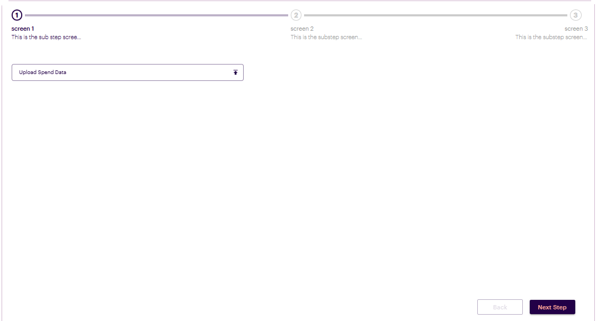

# Introduction

# Inter-widget connectivity is a pivotal feature that facilitates communication between two or more widgets based on user interactions or predefined custom actions. This functionality enhances the user experience by enabling seamless interaction across different widgets, allowing them to respond dynamically to events triggered by user actions.

# Inter-widget connectivity refers to the ability of widgets to communicate and share data with one another. This feature is essential in creating cohesive and interactive applications where user actions in one widget can influence the behavior or state of another. For instance, selecting an item in a list can automatically update details in a corresponding widget, thus providing a more integrated and responsive user interface

# Enabling a widget to respond dynamically to interactions interactions occurring in another widget

# To enable a widget to dynamically respond to interactions occurring in another widget, the user must include a special key called `affected_by` in the UIAC. This key is a list that contains the IDs of the widgets that influence its behavior.

# Sample example which showcase passing `affected_by`

# Below is a sample example featuring two widgets: one displaying a Plotly graph and the other presenting a simple table


# Assuming we have two widgets with IDs 1 and 2, to enable the widget with ID 2 to respond to interactions occurring in widget 1, a special key `affected_by` (This key is a list that contains the IDs of the widgets that influence its behavior) must be included at the top level of the UIAC within widget 2,

# If widget 2 needs to respond to interactions occurring in multiple widgets, all relevant widget IDs must be included in a list.

# Sample code demonstrating how to enable a widget to respond to interactions occurring in another widget

```
import json
x={
  "affected_by":[100690],
  "table_headers": [
    "Name",
    "country",
    "Age"
  ],
  "table_data": [
    [
      "tom",
      "US",
      1
    ],
    [
      "nick",
      "US",
      15
    ],
    [
      "juli",
      "US",
      14
    ]
  ],
  "show_searchbar": False,
  "tableOptions": {},
  "freezing": False,
  "isTooltip": False,
}
dynamic_outputs=json.dumps(x)

```
# **Progress Bar and Data Transfer Between Screens**

# The progress bar or stepper component is a tool for visualizing user interfaces, particularly in scenarios where a specific flow is involved, such as multi-step forms. This component provides users with a clear understanding of their progress through a sequence of steps, making complex processes more manageable and intuitive.

# Creating a Stepper Screen
# To create a stepper screen within your application ,navigate to admin screen, locate the Screen List View. This section displays all the screens available in your application,For each screen listed, there will be a three-dot icon (often referred to as a "more options" icon). Click on the three-dot icon associated with the screen. A menu will appear,from the menu options displayed, choose `Set to Stepper Screen`

# an example of progress bar component

- 

- 

# **Widget Actions and Navigation Requirements**
# so each  widget in the screen can have an action to be performed, so if there is any action conigured in the widget, than it needs to be perfomed , without which user cannot naviage to next screen

# a screen can contain multiple widgets, each of which may or may not have associated actions. When navigating through a next screens, it is essential that any configured actions for these widgets are performed before the user can proceed to the next screen.

# Action Configuration for Widgets

## For example, consider a screen with two widgets that both require actions to be executed. In this case, you would need to pass specific key-value pairs i.e `current_action` to indicate the action for each widget. For instance:
- For Widget 1, you would pass `current_action: 1`.
- For Widget 2, you would pass `current_action: 2`.
# This approach ensures that each widget's action is recognized and executed appropriately.

# If screen contains more widgets, and all of them require actions to be performed, simply follow the same procedure. Assign and pass the `current_action` key in uiac with the corresponding widget number (e.g., current_action: 3, current_action: 4, etc.). This systematic method allows for seamless management of actions across all widgets on the screen.

# If a widget does not require an action or if the action is optional, it is essential to pass `current_action:None` in uaic for that widget. This allows users to navigate to the next screen without needing to perform any action on that widget. If this is not specified, users will be unable to proceed to the next screen without completing the required actions

# **Data Transfer Between Screens**

# It is possible to transfer data from one screen to another during navigation. Each widget allows users to define specific data using a key called `screen_navigation_data` that needs to be passed in uiac. Any data associated with this key will be transferred seamlessly to the next screen when the user navigates.

# This feature enables a smooth flow of information, ensuring that relevant data is preserved and accessible as users progress through the screens.

# **usage and code samples**

## an example with single widget
```

import json

data = {
    "current_action": 1,
    "screen_navigation_data": {
        "table_headers": ["Name", "country", "Age"],
        "table_data": [["tom", "US", 10], ["nick", "US", 15], ["juli", "US", 14]],
        "tableOptions": {},
        "freezing": True,
    },
    "form_config": {
        "fields": [
            {
                "type": "upload",
                "label": "Upload Spend Data",
                "name": "Upload_Spend_Data",
                "multiple": True,
                "is_button": True,
                "inputprops": {"accept": ".csv"},
                "validator": "upload",
                "variant": "outlined",
                "grid": 12,
                "fullWidth": True,
            }
        ]
    },
}
if "action_type" in globals().keys() and action_type == "upload":
    new_files = screen_data.get("Upload_Spend_Data", [])
    if not isinstance(new_files, list):
        new_files = [new_files]  # Wrap single upload in a list

    if is_multiple:
        # Append each file to the uploaded_files list if multiple uploads are allowed
        for file in new_files:
            uploaded_files.append(file)
    else:
        uploaded_files = new_files
        data["form_config"]["fields"][0]["value"] = uploaded_files
dynamic_outputs = json.dumps(x)

```
## An example featuring two widgets on the screen
## sample code of first widget

```
import json

data = {
    "current_action": 1,
    "screen_navigation_data": {
        "table_headers": ["Name", "country", "Age"],
        "table_data": [["tom", "US", 10], ["nick", "US", 15], ["juli", "US", 14]],
        "tableOptions": {},
        "freezing": True,
    },
    "form_config": {
        "fields": [
            {
                "type": "upload",
                "label": "Upload Spend Data",
                "name": "Upload_Spend_Data",
                "multiple": True,
                "is_button": True,
                "inputprops": {"accept": ".csv"},
                "validator": "upload",
                "variant": "outlined",
                "grid": 12,
                "fullWidth": True,
            }
        ]
    },
}
if "action_type" in globals().keys() and action_type == "upload":
    new_files = screen_data.get("Upload_Spend_Data", [])
    if not isinstance(new_files, list):
        new_files = [new_files]  # Wrap single upload in a list

    if is_multiple:
        # Append each file to the uploaded_files list if multiple uploads are allowed
        for file in new_files:
            uploaded_files.append(file)
    else:
        uploaded_files = new_files
        data["form_config"]["fields"][0]["value"] = uploaded_files
dynamic_outputs = json.dumps(x)

```

## sample of code of second widget

```
import json

data = {
    "current_action": 2,
    "screen_navigation_data": {
        "table_headers": ["Name", "country", "Age"],
        "table_data": [["tom", "US", 10], ["nick", "US", 15], ["juli", "US", 14]],
        "tableOptions": {},
        "freezing": True,
    },
    "form_config": {
        "fields": [
            {
                "type": "upload",
                "label": "Upload Spend Data",
                "name": "Upload_Spend_Data",
                "multiple": True,
                "is_button": True,
                "inputprops": {"accept": ".csv"},
                "validator": "upload",
                "variant": "outlined",
                "grid": 12,
                "fullWidth": True,
            }
        ]
    },
}
if "action_type" in globals().keys() and action_type == "upload":
    new_files = screen_data.get("Upload_Spend_Data", [])
    if not isinstance(new_files, list):
        new_files = [new_files]  # Wrap single upload in a list

    if is_multiple:
        # Append each file to the uploaded_files list if multiple uploads are allowed
        for file in new_files:
            uploaded_files.append(file)
    else:
        uploaded_files = new_files
        data["form_config"]["fields"][0]["value"] = uploaded_files
dynamic_outputs = json.dumps(x)

```
# Note - If the second widget does not have any action, or if an action is present but is not mandatory, then `current_action: None` should be passed in uiac.